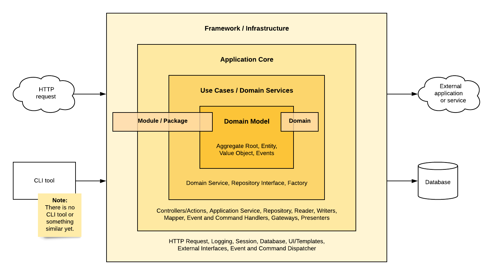

# The inner structure of the new architecture

**Created:** 2020-08-14 by Mirko

**Status:** accepted

**Decision makers:** Moritz, Daniel W., Tobias S., Mirko

## Context

While starting the refactoring of the shop software, we also started to create a new architecture for the shop
software. While in the refactoring process, we didn't know how the architecture should look or what we need at a
certain point, we can now describe it very well. Therefore, the following part will give an overview of how we
want to structure the architecture.

Describing this structure, we orientated ourselves on Martin Fowler's clean architecture and other models like
onion or hexagonal architectures. For us, it was an essential detail that domain-driven design should be visible
clearly.

## Decision

The new (GX4) architecture of the shop software includes four layers. Each layer should only interact with its
neighbors, and the inner layer shouldn't require any knowledge about the outer layers. As shown in the picture
below, we have the Framework, Application Core, Use Cases, and the Domain Model as separate layers.

### Framework

The framework layer includes general tools and components to execute the shop software. It contains no specific
business logic that can't tell you anything about the exact functionality of this software, but it provides the
framework for running the software. This layer will include elements that handle, for example, incoming HTTP
requests, logging, session, or the database connection.

### Application Core
Deeper in the application core layer, the components execute certain main functionalities of the application. The
tasks performed here are still very technical and far away from specific business rules. Parts of this layer are
controllers or actions for the incoming HTTP requests, application services, or database readers and writers.

### Use Cases
The (domain-driven design) domain starts with the layer for the use cases. The entirety of domains show what
this application is about; therefore, this layer provides information about the use cases and possibilities of
interacting with these domains. Domain service, interfaces of repositories, and factories are typical components
of this layer.

### Domain Model
When using domain-driven design, the model is a fundamental part of the software because it contains the business
logic of the whole software. But this is also the part that is less volatile than the outer parts of the software.
The components of this layer are entities, value objects, events, and the aggregate root.

## Consequences

Following this, the architecture limits the usage of components of different layers; for instance, it's not
possible to directly use a logger and database connection inside the domain. Therefore, a favorable outcome is
that the maintainability of each component increases.

In some cases, we bend some general recommendations, but we do this always to make the whole architecture as
understandable and catchy as possible. So, for example, the factory is not part of the domain model, which it
usually is in the domain-driven design. As something most likely providing the ability for data to go through
boundaries, we put it also near the application services, which use these factories in general.