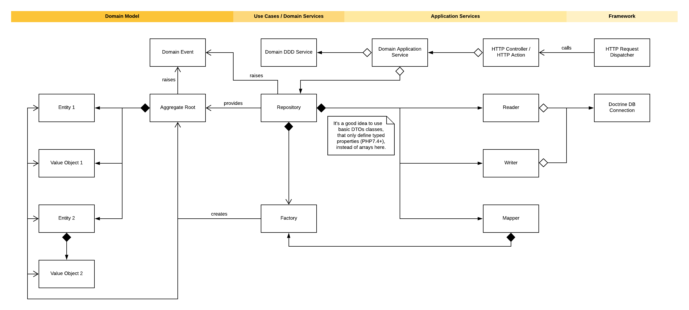

# Rules and best practices for implementing modules

**Created:** 2020-08-14 by Mirko

**Status:** accepted

**Decision makers:** Moritz, Daniel W., Tobias S., Mirko

**Last updated:** 2021-04-01 by Mirko


## Context

We tried different ideas and patterns for implementing modules in the past, but not all of these improved the quality
or usability of these modules. Therefore, and because of consistency, we needed a general ruleset and collection of
best practices of how to implement modules, domains, and application services for the GX shop software.

The following decisions are based on the ADR "004 - The inner structure of the new" architecture about the shop
architecture structure, so it would be wise to read this ADR first.


## Decision

### File-based module structure

The file and directory structure of a module separates components of different architecture layers and features. The
following example shows this kind of separation:

```
GambioAdmin/
    - Modules/
        - Example/
            - ExampleServiceProvider.php
            - routes.php
            - ui/
                - assets/
                - templates/
            - App/                                        [Application Core]
                - Actions/
                    - ExampleAction.php
                - CommandHandlers/
                - Data/
                    - ExampleMapper.php
                    - ExampleReader.php
                    - ExampleRepository.php
                    - ExampleWriter.php
                - EventHandlers/
                - Exceptions/
                    - SomethingNeedsToBeHandledInTheRepositoryException.php
                - ExampleApplicationService.php
            - Model/                                      [Domain Model]
                - Collections/
                - Entities/
                - Events/
                    - ExampleCreated.php
                    - ExampleDeleted.php
                    - ExamplePartUpdated.php
                - Exceptions/
                    - BrokeABusinessRuleException.php
                - Interfaces/
                - ValueObjects/
                - ExampleAggregateRoot.php
            - Services/                                   [Use Cases / Domain Services]
                - Exceptions/
                    - CreationFailedException.php
                    - StorageFailedException.php
                    - DeletionFailedException.php
                - ExampleDomainService.php
                - ExampleFactory.php
                - ExampleRepositoryInterface.php
                - ExampleApplicationServiceInterface.php
            - Support/                                    [Framework]
                - ExampleHelper.php
                - ExampleClient.php
```

As you can see, the first directories (`App`, `Support`, `Model`, and `Services`) separating the Application Services,
Framework, Domain Model, and Domain Services/Use Cases layer of the module. An additional directory named `ui`
contains all UI specific content.


### Implementing a module

* New routes will be defined using a `routes.php` file in the base directory of the module.
* Components and services of a module are defined using a Service Provider, which also must be inside the module's
  base directory.
* UI components like templates and assets (JS and SCSS) have to be inside the `ui` directory. The `ui/templates`
  directory contains the templates, while the `ui/assets` directory contains the assets. All assets are build based
  on a `ui/assets/index.ts` file that will be processed by Webpack.


### Implementing a domain

* We use domain-driven design for modeling new domains and focus on creating rich domain models (or as rich as
  possible) in context of the use-cases of the domain.
* Writing the documentation does have priority and should start at the beginning (or even before implementing the
  domain).
* Use cases of a domain result in meaningful events that will be raised by the aggregate root or the repository (in
  case of creation or deletion).
* Implementing an ID for an entity, you should not use ambivalent values. In general, it's a positive integer or
  string corresponding to a value in the database. It shouldn't be that value or `null`, because this makes it
  harder to handle the IDs.
* To store new entities, you use the factory for the creation and add them to the aggregate root. To create a new
  aggregate root,  you need to provide the necessary information to the repository, which then creates, stores, and
  returns them.
* A service, implemented to interact with a domain comfortably, should rely on primitive types for
  arguments as far as possible. We call these classes application services, and they are entirely different
  from domain services in domain-driven design.
* Each domain should have at least one application service, designed on the use cases of that domain. Use
  cases of the aggregate root should not be part of these services.
* We separate components that read and write into data sources like a MySQL database or a file on the server, which
  is also justified by the single responsibility principle.
* The repository uses a mapper class to map data from the reader and writer components to domain objects.
* Domain objects should not implement the `JsonSerializable` interface.
* Value objects like collection should not implement the `ArrayAccess` interface.

The image below shows the model of an example domain:




### Implementing an application service

* While handling language-dependent data, it's comfortable to use the two-digit ISO code instead of the language ID.
  So whenever a service needs an identifier for a language, the two-digit ISO code should be applied.
* We keep domain objects near the domain and don't transfer them outside an application service that requested them.
  If the domain data need to be provided as a response (e.q. for an incoming HTTP or API request), we use DTOs or
  serialization to uncouple the data from the domain object.
* We use HTTP actions instead of HTTP controllers because it's better to handle a single request in a component
  instead of multiple requests. The single responsibility principle also justifies this.


## Consequences

These rules and decisions come with a few consequences. The positive ones are that in general, the implementation of
new modules, domains, and application services will become more consistent and easier to understand. Another positive
consequence might be that we can set up conventions instead of configurations, which means that we can automatically
process files that match a specified pattern instead of changing configuration files.

Besides these positive consequences, there is also a negative one: Smaller or medium-size modules might have components,
where some argue are not necessary or too much, but it all helps to improve the consistency and comprehensibility of
these modules.

## Updates

### Completely reworked proposed and not accepted ADR (2020-04-01)

Added new rules and extended the example directory structure.