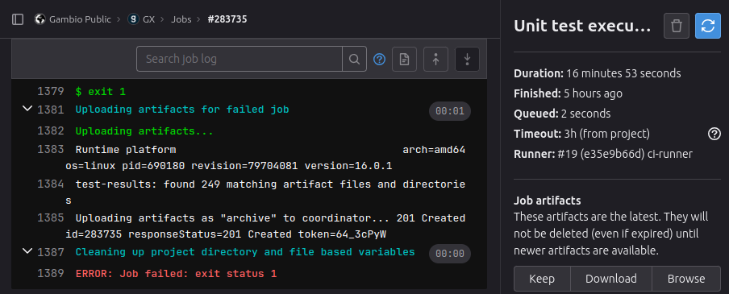
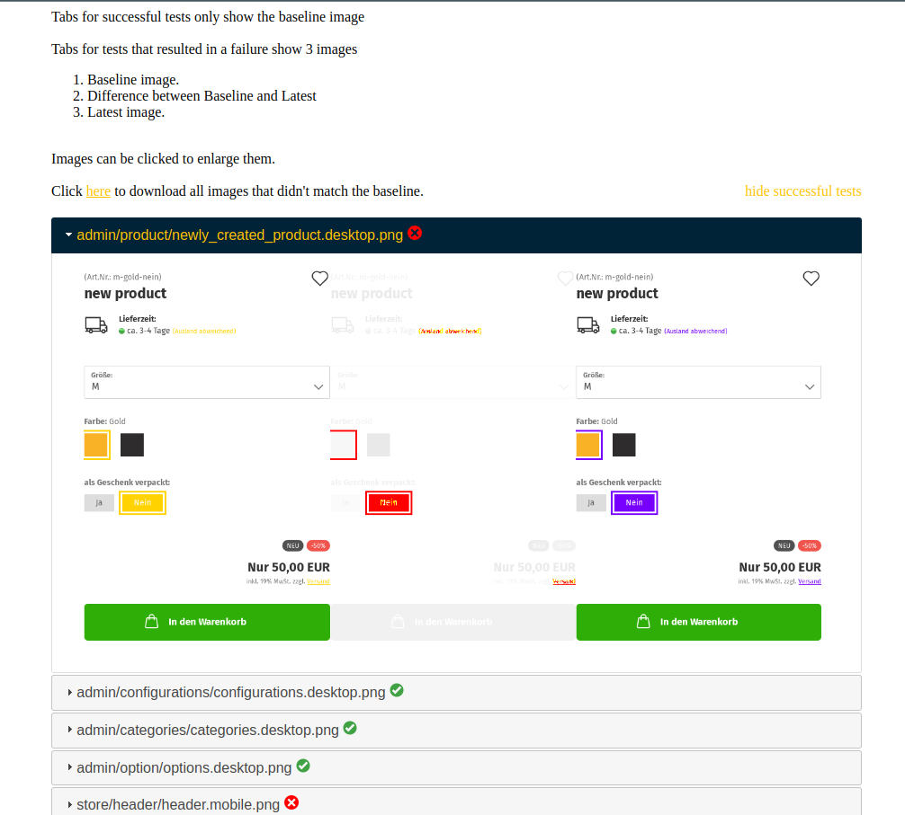
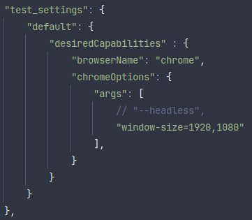

# Nightwatch.js Documentation

## How to Run Nightwatch.js Tests in the Shop

When running a complete test suite using `yarn tests`, the Nightwatch.js tests will also be executed at the end. You can specifically trigger the Nightwatch.js tests using the `yarn tests:e2e` command.

## Failing CI Pipelines

### Visual Regression Testing

Error messages like:

```
Visual regression test results for element <body>... in 5000ms - expected "true" but got:
"/home/gitlab-runner/builds/e35e9b66/3/gambio/gxdev/tests/nightwatch/vrt/diff/store/categories/category_as_list.tablet.png"
```

can be checked in the failed pipeline. To review, click the "Download" button in the "Job artifacts" section on the right sidebar.



After downloading the zip archive, extract its contents to a local web server. Inside the extracted files, there's a `test-results` directory containing results in txt format. If there were any failed Visual Regression Tests (VRT), you'll also find a `vrt` directory.



This page displays each VRT test. For each failed test, three screenshots are shown:

1) The baseline image on the left for comparison.
2) A comparison image between images 1 and 3 in the middle.
3) The recently captured screenshot on the right.

This page offers two additional functions:

1) A "Hide Successful Tests" link to hide successful tests upon clicking.
2) A download link above the first test to download all recently captured screenshots of failed tests.

#### the file permissions must be set to 0777 for the download to function

If the differences are intended changes, the downloaded screenshots can replace the baseline images in this repository. Baseline screenshots are stored in `tests/nightwatch/vrt/baseline`.

### End-to-End (E2E) Testing

If regular E2E tests are failing, they can also be executed locally. To do this, adjust the `nightwatch.conf.js` (`tests/nightwatch/nightwatch.conf.js`) file.



Removing the `"--headless",` argument will launch a Chrome window during test execution, allowing observation of the test progress.

#### Most likely, the VRT tests will fail locally; temporarily deleting the `tests/nightwatch/vrt/baseline` directory will resolve this.

## Execution with different resolutions
Every test is initially executed for the "desktop" resolution. After these tests are run, all tests with the "vrt" tag are executed for all other resolutions as well.
### Tags

Tests in Nightwatch.js can be tagged with four categories:
1) `setup`: Executes once at the start, usually installing payment and shipping modules.
2) `admin`: Tests parts of the shop under `/admin`.
3) `store`: Tests parts of the store front
4) `vrt`: Visual Regression Tests.

#### these tags are set in each individual test case class
tests are located at `tests/nightwatch/tests`

### Resolutions
1) desktop (1920x1080)
2) desktop-small (1680x1050)
3) desktop-large (2560x1080)
4) mobile (414x900)
5) tablet (1024x1366)