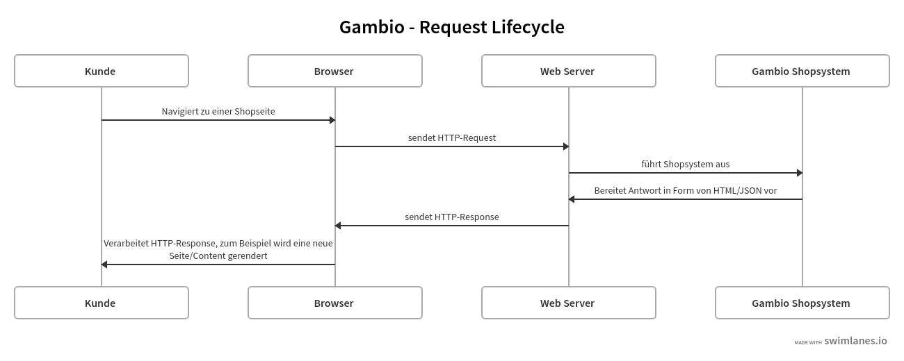

## Request Lifecycle

### Einführung

Die Aufgabe der Anwendung, auf die der Onlineshop basiert, ist es, HTTP-Anfragen zu verarbeiten und zu beantworten.

Hierbei werden jedoch üblicherweise die englischen Begriffe *Request* und *Response* verwendet.
Das Shopsystem antwortet auf HTTP-Requests mit HTTP-Responses, was wiederum den Begriff *Request Lifecycle* prägt.
Der Browser ist dabei in der Lage, die gewünschte Seite zu zeichnen (rendern), was innerhalb des gesamten Zykluses in
der Regel nur ein Burchteil von Sekunden ausmacht.

Die folgenden Abschnitte beziehen sich auf den neuen Anwendungskern des Shopsystems. Aktuell wird dieser Kern nur auf
ein paar neuen Seiten im Gambio Admin verwendet. Soll aber die Grundlage aller zukünftigen Entwicklungen darstellen.

### Einstiegspunkt

Eingehende Webanfragen werden hierbei vom HTTP-Server zu Datei weitergeleitet. Diese dienen als Einstiegspunkt
(Entrypoint) für alle Anfragen. Bisher existieren zwei solcher Einstiegspunkte, welche auf dem neuen Anwendungskern
baiseren: `admin/index.php` für den Adminbereich und `api_v3.php` für die REST API v3.  

Sie binden einen Autoloader ein und führen im Anschluss die [Application][ioc container] Klasse aus. Durch das Ausführen
der Application Klasse antwortet der Server mit einer HTTP-Antwort.

Damit die *Application* Klasse mit einer HTTP-Response antworten kann, benötigt diese einen Kernel und einen
[Bootstrapper](bootstrapper).

#### Kernel

Aktuell existiert nur der [Http Kernel][http kernel] als Implementierung eines [Kernels][kernel interface] im Shopsystem.
Seine Aufgabe ist es, mit Hilfe der `boot` Methode alle Komponenten zu laden und anschließend über die `run` Methode,
die eingegangene HTTP-Anfrage zu beantworten.

#### Bootstrapper

Für die verschiedenen Bereiche im Shop gibt es jeweils eine Bootstrapper Klasse, die in der Regel aus weiteren
[Bootstrapper][bootstrapper interface] Klassen besteht.

So führt beispielsweise der [AdminBootstrapper][admin bootstrapper] weitere Bootstrapper in einer bestimmten Reihenfolge
aus, um nach und nach alle Service Klassen registriert, Routen definiert und alles weitere, das zum Beantworten der
Webanfrage benötigt wird.
Die einzige Methode eines Bootstrapper ist `boot` und er darf [keinen Konstruktor][abstract bootstrapper] besitzen.

[ioc container]: ./ioc_container.md
[kernel interface]: ../../../src/GambioCore/Application/Kernel/Kernel.php
[http kernel]: ../../../src/GambioCore/Application/Kernel/HttpKernel.php
[bootstrapper interface]: ../../../src/GambioCore/Application/Kernel/Bootstrapper.php
[abstract bootstrapper]: ../../../src/GambioCore/Application/Kernel/AbstractBootstrapper.php
[admin bootstrapper]: ../../../src/GambioAdmin/Application/Kernel/AdminBootstrapper.php
