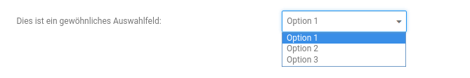
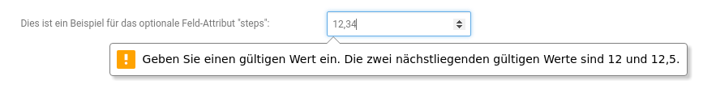

# GXModules Konfigurationsdatei


## <a name="introduction"></a>Einführung
Mit der Shopversion 3.9 ermöglicht das GXModules-System auch die automatische Einbindung deines Moduls in das Modul-Center
sowie die Generierung einer Konfigurationsseite anhand einer JSON Konfigurationsdatei.

Das klingt zunächst vielleicht einmal vollkommen abstract, aber erleichtert dir als Modulentwickler die Entwicklung von Modulen.
Du kannst nun anhand einer JSON Datei, welche du in deinem Modul ablegst, automatisch dein Modul im Modul-Center anzeigen zu lassen.
Außerdem kann anhand der Angaben in dieser JSON Datei auch eine Seite zur Konfiguration deines Moduls automatisch erzeugt werden.
Dies spart dir also die Erstellung einer Module-Center Klasse, eines Controllers sowie HTML-Templates zur Erzeugung des
Modul-Center Eintrags und der Konfigurationsseite.

Auf die Konfigurationswerte, die der Shopbetreiber nach der Installation deines Moduls konfiguriert hat, kannst du
außerdem ganz einfach über eine bereitgestellte Hilfsklasse zugreifen.


**Inhalt:**

- [Einführung](#introduction)
- [Die JSON Konfigurationsdatei](#configureFile)
- [Eigene Funktionen bei Installation und Deinstallation ausführen](#installUninstall)
- [Konfigurationsbereiche](#configureSections)
- [Tabs definieren](#configureTabs)
- [Arten von Konfigurationsfeldern](#configureFields)
    - [Switcher](#configureFieldsSwitcher)
    - [Eingabefelder](#configureFieldsInput)
        - [Passwort](#configureFieldsPassword)
        - [E-Mail](#configureFieldsEmail)
        - [Nummern](#configureFieldsNumber)
        - [Farben](#configureFieldsColors)
        - [Datum](#configureFieldsDate)
        - [Datum mit Stundenangabe](#configureFieldsDateTime)
        - [Dateiupdload](#configureFieldsFileupload)
        - [Mehrzeiliges Eingabefeld (textarea)](#configureFieldsTextarea)
        - [HTML Editor](#configureFieldsWYSIWYG)
    - [Auswahlfelder](#configureFieldsSelect)
        - [Mehrfachauswahl](#configureFieldsMultiSelect)
        - [Kundengruppen](#configureFieldsCustomerGroups)
        - [Bestellstatus](#configureFieldsOrderStatus)
        - [Länder](#configureFieldsCountries)
        - [Sprachen](#configureFieldsLanguages)
    - [Ajax-Button](#configureFieldsAjaxButton)
    - [Modal-Button](#configureFieldsModalButton)
        - [Modal-Fenster mit einfachem Text](#configureFieldsModalText)
        - [Modal-Fenster mit gerendertem HTML](#configureFieldsModalHTML)
- [Optionale Feldattribute](#configureFieldsOptionals)
    - [accept](#configureFieldsOptionalsDefaultValue)
    - [color](#configureFieldsOptionalsDefaultValue)
    - [default_value](#configureFieldsOptionalsDefaultValue)
    - [max](#configureFieldsOptionalsMax)
    - [min](#configureFieldsOptionalsMin)
    - [regex](#configureFieldsOptionalsRegex)
    - [required](#configureFieldsOptionalsRequired)
    - [selected](#configureFieldsOptionalsStep)
    - [step](#configureFieldsOptionalsStep)
    - [tooltip](#configureFieldsOptionalsTooltip)
- [Abfragen von Konfigurationswerten](#getModuleConfiguration)
    - [Rückgabewert pro Feldtyp](#returnValueByFieldType)
- [GXModuleController](#GXModuleController)
- [Ausführliches Beispiel](#example)


## <a name="configureFile"></a>Die JSON Konfigurationsdatei
Die JSON Datei, welche die gesamte Magie vollführt, muss im Hauptverzeichnis deines Moduls unter dem Namen `GXModule.json` abgelegt werden.
Im Nachfolgendem gehen wir Schritt für Schritt auf den Aufbau dieser Konfigurations-Datei ein und zeigen dir sämtliche Einstellungsmöglichkeiten auf.

```json
{
    "title": "sample_module.module_title",
    "description": "sample_module.module_description",
    "forceIncludingFiles": false,
    "configuration": […]
}
```

Der obige Auszug zeigt dir das Grundgerüst der Konfigurations-Datei mit den Attributen `forceIncludingFiles`, `title`, `description` und `configuration`.
Auf den Wert für das Attribute `configuration` gehen wir im nächsten Abschnitt dieses Tutorials ein, die anderen lassen sich ganz einfach erklären:

* `forceIncludingFiles`: Kann entweder auf `true` oder `false` gesetzt werden. Im `true`-Fall werden die Dateien des Modules
 im Shop und Gambio Admin auch dann beachten und eingebunden, wenn das Modul noch nicht über das
 Module-Center installiert wurde.
* `title`: Enthält eine Referenze zum Titel des Moduls. Dabei steht das obige `sample_module` für die
 *section* einer Textphrase und das `title` für die Textphrase selbst.
* `description`: Enthält eine Referenze zur Beschreibung des Moduls.
 Das angewendete Schema ist hier das selbige wie beim Titel.

**Hinweis:** Wird der Titel und die Beschreibung wie oben in der Konfigurations-Datei referenziert, dann muss das Modul eine
`sample_module.lang.inc.php` Sprachdatei innerhalb eines `TextPhrases`-Ordners enthalten.
Wie genau man unter GXModules eigene Sprachdateien einbinden kann, kannst du im Abschnitt
[Anlegen und Bearbeiten von Sprachdateien](create_new_language_phrases.md) nachlesen.

## <a name="installUninstall"></a>Eigene Funktionen bei Installation und Deinstallation ausführen
In der JSON Datei kannst du den Bereich "install" und "uninstall" definieren um eigene Funktionen auszuführen,
die dann bei Installation und Deinstallation des Moduls automatisch ausgeführt werden.

```json
{
   "install": {
       "controller": "TestBeforeInstall",
   	   "method": "install"
   	},
   	"uninstall": {
   	    "controller": "TestBeforeInstall",
   	    "method": "uninstall"
   	}
}
```

* controller : Legt fest welche PHP Klasse geladen werden soll
* method : Legt fest welche Funktion aus der PHP-Klasse ausgeführt werden soll

```php
class MyModuleBeforeInstall
{
	public function install($db, $data, $languageTextManager, $cacheControl)
	{
		// do some stuff before install
	}
	
	public function uninstall($db, $data, $languageTextManager, $cacheControl)
	{
		// do some stuff after uninstall
	}
}
```
Es stehen in der Funktion immer die folgenden Objekte zur Verfügung:
* $db : CodeIgniter QueryBuilder, der Operationen an der Datenbank durchführen kann. Weitere Informationen unter [Query Builder Class](https://www.codeigniter.com/userguide3/database/query_builder.html)
* $data : Alle Felder aus der GXModule.json Datei
* $languageTextManager : Kann benutzt werden, um TextPhrasen zu erhalten [siehe Sprachdateien](create_new_language_phrases.md#Verwenden%20der%20Sprachdateien%20in%20...)
* $cacheControl : Funktionen, um den Cache neu zu erstellen


## <a name="configureSections"></a>Konfigurationsbereiche
In der JSON Datei steuert das Attribute `configuration` die Konfigurationsseite, die beim Klick auf den *Bearbeiten*-Button angezeigt wird,
nachdem das Modul über das Module-Center installiert und ausgewählt wurde.

Die automatisch generierte Konfigurationsseite unterteilt sich in mehrere Konfigurationsbereiche.
Auf dem nachfolgenden Bild kannst du die Bereiche `Status` und `Beispiel-Bereich #1: Switcher` erkennen:


Der folgende Auszug zeigt dir wiederum, wie du einen Bereich zur Konfigurationsseite hinzufügst:

```json
{
    "title": "sample_module.module_title",
    "description": "sample_module.module_description",
    "forceIncludingFiles": false,
    "configuration": [
        {
            "title": "sample_module.section_title",
            "fields": {}
        }
    ]
}
```

Für jeden Bereich, den du hinzufügen möchtest, musst du dem Attribut (bzw. Array) `configuration` ein weiteres JSON Objekt
mit den Attributen `title` und `fields` hinzufügen.
Über das Attribut `title` kannst du den Titel des Bereichs referenzieren.
Dies erfolgt wie bereits beim Titel bzw. der Beschreibung des Moduls über die Angabe einer Sprachsektion und einer Textphrase.
Dem Attribut `fields` widmet sich der nächste Abschnitt des Tutorials.

**Hinweis:** Die Reihenfolge innerhalb des Arrays entspricht der Reihenfolge auf der Konfigurationsseite.
**Hinweis:** Wenn `title` wegelassen wird, wird keine Überschrift für die Section angezeigt
und es wird keine Trennlinie angezeigt.

**Wichtig:** Auf der Konfigurationsseite wird der Bereich `Status` (siehe obiges Bild) immer als erstes angezeigt und
muss nicht extra als Bereich in der JSON Datei definiert werden.
Er enthält immer eine *Switcher*-Element, mit welchem man den Status des Moduls (aktiv bzw. deaktiviert) steuern kann.
Der dazugehörige Konfigurationswert lautet `active`.

## <a name="configureTabs"></a>Tabs definieren
Als Alternative zu den Sections kannst du auch Tabs definieren, die dann am oberen Rand angezeigt werden und nur die
Felder anzeigen, die dort definiert wurden. Siehe [Arten von Konfigurationsfeldern](#configureFields)

```json
{
    "title": "sample_module.module_title",
    "description": "sample_module.module_description",
    "forceIncludingFiles": false,
    "configuration": [
        {
            "tab": "sample_module.tab_title",
            "fields": {}
        }
    ]
}
```

Sobald man eine Section als Tab definiert hat, wird die Section "Status" nicht mehr angezeigt und automatisch ein
Tab mit den Namen "Allgemein" hinzugefügt, der dann den Status Switcher enthält.
Für alle Sections die nicht als Tab definiert wurden, werden die Felder dann unter dem Tab "Allgemein" angezeigt.


## <a name="configureFields"></a>Arten von Konfigurationsfeldern
Nachdem du in der Konfigurations-Datei einen Bereich über das `configuration` Attribut definiert hast, kannst du über das
`fields` Attribut angeben, über welche Elemente dieser Bereich verfügt.
Hierbei hast du eine große Auswahl an verschiedenen Eingabe- sowie Auswahlmöglichkeiten und auch die Definierung von
Modalfenstern oder Buttons, welche einen Ajax-Request auslösen, stehen dir zur Verfügung.

Der folgende Auszug zeigt dir exemplarisch die Definition eines Eingabefeldes:

```json
{
    "title": "sample_module.module_title",
    "description": "sample_module.module_description",
    "forceIncludingFiles": false,
    "configuration": [
        {
            "title": "sample_module.section_title",
            "fields": {
                "sampleInput": {
                    "type": "text",
                    "label": "sample_module.input_field"
                }
            }
        }
    ]
}
```

Durch die obige Definition erzeugt man ein Inputfeld mit dem Namen `sampleInput`.
Das es sich um ein normales Inputfeld handelt, ergibt sich durch das Attribut `type` mit dem Wert `text`.
Das Attribut `label` enthält eine Referenz zu einer Textphrase und wird auf der Konfigurationsseite links vom Eingabefeld angezeigt.

Der Name des Feldes legt auch fest, über welchen Schlüssel der Konfigurationswert von dir abgefragt werden kann.
Wie genau du das kannst, wird dir im Abschnitt [Abfragen von Konfigurationswerten](#getModuleConfiguration) erklärt.

Im Folgendem stellen wir dir alle Möglichkeiten kurz vor und zeigen dir, wie du sie in deine Konfigurations-Datei einbindest.
Die einzelnen Abschnitte enthalten dabei ein Bild des Feldes, gefolgt von einem minimalistischen Auszug zur Definition
und werden abgeschlossen durch eine kurze Erklärung der im JSON vorkommenden Attribute.


### <a name="configureFieldsSwitcher"></a>Switcher


```json
{
    "configuration": [
        {
            "title": "sample_module.section_switcher",
            "fields": {
                "sampleSwitcher": {
                    "type": "checkbox",
                    "label": "sample_module.label_switcher"
                }
            }
        }
    ]
}
```

* `samplecheck`: Legt den Namen des Konfigurations-Schlüssel fest.
* `type`:        Art des Feldes, der Wert `checkbox` legt fest, dass es ein Switcher ist.
* `label`:       Referenz zur Textphrase des Labels.

Mögliche [optionale Attribute](#configureFieldsOptionals):

* `default_value`
* `required`
* `tooltip`


### <a name="configureFieldsInput"></a>Eingabefelder


```json
{
    "configuration": [
        {
            "title": "sample_module.section_inputs",
            "fields": {
                "sampleInput": {
                    "type": "text",
                    "label": "sample_module.label_input"
                }
            }
        }
    ]
}
```

* `sampleInput`: Legt den Namen des Konfigurations-Schlüssel fest.
* `type`:        Art des Feldes, der Wert `text` legt fest, dass es ein normales Eingabefeld ist.
* `label`:       Referenz zur Textphrase des Labels.

Mögliche [optionale Attribute](#configureFieldsOptionals):

* `default_value`
* `readonly`
* `regex`
* `required`
* `tooltip`


#### <a name="configureFieldsPassword"></a>Passwort


```json
{
    "configuration": [
        {
            "title": "sample_module.section_inputs",
            "fields": {
                "samplePassword": {
                    "type": "password",
                    "label": "sample_module.label_password"
                }
            }
        }
    ]
}
```

* `samplePassword`: Legt den Namen des Konfigurations-Schlüssel fest.
* `type`:           Art des Feldes, der Wert `password` legt fest, dass es ein Eingabefeld für Passwörter ist.
* `label`:          Referenz zur Textphrase des Labels.

Mögliche [optionale Attribute](#configureFieldsOptionals):

* `regex`
* `required`
* `tooltip`


#### <a name="configureFieldsEmail"></a>E-Mail


```json
{
    "configuration": [
        {
            "title": "sample_module.section_inputs",
            "fields": {
                "sampleEmail": {
                    "type": "email",
                    "label": "sample_module.label_email"
                }
            }
        }
    ]
}
```

* `sampleEmail`: Legt den Namen des Konfigurations-Schlüssel fest.
* `type`:        Art des Feldes, der Wert `email` legt fest, dass es ein Eingabefeld für E-Mailadressen ist.
* `label`:       Referenz zur Textphrase des Labels.

Mögliche [optionale Attribute](#configureFieldsOptionals):

* `default_value`
* `readonly`
* `regex`
* `required`
* `tooltip`


#### <a name="configureFieldsNumber"></a>Nummern


```json
{
    "configuration": [
        {
            "title": "sample_module.section_inputs",
            "fields": {
                "sampleNumber": {
                    "type": "number",
                    "label": "sample_module.label_number"
                }
            }
        }
    ]
}
```

* `sampleNumber`: Legt den Namen des Konfigurations-Schlüssel fest.
* `type`:         Art des Feldes, der Wert `number` legt fest, dass es ein Eingabefeld für Nummern ist.
* `label`:        Referenz zur Textphrase des Labels.

Mögliche [optionale Attribute](#configureFieldsOptionals):

* `default_value`
* `max`
* `min`
* `readonly`
* `regex`
* `required`
* `step`
* `tooltip`


#### <a name="configureFieldsColors"></a>Farben


```json
{
    "configuration": [
        {
            "title": "sample_module.section_inputs",
            "fields": {
                "sampleColor": {
                    "type": "color",
                    "label": "sample_module.label_color"
                }
            }
        }
    ]
}
```

* `sampleColor`: Legt den Namen des Konfigurations-Schlüssel fest.
* `type`:        Art des Feldes, der Wert `color` legt fest, dass es ein Eingabefeld für Farben ist.
* `label`:       Referenz zur Textphrase des Labels.

Mögliche [optionale Attribute](#configureFieldsOptionals):

* `default_value`
* `required`
* `tooltip`


#### <a name="configureFieldsDate"></a>Datum


```json
{
    "configuration": [
        {
            "title": "sample_module.section_inputs",
            "fields": {
                "sampleDate": {
                    "type": "date",
                    "label": "sample_module.label_date"
                }
            }
        }
    ]
}
```

* `sampleDate`: Legt den Namen des Konfigurations-Schlüssel fest.
* `type`:       Art des Feldes, der Wert `date` legt fest, dass es ein Eingabefeld für ein Datum ist.
* `label`:      Referenz zur Textphrase des Labels.

Mögliche [optionale Attribute](#configureFieldsOptionals):

* `default_value`
* `readonly`
* `required`
* `tooltip`


#### <a name="configureFieldsDateTime"></a>Datum mit Stundenangabe


```json
{
    "configuration": [
        {
            "title": "sample_module.section_inputs",
            "fields": {
                "sampleDateTime": {
                    "type": "datetime",
                    "label": "sample_module.label_datetime"
                }
            }
        }
    ]
}
```

* `sampleDateTime`: Legt den Namen des Konfigurations-Schlüssel fest.
* `type`:           Art des Feldes, der Wert `datetime` legt fest, dass es ein Eingabefeld für ein Datum mit Stundenangabe ist.
* `label`:          Referenz zur Textphrase des Labels.

Mögliche [optionale Attribute](#configureFieldsOptionals):

* `default_value`
* `readonly`
* `required`
* `tooltip`


#### <a name="configureFieldsFileupload"></a>Dateiupload


```json
{
    "configuration": [
        {
            "title": "sample_module.section_inputs",
            "fields": {
                "sampleFile": {
                    "type": "file",
                    "label": "sample_module.label_file",
                    "folder": "images"
                }
            }
        }
    ]
}
```

* `sampleFile`: Legt den Namen des Konfigurations-Schlüssel fest.
* `type`:       Art des Feldes, der Wert `file` legt fest, dass es ein Eingabefeld für den Dateiupload ist.
* `label`:      Referenz zur Textphrase des Labels.
* `folder`:     Zielverzeichnis für die hochgeladene Datei.

Mögliche [optionale Attribute](#configureFieldsOptionals):

* `accept`
* `tooltip`


#### <a name="configureFieldsTextarea"></a>Mehrzeiliges Eingabefeld (textarea)


```json
{
    "configuration": [
        {
            "title": "sample_module.section_inputs",
            "fields": {
                "sampleTextarea": {
                    "type": "textarea",
                    "label": "sample_module.label_textarea"
                }
            }
        }
    ]
}
```

* `sampleTextarea`: Legt den Namen des Konfigurations-Schlüssel fest.
* `type`:           Art des Feldes, der Wert `textarea` legt fest, dass es ein mehrzeiliges Eingabefeld ist.
* `label`:          Referenz zur Textphrase des Labels.

Mögliche [optionale Attribute](#configureFieldsOptionals):

* `default_value`
* `readonly`
* `required`
* `tooltip`


#### <a name="configureFieldsWYSIWYG"></a>HTML Editor


```json
{
    "configuration": [
        {
            "title": "sample_module.section_inputs",
            "fields": {
                "sampleEditor": {
                    "type": "editor",
                    "label": "sample_module.label_editor"
                }
            }
        }
    ]
}
```

* `sampleEditor`: Legt den Namen des Konfigurations-Schlüssel fest.
* `type`:         Art des Feldes, der Wert `editor` legt fest, dass es ein HTML-Editor ist.
* `label`:        Referenz zur Textphrase des Labels.

Mögliche [optionale Attribute](#configureFieldsOptionals):

* `default_value`
* `readonly`
* `required`
* `tooltip`


### <a name="configureFieldsSelect"></a>Auswahlfelder


```json
{
    "configuration": [
        {
            "title": "sample_module.section_selects",
            "fields": {
                "sampleSelect": {
                    "type": "select",
                    "label": "sample_module.label_select",
                    "values": [
                        {
                            "value": "value1",
                            "text": "sample_module.option_value1"
                        },
                        {
                            "value": "value2",
                            "text": "sample_module.option_value2"
                        },
                        {
                            "value": "value2",
                            "text": "sample_module.option_value3"
                        }
                    ]
                }
            }
        }
    ]
}
```

* `sampleSelect`: Legt den Namen des Konfigurations-Schlüssel fest.
* `type`:         Art des Feldes, der Wert `select` legt fest, dass es ein Auswahlfeld ist.
* `label`:        Referenz zur Textphrase des Labels.
* `values`:       Enthält alle Auswahlmöglichkeiten.
* `value`:        Wert der jeweiligen Auswahloption.
* `text`:         Referenz zur Textphrase der jeweiligen Auswahloptionen.

Mögliche [optionale Attribute](#configureFieldsOptionals):

* `default_value`
* `required`
* `tooltip`


#### <a name="configureFieldsMultiSelect"></a>Mehrfachauswahl


```json
{
    "configuration": [
        {
            "title": "sample_module.section_selects",
            "fields": {
                "sampleMultiSelect": {
                    "type": "multiselect",
                    "label": "sample_module.label_multiselect",
                    "values": [
                        {
                            "value": "value1",
                            "text": "sample_module.option_value1"
                        },
                        {
                            "value": "value2",
                            "text": "sample_module.option_value2"
                        },
                        {
                            "value": "value2",
                            "text": "sample_module.option_value3"
                        }
                    ]
                }
            }
        }
    ]
}
```

* `sampleMultiSelect`: Legt den Namen des Konfigurations-Schlüssel fest.
* `type`:              Art des Feldes, der Wert `multiselect` legt fest, dass es ein Auswahlfeld mit Mehrfachauswahl ist.
* `label`:             Referenz zur Textphrase des Labels.
* `values`:            Enthält alle Auswahlmöglichkeiten.
* `value`:             Wert der jeweiligen Auswahloption.
* `text`:              Referenz zur Textphrase der jeweiligen Auswahloptionen.

Mögliche [optionale Attribute](#configureFieldsOptionals):

* `default_value`
* `selected`
* `required`
* `tooltip`


#### <a name="configureFieldsCustomerGroups"></a>Kundengruppen


```json
{
    "configuration": [
        {
            "title": "sample_module.section_selects",
            "fields": {
                "sampleCustomerGroup": {
                    "type": "customer_group",
                    "label": "sample_module.label_customer_group"
                }
            }
        }
    ]
}
```

* `sampleCustomerGroup`: Legt den Namen des Konfigurations-Schlüssel fest.
* `type`:                Art des Feldes, der Wert `customer_group` legt fest, dass es ein Auswahlfeld für Kundengruppen ist.
* `label`:               Referenz zur Textphrase des Labels.

Mögliche [optionale Attribute](#configureFieldsOptionals):

* `default_value`
* `required`
* `tooltip`


#### <a name="configureFieldsOrderStatus"></a>Bestellstatus


```json
{
    "configuration": [
        {
            "title": "sample_module.section_selects",
            "fields": {
                "sampleOrderStatus": {
                    "type": "order_status",
                    "label": "sample_module.label_order_status"
                }
            }
        }
    ]
}
```

* `sampleOrderStatus`: Legt den Namen des Konfigurations-Schlüssel fest.
* `type`:              Art des Feldes, der Wert `order_status` legt fest, dass es ein Auswahlfeld für Bestellstatus ist.
* `label`:             Referenz zur Textphrase des Labels.

Mögliche [optionale Attribute](#configureFieldsOptionals):

* `default_value`
* `required`
* `tooltip`


#### <a name="configureFieldsCountries"></a>Länder


```json
{
    "configuration": [
        {
            "title": "sample_module.section_selects",
            "fields": {
                "sampleCountryList": {
                    "type": "countries",
                    "label": "sample_module.label_countries"
                }
            }
        }
    ]
}
```

* `sampleCountryList`: Legt den Namen des Konfigurations-Schlüssel fest.
* `type`:              Art des Feldes, der Wert `countries` legt fest, dass es ein Auswahlfeld für Länder ist.
* `label`:             Referenz zur Textphrase des Labels.

Mögliche [optionale Attribute](#configureFieldsOptionals):

* `default_value`
* `required`
* `tooltip`


#### <a name="configureFieldsLanguages"></a>Sprachen


```json
{
    "configuration": [
        {
            "title": "sample_module.section_selects",
            "fields": {
                "sampleLanguage": {
                    "type": "languages",
                    "label": "sample_module.label_languages"
                }
            }
        }
    ]
}
```

* `sampleLanguage`: Legt den Namen des Konfigurations-Schlüssel fest.
* `type`:           Art des Feldes, der Wert `languages` legt fest, dass es ein Auswahlfeld für Sprachen ist.
* `label`:          Referenz zur Textphrase des Labels.

Mögliche [optionale Attribute](#configureFieldsOptionals):

* `default_value`
* `required`
* `tooltip`


### <a name="configureFieldsAjaxButton"></a>Ajax-Button


```json
{
    "configuration": [
        {
            "title": "sample_module.section_buttons",
            "fields": {
                "sampleAjaxButton": {
                    "type": "button",
                    "label": "sample_module.label_button_ajax",
                    "text": "sample_module.text_button_ajax",
                    "action": {
                        "controller": "SampleButtonController",
                        "method": "sampleAction",
                        "message": "sample_module.text_success_button_ajax"
                    }
                }
            }
        }
    ]
}
```

* `sampleAjaxButton`:  Legt den Namen des Buttons fest.
* `type`:              Art des Feldes, der Wert `button` legt fest, dass es ein Button für einen Ajax-Aufruf ist.
* `label`:             Referenz zur Textphrase des Labels.
* `text`:              Referenz zur Textphrase des Button-Textes.
* `action`:            Definiert den Ajax-Aufruf, welcher beim Klicken des Buttons erfolgt.
* `controller`:        Definiert den Controller, an den der Ajax-Aufruf gehen soll.
* `method`:            Definiert die Methode des Controller, die für den Ajax-Aufruf verwendet werden soll.
* `message`:           Referenz zur Textphrase, welche im Erfolgfall über die AdminInfoBox angezeigt werden soll.

Mögliche [optionale Attribute](#configureFieldsOptionals):

* `color`
* `tooltip`

**Hinweis:** Alle Formulardaten sind im aufgerufenen Controller über die POST-Variable `data` unserialisiert verfügbar.
Einen erleichterten Zugriff erlaubt hier aber der `GXModuleController`.


### <a name="configureFieldsModalButton"></a>Modal-Button


```json
{
    "configuration": [
        {
            "title": "sample_module.section_buttons",
            "fields": {
                "sampleModalButton": {
                    "type": "button",
                    "label": "sample_module.label_button_modal",
                    "text": "sample_module.text_button_modal",
                    "modal": "sampleModal"
                }
            }
        }
    ]
}
```

* `sampleModalButton`: Legt den Namen des Buttons fest.
* `type`:              Art des Feldes, der Wert `button` legt fest, dass es ein Button für ein Modal ist.
* `label`:             Referenz zur Textphrase des Labels.
* `text`:              Referenz zur Textphrase des Button-Textes.
* `modal`:             Definiert, welches Modal beim Klicken des Buttons angezeigt werden soll.

Mögliche [optionale Attribute](#configureFieldsOptionals):

* `color`
* `tooltip`


#### <a name="configureFieldsModalText"></a>Modal-Fenster mit einfachem Text


```json
{
    "configuration": [
        {
            "title": "sample_module.section_buttons",
            "fields": {
                "sampleModal": {
                    "type": "modal",
                    "title": "sample_module.modal_title_sample_modal",
                    "description": "sample_module.modal_description_sample_modal",
                    "buttons": {
                        "close": {
                            "text": "buttons.cancel"
                        },
                        "delete": {
                            "text": "buttons.delete",
                            "action": {
                                "controller": "SampleButtonController",
                                "method": "someAction",
                                "message": "sample_module.text_success_button_modal"
                            }
                        }
                    }
                }
            }
        }
    ]
}
```

* `sampleModal`:        Legt den Namen des Modal-Fensters fest. Dieser Name muss auch zum Aufruf des Modals verwendet werden.
* `type`:               Art des Feldes, der Wert `button` legt fest, dass es ein Button ist.
* `title`:              Referenz zur Textphrase des Modal Titels.
* `description`:        Referenz zur Textphrase des Modal Texts.
* `buttons`:            Definiert die Buttons des Modals.
* `close` und `delete`: Name der jeweiligen Buttons und enthält deren Definitionen.
* `action`:             (Optional) Definiert den Ajax-Aufruf, welcher beim Klicken des Buttons erfolgt. Wenn dieses Attribut fehlt, dann wird das Modal einfach geschlossen.
* `method`:             (Optional) Definiert die Methode des Controller, die für den Ajax-Aufruf verwendet werden soll.
* `controller`:         (Optional) Definiert den Controller, an den der Ajax-Aufruf gehen soll.
* `message`:            (Optional) Referenz zur Textphrase, welche im Erfolgfall über die AdminInfoBox angezeigt werden soll.

Mögliches [optionales Attribut](#configureFieldsOptionals) für die Buttons:

* `color`


#### <a name="configureFieldsModalHTML"></a>Modal-Fenster mit gerendertem HTML


```json
{
    "configuration": [
        {
            "title": "sample_module.section_buttons",
            "fields": {
                "sampleModal2": {
                    "type": "modal",
                    "title": "sample_module.modal_title_sample_modal",
                    "content": "Partner/Sample/Admin/Html/modal_content.html",
                    "buttons": {
                        "close": {
                            "text": "buttons.cancel"
                        },
                        "delete": {
                            "text": "buttons.delete",
                            "action": {
                                "controller": "SampleButtonController",
                                "method": "someAction",
                                "message": "sample_module.text_success_button_modal"
                            }
                        }
                    }
                }
            }
        }
    ]
}
```

* `sampleModal`:        Legt den Namen des Modal-Fensters fest. Dieser Name muss auch zum Aufruf des Modals verwendet werden.
* `type`:               Art des Feldes, der Wert `button` legt fest, dass es ein Button ist.
* `title`:              Referenz zur Textphrase des Modal Titels.
* `content`:            Pfad zu einer Template-Datei, welche gerendert im Modal angezeigt werden soll.
* `buttons`:            Definiert die Buttons des Modals.
* `close` und `delete`: Name der jeweiligen Buttons und enthält deren Definitionen.
* `action`:             (Optional) Definiert den Ajax-Aufruf, welcher beim Klicken des Buttons erfolgt. Wenn dieses Attribut fehlt, dann wird das Modal einfach geschlossen.
* `method`:             (Optional) Definiert die Methode des Controller, die für den Ajax-Aufruf verwendet werden soll.
* `controller`:         (Optional) Definiert den Controller, an den der Ajax-Aufruf gehen soll.
* `message`:            (Optional) Referenz zur Textphrase, welche im Erfolgfall über die AdminInfoBox angezeigt werden soll.

Mögliches [optionales Attribut](#configureFieldsOptionals) für die Buttons:

* `color`


## <a name="configureFieldsOptionals"></a>Optionale Feldattribute
Im Folgenden werden die optionale Attribute für Felder beschrieben und ein kurzes Beispiel zur Nutzung gegeben.


### <a name="configureFieldsOptionalsDefaultValue"></a>accept
Definiert die erlaubten Dateiformate für einen Datei-Upload.


```json
{
    "configuration": [
        {
            "title": "sample_module.section_optionals",
            "fields": {
                "sampleOptionalAccept": {
                    "type": "file",
                    "label": "sample_module.label_optional_accept",
                    "folder": "images",
                    "accept": "image/*"
                }
            }
        }
    ]
}
```


### <a name="configureFieldsOptionalsDefaultValue"></a>color
Definiert die Farbe eines Buttons.
Mögliche Werte sind: `default`, `primary`, `success`, `info`, `warning`, `danger` und `link`.


```json
{
    "configuration": [
        {
            "title": "sample_module.section_optionals",
            "fields": {
                "sampleOptionalColor": {
                    "type": "button",
                    "label": "sample_module.label_button_modal",
                    "text": "sample_module.text_button_modal",
                    "modal": "sampleModal",
                    "color": "warning"
                }
            }
        }
    ]
}
```

### <a name="configureFieldsOptionalsDefaultValue"></a>default_value
Definiert den Standardwert des Feldes:
* Für ein Eingabefeld muss der Wert ein *String* sein.
* Für ein Auswahlfeld muss der Wert ein *String* mit dem Wert der Auswahloption sein.
* Für ein Mehrfach-Auswahlfeld muss der Wert ein kommagetrennter *String* mit den Werten der Auswahloptionen sein.


```json
{
    "configuration": [
        {
            "title": "sample_module.section_optionals",
            "fields": {
                "sampleOptionalDefaultValue": {
                    "type": "text",
                    "label": "sample_module.label_input",
                    "default_value": "Lorem ipsum …"
                }
            }
        }
    ]
}
```


### <a name="configureFieldsOptionalsMax"></a>max
Definiert für ein Zahlen-Eingabefeld einen maximal Wert, welcher eingegeben werden darf.


```json
{
    "configuration": [
        {
            "title": "sample_module.section_optionals",
            "fields": {
                "sampleOptionalMax": {
                    "type": "number",
                    "label": "sample_module.label_number",
                    "max": 50
                }
            }
        }
    ]
}
```


### <a name="configureFieldsOptionalsMin"></a>min
Definiert für ein Zahlen-Eingabefeld einen minimal Wert, welcher eingegeben werden muss.


```json
{
    "configuration": [
        {
            "title": "sample_module.section_optionals",
            "fields": {
                "sampleOptionalMix": {
                    "type": "number",
                    "label": "sample_module.label_number",
                    "mix": 50
                }
            }
        }
    ]
}
```


### <a name="configureFieldsOptionalsRegex"></a>regex
Definiert ein Pattern, dem der eingegebene Wert entsprechen muss.


```json
{
    "configuration": [
        {
            "title": "sample_module.section_optionals",
            "fields": {
                "sampleOptionalRegex": {
                    "type": "text",
                    "label": "sample_module.label_input",
                    "regex": "[0-9()-\\+\\s]+"
                }
            }
        }
    ]
}
```


### <a name="configureFieldsOptionalsRequired"></a>required
Definiert, dass ein Eingabe- oder Auswahlfeld ein Pflichfeld ist.


```json
{
    "configuration": [
        {
            "title": "sample_module.section_optionals",
            "fields": {
                "sampleOptionalRequired": {
                    "type": "text",
                    "label": "sample_module.label_input",
                    "required": true
                }
            }
        }
    ]
}
```


### <a name="configureFieldsOptionalsStep"></a>selected
Definiert für ein Auswahlfeld mit Mehrfachauswahl, die vorausgewählten Optionen.


```json
{
    "configuration": [
        {
            "title": "sample_module.section_optionals",
            "fields": {
                "sampleOptionalSelected": {
                    "type": "multiselect",
                    "label": "sample_module.label_optional_selected",
                    "values": [
                        {
                            "value": "value1",
                            "text": "sample_module.option_value1"
                        },
                        {
                            "value": "value2",
                            "text": "sample_module.option_value2"
                        },
                        {
                            "value": "value3",
                            "text": "sample_module.option_value3"
                        }
                    ],
                    "selected": [
                        "value1",
                        "value2"
                    ]
                }
            }
        }
    ]
}
```


### <a name="configureFieldsOptionalsStep"></a>step
Definiert für ein Zahlen-Eingabefeld, die Schrittweite der eingegebenen Zahlen.



```json
{
    "configuration": [
        {
            "title": "sample_module.section_optionals",
            "fields": {
                "sampleOptionalStep": {
                    "type": "number",
                    "label": "sample_module.label_optional_step",
                    "step": 0.5
                }
            }
        }
    ]
}
```


### <a name="configureFieldsOptionalsTooltip"></a>tooltip
Definiert ein Tooltip, dass rechts vom Feld angezeigt wird.


```json
{
    "configuration": [
        {
            "title": "sample_module.section_optionals",
            "fields": {
                "sampleOptionalTooltip": {
                    "type": "text",
                    "label": "sample_module.label_optional_tooltip",
                    "tooltip": {
                        "type": "info",
                        "text": "sample_module.text_tooltip"
                    }
                }
            }
        }
    ]
}
```

* `type`: Definiert den Typ des Tooltips. Mögliche Werte sind: `info` und `error`.
* `text`: Referenz zur Textphrase des Tooltip Textes.


## <a name="getModuleConfiguration"></a>Abfragen von Konfigurationswerten
Um abgespeicherte Konfigurationswerte abzufragen, kannst du den `GXModuleConfigurationStorage` verwenden.

Der folgende Auszug zeigt dir, wie du den Storage initialisierst und den Konfigurationswert `active` abfragst.

```php
$configurationStorage = MainFactory::create('GXModuleConfigurationStorage', '{Modulhersteller}/{Modulname}');
$activeValue = $configurationStorage->get('active');
```

Beachte bitte, dass wir im zweiten Argument der `create`-Methode der `MainFactory` die Platzhalter `Modulhersteller` und
`Modulname` verwenden, welche du entsprechend deinem Modul anpassen musst.

**Wichtig:**: Sollte der Shopbetreiber noch keine Konfiguration vorgenommen haben, so erhälst du von dem `GXModuleConfigurationStorage`
für die angefragten Konfigurationswerte `false` zurück.


## <a name="returnValueByFieldType"></a>Rückgabewert pro Feldtyp
Um möglichen Fehler vorzubeugen, folgt hier eine kurze Übersicht, die dir zeigt, mit welchen Rückgabewerten du für
die einzelnen Feldtypen rechnen musst.

| Feldtype         | Rückgabewert                                               |
|------------------|------------------------------------------------------------|
| `checkbox`       | string, `1` für true, `0` für false                        |
| `text`           | string                                                     |
| `password`       | string                                                     |
| `email`          | string                                                     |
| `number`         | string                                                     |
| `color`          | string, Farbcode mit vorangestellter #                     |
| `date`           | string                                                     |
| `datetime`       | string                                                     |
| `file`           | string, Dateipfad ausgehend vom Hauptverzeichnis des Shops |
| `textarea`       | string,                                                    |
| `editor`         | string,                                                    |
| `select`         | string                                                     |
| `multiselect`    | array                                                      |
| `customer_group` | string                                                     |
| `order_status`   | string                                                     |
| `countries`      | string                                                     |
| `languages`      | string                                                     |

Sollte kein Konfigurationswert in der Datenbank gespeichert sein, dann wird immer `false` (boolean) zurückgegeben.


## <a name="GXModuleController"></a>GXModuleController
Um leichter auf die Konfigurationen und Daten aus dem Konfigurations-Formular zuzugreifen, kannst du deine Controller
von der Klasse `GXModuleController` erben lassen.
Dies erlaubt dir über den `config` Parameter direkt auf den `GXModuleConfigurationStorage` für dein Module zuzugreifen: `$this->config->get('active');`

Im Fall, dass eine der *actions* des Controllers für einen Ajax-Request, ausgehend von der Konfigurationsseite, verwendet wird,
dann werden dieser Methode als erstes Argument automatisch alle Formuardaten in Form eines Array übergeben.

```php
class SampleButtonController extends GXModuleController
{
    public function someAction($data)
    {
        if($data['sampleInput'] === 'cool')
        {
            // do some cool stuff
        }
        
        // do some stuff
    }
}
```


## <a name="example"></a>Ausführliches Beispiel
Alle im Tutorial vorgestellten Konfigurationsmöglichkeiten kannst du dir in Form eines GXModule Projekts noch einmal
genauer anschauen.
Unter folgenden Link kannst du das Paket runterladen und in das Hauptverzeichnis deines Shops entpacken:
[Beispiel-Modul zur GXModules Konfigurations-JSON](../samples/gxmodules-config-json/GXModules-Konfigurations-JSON.zip)

Falls du das Projekt nicht als ZIP herunterladen willst, kannst du [hier](../samples/gxmodules-config-json)
die einzelnen Dateien aus dem Projekt aufrufen.