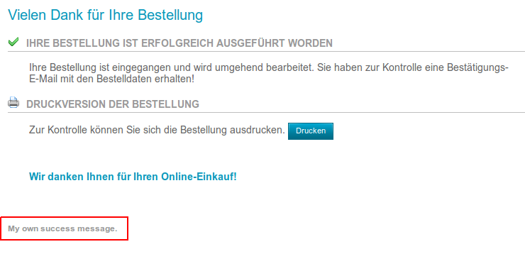

# Liste aller Extender

Extender sind eine Art Hook-Point-System. So kann an festgelegten Stellen zusätzlicher Quellcode als so genannter
Extender ausgeführt werden.

- [AdminApplicationBottomExtenderComponent](#AdminApplicationBottomExtenderComponent)
- [AdminApplicationTopExtenderComponent](#AdminApplicationTopExtenderComponent)
- [AdminApplicationTopPrimalExtenderComponent](#AdminApplicationTopPrimalExtenderComponent)
- [AdminCategoriesExtenderComponent](#AdminCategoriesExtenderComponent)
- [AdminCategoriesOverviewExtenderComponent](#AdminCategoriesOverviewExtenderComponent)
- [AdminEditCategoryExtenderComponent](#AdminEditCategoryExtenderComponent)
- [AdminEditProductExtenderComponent](#AdminEditProductExtenderComponent)
- [AdminHeaderExtenderComponent](#AdminHeaderExtenderComponent)
- [AdminLanguageExtenderComponent](#AdminLanguageExtenderComponent)
- [AdminOrderActionExtenderComponent](#AdminOrderActionExtenderComponent)
- [AdminOrderOverviewExtenderComponent (deprecated)](#AdminOrderOverviewExtenderComponent)
- [AdminOrderOverviewTableExtenderComponent (deprecated)](#AdminOrderOverviewTableExtenderComponent)
- [AdminOrderStatusMailExtenderComponent](#AdminOrderStatusMailExtenderComponent)
- [ApplicationBottomExtenderComponent](#ApplicationBottomExtenderComponent)
- [ApplicationTopExtenderComponent](#ApplicationTopExtenderComponent)
- [ApplicationTopPrimalExtenderComponent](#ApplicationTopPrimalExtenderComponent)
- [CheckoutSuccessExtenderComponent](#CheckoutSuccessExtenderComponent)
- [HeaderExtenderComponent](#HeaderExtenderComponent)
- [JSAccountExtenderComponent (deprecated)](#JSAccountExtenderComponent)
- [JSAccountHistoryExtenderComponent (deprecated)](#JSAccountHistoryExtenderComponent)
- [JSAddressBookProcessExtenderComponent (deprecated)](#JSAddressBookProcessExtenderComponent)
- [JSCallbackServiceExtenderComponent (deprecated)](#JSCallbackServiceExtenderComponent)
- [JSCartExtenderComponent (deprecated)](#JSCartExtenderComponent)
- [JSCatExtenderComponent (deprecated)](#JSCatExtenderComponent)
- [JSCheckoutExtenderComponent (deprecated)](#JSCheckoutExtenderComponent)
- [JSGlobalExtenderComponent (deprecated)](#JSGlobalExtenderComponent)
- [JSGVSendExtenderComponent (deprecated)](#JSGVSendExtenderComponent)
- [JSIndexExtenderComponent (deprecated)](#JSIndexExtenderComponent)
- [JSManufacturersExtenderComponent (deprecated)](#JSManufacturersExtenderComponent)
- [JSPriceOfferExtenderComponent (deprecated)](#JSPriceOfferExtenderComponent)
- [JSProductInfoExtenderComponent (deprecated)](#JSProductInfoExtenderComponent)
- [JSSectionExtenderComponent](#JSSectionExtenderComponent)
- [JSWishlistExtenderComponent (deprecated)](#JSWishlistExtenderComponent)
- [JSWithdrawalExtenderComponent (deprecated)](#JSWithdrawalExtenderComponent)
- [LoginExtenderComponent](#LoginExtenderComponent)
- [OrderExtenderComponent](#OrderExtenderComponent)
- [PDFOrderExtenderComponent](#PDFOrderExtenderComponent)
- [PostInstallationAdminExtendercomponent](#PostInstallationAdminExtendercomponent)
- [PostInstallationShopExtendercomponent](#PostInstallationShopExtendercomponent)
- [PostUpdateAdminExtendercomponent](#PostUpdateAdminExtendercomponent)
- [PostUpdateShopExtendercomponent](#PostUpdateShopExtendercomponent)


## <a name="AdminApplicationBottomExtenderComponent"></a>AdminApplicationBottomExtenderComponent

**Klassenname**
AdminApplicationBottomExtenderComponent

**Datei**
`system/extender/AdminApplicationBottomExtenderComponent.inc.php`

**Beschreibung**
Dieser Extender wird in der `application_bottom.php` im Gambio Admin eingebunden. Durch einen Overload ist es möglich, auf jeder Seite im Gambio Admin am Ende der Seite Quellcode auszuführen. Da der Extender außerhalb des Body-Tags geladen wird, sollte keine Ausgabe erzeugt werden.


## <a name="AdminApplicationTopExtenderComponent"></a>AdminApplicationTopExtenderComponent

**Klassenname**
AdminApplicationTopExtenderComponent

**Datei**
`system/extender/AdminApplicationTopExtenderComponent.inc.php`

**Beschreibung**
Dieser Extender wird in der `application_top.php` im Gambio Admin eingebunden. Durch einen Overload ist es möglich, auf jeder Seite im Gambio Admin zu Beginn der Seite Quellcode auszuführen. Da der Extender außerhalb des Body-Tags geladen wird, sollte keine Ausgabe erzeugt werden.


## <a name="AdminApplicationTopPrimalExtenderComponent"></a>AdminApplicationTopPrimalExtenderComponent

**Klassenname**
AdminApplicationTopPrimalExtenderComponent

**Datei**
`system/extender/AdminApplicationTopPrimalExtenderComponent.inc.php`

**Beschreibung**
Dieser Extender funktioniert analog zum [AdminApplicationTopExtender](#AdminApplicationTopExtenderComponent) mit dem Unterschied, dass dieser Extender an einer früheren Stelle der `application_top.php` ausgeführt wird. Dieser Extender ist die frühste Möglichkeit eigenen Code in den Gambio Admin zu injizieren.


## <a name="AdminCategoriesExtenderComponent"></a>AdminCategoriesExtenderComponent

**Klassenname**
AdminCategoriesExtenderComponent

**Datei**
`system/extender/AdminCategoriesExtenderComponent.inc.php`

**Beschreibung**
Dieser Extender wird in der `classes/categories.php` im Gambio Admin eingebunden. Durch einen Overload ist es möglich, bei der Bearbeitung (Speichern, Editieren oder Löschen) eines Produkts oder einer Kategorie einzugreifen und eigenen Quellcode einzubinden.


## <a name="AdminCategoriesOverviewExtenderComponent"></a>AdminCategoriesOverviewExtenderComponent (deprecated)

**Klassenname**
AdminCategoriesOverviewExtenderComponent

**Datei**
`system/extender/AdminCategoriesOverviewExtenderComponent.inc.php`

**Beschreibung**
Dieser Extender ist in der aktuellen Version 2.7.1.2 defekt.


## <a name="AdminEditCategoryExtenderComponent"></a>AdminEditCategoryExtenderComponent

**Klassenname**
AdminEditCategoryExtenderComponent

**Datei**
`system/extender/AdminEditCategoryExtenderComponent.inc.php`

**Beschreibung**
Dieser Extender dient der Erweiterung des Formulars in der Kategoriebearbeitung. Es gibt dabei vier verschiedene Ausgabepositionen, denen jeweils eigene Inhalte, wie Eingabefelder oder Informationen hinzugefügt werden können.

Die Positionen lauten:
- `top`: über den Kategoriestammdaten
- `left`: unter Kategorie-Filter
- `right`: unter der Position `left`
- `bottom`: unter den Kategoriedetails

Die Namen der Positionen `left` und `right` beschreiben deren Lage im alten Adminbereich (Version < 2.5) und wurden aus Gründen der Abwärtskompatibilität beibehalten.

Die Zuweisung von Inhalten zu einer Position folgt folgender Struktur:

```php
$this->v_output_buffer['<top|left|right|bottom>']['<custom_identifier>'] = array('title' => '<headline>', 'content' => '<content>');
```

- `<top|left|right|bottom>`: Positionsangabe für die entstehende Box (`top`, `left`, `right` oder `bottom`)
- `<custom_identifier>`: Eindeutiger Identifier für den Overload zur internen Identifikation
- `<headline>`: Freier Text für die Kopfzeile der entstehenden Box
- `<content>`: Inhalt der entstehenden Box

Beispiel für einen Overload des AdminEditCategoryExtenders:

```php
class SampleAdminEditCategoryExtender extends SampleAdminEditCategoryExtender_parent
{
	function proceed()
	{
		parent::proceed();
		
		$this->v_output_buffer['top']['sampleOverload'] = array('title' => 'TOP Headline', 'content' => 'Top content');
		$this->v_output_buffer['bottom']['sampleOverload'] = array('title' => 'BOTTOM Headline', 'content' => 'Bottom content');
		$this->v_output_buffer['left']['sampleOverload'] = array('title' => 'LEFT Headline', 'content' => 'Left content');
		$this->v_output_buffer['right']['sampleOverload'] = array('title' => 'RIGHT Headline', 'content' => 'Right content');
	}
}
```

Dieses Beispiel erzeugt Boxen mit Dummy-Werten an allen zur Verfügung stehenden Positionen.


## <a name="AdminEditProductExtenderComponent"></a>AdminEditProductExtenderComponent

**Klassenname**
AdminEditProductExtenderComponent

**Datei**
`system/extender/AdminEditProductExtenderComponent.inc.php`

**Beschreibung**
Dieser Extender dient der Erweiterung des Formulars in der Artikelbearbeitung. Es gibt dabei zwei verschiedene Ausgabepositionen, denen jeweils eigene Inhalte, wie Eingabefelder oder Informationen hinzugefügt werden können. Innerhalb des Extenders kann auf die Variable `product_data` zugegriffen werden, welche alle Artikeldaten enthält.

Die Positionen lauten:
  - `top`: unter der Filterauswahl
  - `bottom`: unter den Artikelbildern

Im alten Adminbereich gab es noch zwei weitere Positionen `left` und `right`. Diese werden in der aktuellen Version jedoch nicht unterstützt.

Die Zuweisung von Inhalten zu einer Position folgt folgender Struktur:

```php
$this->v_output_buffer['<top|bottom>']['<custom_identifier>'] = array('title' => '<headline>', 'content' => '<content>');
```

- `<top|bottom>`: Positionsangabe für die entstehende Box (`top` oder `bottom`)
- `<custom_identifier>`: Eindeutiger Identifier für den Overload zur internen Identifikation
- `<headline>`: Freier Text für die Kopfzeile der entstehenden Box
- `<content>`: Inhalt der entstehenden Box

Beispiel für einen Overload des AdminEditProductExtenders:

```php
class SampleAdminEditProductExtender extends SampleAdminEditProductExtender_parent
{
	function proceed()
	{
		parent::proceed();
		
		$this->v_output_buffer['top']['sample'] = array('title' => 'TOP Headline', 'content' => 'Top content');
		$this->v_output_buffer['bottom']['sample'] = array('title' => 'BOTTOM Headline', 'content' => 'Bottom content');
	}
}
```

Dieses Beispiel erzeugt Boxen mit Dummy-Werten an allen zur Verfügung stehenden Positionen.


## <a name="HeaderExtenderComponent"></a>HeaderExtenderComponent

**Klassenname**
AdminHeaderExtenderComponent

**Datei**
`system/extender/AdminHeaderExtenderComponent.inc.php`

**Beschreibung**
Dieser Extender wird überall im Gambio Admin eingebunden. Durch einen Overload kann dem <head> beliebiger Inhalt, wie z.B. JavaScript-Code, der auf jeder Seite im Shop ausgeführt werden soll, hinzugefügt werden. Die Einbindung des Overloads passiert als Letztes (Vorletztes in Honeygrid) im <head>-Bereich.


## <a name="AdminLanguageExtenderComponent"></a>AdminLanguageExtenderComponent

**Klassenname**
AdminLanguageExtenderComponent

**Datei**
`system/extender/AdminLanguageExtenderComponent.inc.php`

**Beschreibung**
Dieser Extender wird bei der Bearbeitunng einer Sprache auf der `admin/languages.php` ausgeführt.
<a name="AdminLanguageExtender_table"></a>Dabei wird zwischen folgenden Aktionen unterschieden:

|Aktion       |Beschreibung|Zugriff auf die LanguageId         |
|-------------|------------|-----------------------------------|
|insert       |Erstellen   |`$this->v_data_array['insert_id']` |
|copy         |Kopieren    |`$this->v_data_array['insert_id']` |
|save         |Ändern      |`$this->v_data_array['GET']['lID']`|
|deleteconfirm|Löschen     |`$this->v_data_array['GET']['lID']`|

Um auf die verschiedenen Aktionen unterschiedlich reagieren zu können, kann ein Switch auf `$this->v_data_array['GET']['action']` gemacht werden. Bei den verschiedenen Aktionen wird auf unterschiedliche Weise auf die ID der Sprache zugegriffen (siehe [Tabelle](#AdminLanguageExtender_table)).
Bei der Aktion `copy` kann auf die ID der Sprache, von der kopiert wurde, über `$this->v_data_array['POST']['ref_language_id']` zugegriffen werden.

Beispiel für einen Overload des AdminLanguageExtenders:

```php
class SampleAdminLanguageExtender extends SampleAdminLanguageExtender_parent
{
    public function proceed()
    {
        $logControl = MainFactory::create_object('LogControl', array(), true);
        
        switch($this->v_data_array['GET']['action'])
        {
            case 'insert':
                $logControl->notice('The language with ID ' .
                    (int)$this->v_data_array['insert_id'] .
                    ' was created.');
                break;
            case 'copy':
                $logControl->notice('The language with ID ' .
                    (int)$this->v_data_array['insert_id'] .
                    ' wurde von einer Sprache mit der ID ' .
                    (int)$this->v_data_array['POST']['ref_language_id'] .
                    ' was copied.');
                break;
            case 'save':
                $logControl->notice('The language with ID ' .
                    (int)$this->v_data_array['GET']['lID'] .
                    ' was changed.');
                break;
            case 'deleteconfirm':
                $logControl->notice('The language with ID ' .
                    (int)$this->v_data_array['GET']['lID'] .
                    ' was deleted.');
                break;
        }

        parent::proceed();
    }
}
```

Dieses Beispiel erzeugt je nach ausgeführter Aktion verschiedene Logeinträge.


## <a name="AdminOrderActionExtenderComponent"></a>AdminOrderActionExtenderComponent

**Klassenname**
AdminOrderActionExtenderComponent

**Datei**
`system/extender/AdminOrderActionExtenderComponent.inc.php`

**Beschreibung**
Dieser Extender wird ausgeführt wenn über die Bestellübersicht (`admin/orders.php`) Aktionen durchgeführt werden. Sobald der GET-Parameter `action` befüllt ist, kommt der Extender zur Ausführung und kann somit auch genutzt werden, um eigene Aktionen zu definieren.
Es wird empfohlen, diesen Extender in Kombination mit dem [AdminOrderOverviewExtender](#AdminOrderOverviewExtenderComponent) zu nutzen.

Folgende Aktionen gibt es aktuell:

|Aktion         |Beschreibung                     |Besondere Parameter                                      |
|---------------|---------------------------------|---------------------------------------------------------|
|update_order   |Änderung des Bestellstatus       |`$this->v_data_array['order_updated']` - Erfolgsindikator|
|gm_multi_status|Änderung mehrer Bestellstatus    |`$this->v_data_array['order_updated']` - Erfolgsindikator|
|resendordermail|Bestellbestätigung neu generieren|                                                         |
|deleteconfirm  |Löschen                          |                                                         |
|deleteccinfo   |Kreditkarteninformationen löschen|                                                         |
|afterbuy_send  |Afterbuy                         |                                                         |

Um auf die verschiedenen Aktionen unterschiedlich reagieren zu können, kann ein Switch auf `$this->v_data_array['action']` gemacht werden.

Beispiel für einen Overload des AdminOrderActionExtender:

```php
class SyncCustomerEmail extends SyncCustomerEmail_parent
{
    public function proceed()
    {
        switch($this->v_data_array['action'])
        {
            case 'sync_email_address':
                $this->_syncEmailAddress(new IdType((int)$this->v_data_array['GET']['oID']));
                break;
        }

        parent::proceed();
    }
    
    private function _syncEmailAddress(IdType $orderId)
    {
        $orderReadService = StaticGXCoreLoader::getService('OrderRead');
        $orderWriteService = StaticGXCoreLoader::getService('OrderWrite');
        $customerReadService = StaticGXCoreLoader::getService('CustomerRead');
        
        $order = $orderReadService->getOrderById($orderId);
        $customerId = new IdType($order->getCustomerId());
        $customer = $customerReadService->getCustomerById($customerId);
        $actualEmail = $customer->getEmail();

        $order->setCustomerEmail(new EmailStringType((string)$actualEmail));
        $orderWriteService->updateOrder($order);
    }
}
```

Dieses Beispiel reagiert auf den action-Parameter `sync_email_address` und ersetzt die Email-Adresse, die in einer Bestellung hinterlegt ist, durch die aktuelle Email-Adresse, die im Kundendatensatz angegeben ist.


## <a name="AdminOrderOverviewExtenderComponent"></a>AdminOrderOverviewExtenderComponent (deprecated)

**Klassenname**
AdminOrderOverviewExtenderComponent

**Datei**
`system/extender/AdminOrderOverviewExtenderComponent.inc.php`

**Beschreibung**
Dieser Extender ist nicht mehr aktuell. Um der Bestellübersicht eine neue Aktion hinzuzufügen, siehe [Erweitern der Bestellübersicht (Aktionen)](extend-orders-overview-actions.md).

Dieser Extender bietet die Möglichkeit der Bestellübersicht neue Aktionen hinzuzufügen. Die Aktionen stehen in den Button-Dropdowns der einzelnen Zeilen der Bestellübersicht zur Verfügung. Aktuell funktioniert dies nur korrekt für Aktionen einzelner Bestellungen und nicht für mehrere Bestellungen gleichzeitig.
Es wird empfohlen, diesen Extender in Kombination mit dem [AdminOrderActionExtender](#AdminOrderActionExtender) zu nutzen.

Die Erzeugung einer neuen Einzelaktion folgt folgender Grammatik:
`$this->v_output_buffer['single_action'] = '<a href="<script>?oID=0[&<any_parameters>]') . '"><menu_text></a>'`

  - `<script>`: Auszuführendes Skript (häufig `orders.php`)
  - `<menu_text>`: Aktionslabel im Button-Dropdown
  - `oID=0`: Ein Skript sorgt automatisch dafür, dass die `0` gegen die korrekte `oID` (Bestellnummer) eingetragen wird
  - `<any_parameters>` (optional): Beliebige Parameter, je nachdem, was das Skript benötigt

Beispiel für einen Overload des AdminOrderOverviewExtender:

```php
class SyncCustomerEmailMenuItem extends SyncCustomerEmailMenuItem_parent
{
    function proceed()
    {
        parent::proceed();

        $this->v_output_buffer['single_action'] = '<a href="' .
            xtc_href_link('orders.php', 'oID=0&action=sync_email_address') .
            '">Synchronize email address</a>';
    }
}
```

Das Beispiel erzeugt im Button-Dropdown einen neuen Eintrag `Synchronize email address`, der den Link `orders.php?oID=0&action=sync_email_address` aufruft (vgl. [AdminOrderActionExtender](#AdminOrderActionExtenderComponent)).


## <a name="AdminOrderOverviewTableExtenderComponent"></a>AdminOrderOverviewTableExtenderComponent (deprecated)

**Klassenname**
AdminOrderOverviewTableExtenderComponent

**Datei**
`system/extender/AdminOrderOverviewTableExtenderComponent.inc.php`

**Beschreibung**
Dieser Extender ist nicht mehr aktuell. Um der Bestellübersicht eine neue Spalte hinzuzufügen, siehe [Erweitern der Bestellübersicht (Tabelle)](extend-orders-overview-table.md).

Mit diesem Extender ist es möglich der Bestellübersicht (`admin/orders.php`) eine neue Spalte hinzuzufügen.

Beispiel für einen Overload des AdminOrderOverviewTableExtender:

```php
class EmailColumn extends EmailColumn_parent
{
	private $columnName = 'EmailColumn';
	
	public function __construct()
	{
		$this->setHeadCell($this->columnName, 'Email');
		$this->setWidth($this->columnName, '50px');
		$this->setHeadClasses($this->columnName, 'link-style email-style');
		
		parent::__construct();
	}

	public function proceed()
	{
		$this->setClasses($this->columnName, 'sample_class_2');
		$this->setContent($this->columnName, $this->getContent());

		parent::proceed();
	}

	private function getContent()
	{
		$orderReadService = StaticGXCoreLoader::getService('OrderRead');
		$order = $orderReadService->getOrderById($this->orderId);
		$email = $order->getCustomerEmail();

		$content = '<a href="mailto:' . $email . '">' . $email . '</a>';

		return $content;
	}
}
```

Dieses Beispiel fügt eine Spalte mit der verlinkten Email-Adresse des Kunden in die Bestellübersicht ein.


## <a name="AdminOrderStatusMailExtenderComponent"></a>AdminOrderStatusMailExtenderComponent

**Klassenname**
AdminOrderStatusMailExtenderComponent

**Datei**
`system/extender/AdminOrderStatusMailExtenderComponent.inc.php`

**Beschreibung**
Mit diesem Extender können der E-Mail zur Bestellstatusänderung zusätzliche Inhalte hinzugefügt werden.
Die Zuweisung der Inhalte folgt folgender Grammatik:
 
`$this->v_output_buffer[<variable_name>] = <content>`

`<variable_name>`: Variablenname für die E-Mail-Vorlage
`<content>`: Content, der der Mail hinzugefügt werden soll

Die Variable kann in der E-Mail-Vorlage **Admin: Änderung Bestellstatus** im Quellcode-Modus mit `{$<variable_name>}`, also z.B. `{$lorem_ipsum}` genutzt werden.


Beispiel für einen Overload des AdminOrderStatusMailExtender:

```php
class SampleAdminOrderStatusMailExtender extends SampleAdminOrderStatusMailExtender_parent
{
    public function proceed()
    {
        $this->v_output_buffer['lorem_ipsum'] = 'Lorem ipsum dolor sit amet.';
        
        parent::proceed();
    }
}
```

Das Beispiel fügt den Text "Lorem ipsum dolor sit amet." in die E-Mail zur Bestellstatusänderung ein.


## <a name="ApplicationBottomExtenderComponent"></a>ApplicationBottomExtenderComponent

**Klassenname**
ApplicationBottomExtenderComponent

**Datei**
`system/extender/ApplicationBottomExtenderComponent.inc.php`

**Beschreibung**
Dieser Extender wird in der `application_bottom.php` im Shop eingebunden. Durch einen Overload ist es möglich, auf jeder Seite im Shop am Ende der Seite Quellcode auszuführen. Da der Extender innerhalb des Body-Tags geladen wird, kann neben PHP-Code auch eine HTML-Ausgabe erzeugt und somit auch JavaScript und CSS ausgeführt werden.

In einem Overload des ApplicationBottomExtenders stehen folgende Daten zur Verfügung:

|Zugriff                             |Beschreibung                                                      |
|------------------------------------|------------------------------------------------------------------|
|`$this->v_data_array['cPath']`      |Kategoriepfad: Eine Folge von "_"-separierten Kategorie-IDs       |
|`$this->v_data_array['products_id']`|Artikel-ID                                                        |
|`$this->v_page`                     |Seitentitel: Mögliche Titel sind unten stehenden Tabelle zu finden|

Folgende Seitentitel sind als Wert für `$this->v_page` möglich:

|Seitentitel       |Beschreibung                         |
|------------------|-------------------------------------|
|Account           |Kunden-/Gastregistrierung            |
|AccountHistory    |Bestellansicht unter "Ihr Konto"     |
|AddressBookProcess|Speicherung eines Adressbuchteintrags|
|CallbackService   |Callback-Service                     |
|Cart              |Warenkorb                            |
|Cat               |Kategorieseite                       |
|Checkout          |Alle Checkout-Seiten                 |
|GVSend            |Senden eines Gutscheins              |
|Index             |Startseite                           |
|Manufacturers     |Herstellerseite                      |
|PriceOffer        |"Woanders günstiger?"-Seite          |
|ProductInfo       |Artikeldetailseite                   |
|Wishlist          |Merkzettel                           |
|Withdrawal        |Widerrufsformular                    |

Beispiel für einen Overload des ApplicationBottomExtenders:

```php
class SampleApplicationBottomExtender extends SampleApplicationBottomExtender_parent
{
	function proceed()
	{
		$this->v_output_buffer[] = '<span id="my_span">This is my span.</span>';
		$this->v_output_buffer[] = '<style type="text/css">.green { color: green; }</style>';
        $this->v_output_buffer[] = '<script type="text/javascript">$("#my_span").addClass("green");</script>';

		parent::proceed();
	}
}
```

Dieses Beispiel fügt einen Text "This is my span." unten auf jeder Seite des Shops ein, definiert eine CSS-Klasse "green", die Text grün färbt und führt JavaScript-Code aus, der dem Text diese Klasse zuweist.


## <a name="ApplicationTopExtenderComponent"></a>ApplicationTopExtenderComponent

**Klassenname**
ApplicationTopExtenderComponent

**Datei**
`system/extender/ApplicationTopExtenderComponent.inc.php`

**Beschreibung**
Dieser Extender wird in der `application_top.php` im Shop eingebunden. Durch einen Overload ist es möglich, auf jeder Seite im Shop zu Beginn der Seite Quellcode auszuführen. Da der Extender außerhalb des Body-Tags geladen wird, sollte keine Ausgabe erzeugt werden.


## <a name="ApplicationTopPrimalExtenderComponent"></a>ApplicationTopPrimalExtenderComponent

**Klassenname**
ApplicationTopPrimalExtenderComponent

**Datei**
`system/extender/ApplicationTopPrimalExtenderComponent.inc.php`

**Beschreibung**
Dieser Extender funktioniert analog zum [ApplicationTopExtender](#ApplicationTopExtenderComponent) mit dem Unterschied, dass dieser Extender an einer früheren Stelle der `application_top.php` ausgeführt wird. Dieser Extender ist die frühste Möglichkeit eigenen Code in den Shop zu injizieren.


## <a name="CheckoutSuccessExtenderComponent"></a>CheckoutSuccessExtenderComponent

**Klassenname**
CheckoutSuccessExtenderComponent

**Datei**
`system/extender/CheckoutSuccessExtenderComponent.inc.php`

**Beschreibung**
Dieser Extender wird in der `checkout_success.php` eingebunden. Durch einen Overload ist es möglich, im Shop nach einer erfolgreichen Bestellung Quellcode auszuführen und eigenen HTML-Code hinzuzufügen. Das Hinzufügen von HTML-Code ist auf verschiedene Weisen möglich:

1. **Hinzufügen von Inhalten an beliebiger Position**
Damit HTML dargestellt werden kann, muss eine entsprechende Smarty-Variable (z.B. `{$lorem_ipsum}`) dem `checkout_success`-Template hinzugefügt werden. Dieses ist unter `templates/<EyeCandy|Honeygrid>/module/checkout_success.html` zu finden. Die Variable kann an beliebiger Stelle im Template positioniert werden. Damit diese Änderung update-sicher implementiert werden kann sollte dazu das [Usermod-System](usermod.md) verwendet werden.
Die Zuweisung der Smarty-Variable folgt folgender Grammatik:

    `$this->v_output_buffer['<variable_name>'] = '<html_code>'`
    
    - `<variable_name>`: Variablenname im `checkout_success`-Template (z.B. `'lorem_ipsum'`)
    - `<html_code>`: Beliebiger HTML-Code

2. **Hinzufügen von Inhalten an fester Position**
Etwas leichter zu verwenden ist die zweite Variante zum Hinzufügen von Inhalten an fester Position. Der hinzugefügte HTML-Code wird direkt unter der Erfolgsmeldung, nach erfolgreich abgeschlossener Bestellung, angezeigt.
Das Hinzufügen von HTML-Code folgt folgender Grammatik:

    `$this->html_output_array[] = '<html_code>'`
    
    - `<html_code>`: Beliebiger HTML-Code

Auf die ID der erzeugten Bestellung kann man über `$this->v_data_array['orders_id']` zugreifen.

Beispiel für einen Overload des CheckoutSuccessExtenders:

```php
class SampleCheckoutSuccessExtender extends SampleCheckoutSuccessExtender_parent
{
    public function proceed()
    {
        parent::proceed();

        $this->_someLogic(new IdType($this->v_data_array['orders_id']));

        $this->html_output_array[] = '<b>My own success message.</b>';
    }
    
    private function _someLogic(IdType $orderId)
    {
        // Some logic
    }
}
```

In diesem Beispiel wird unter der Erfolgsmeldung ein Text "My own success message." in Fettschrift angezeigt.




## <a name="HeaderExtenderComponent"></a>HeaderExtenderComponent

**Klassenname**
HeaderExtenderComponent

**Datei**
`system/extender/HeaderExtenderComponent.inc.php`

**Beschreibung**
Dieser Extender wird überall im Shop eingebunden. Durch einen Overload kann dem <head> beliebiger Inhalt, wie z.B. JavaScript-Code, der auf jeder Seite im Shop ausgeführt werden soll, hinzugefügt werden. Die Einbindung des Overloads passiert als Letztes (Vorletztes in Honeygrid) im <head>-Bereich.


## <a name="JSAccountExtenderComponent"></a>JSAccountExtenderComponent (deprecated)

**Klassenname**
JSAccountExtenderComponent

**Datei**
`system/extender/JSAccountExtenderComponent.inc.php`

**Beschreibung**
Dieser Extender läuft nur noch mit dem EyeCandy-Template. Für Honeygrid sollte das [Usermod-System](usermod.md) genutzt werden.
Dieser JavaScript-Extender wird auf den Kundenregistierungsseiten geladen. Durch einen Overload kann JavaScript-Code speziell für diesen Bereich geladen werden, der nur bei Erstellung eines Kontos ausgeführt werden soll.
Die Ausgabe des JavaScript-Codes erfolgt über ein `echo '<some_js_code>'` (z.B. `echo 'alert("Hello World!");'`) oder ein `include_once('some_script.js')`. Der Inhalt des Overloads wird nach Einbindung aller genutzten Frameworks, wie jQuery ausgeführt, so dass diese genutzt werden können.


## <a name="JSAccountHistoryExtenderComponent"></a>JSAccountHistoryExtenderComponent (deprecated)

**Klassenname**
JSAccountHistoryExtenderComponent

**Datei**
`system/extender/JSAccountHistoryExtenderComponent.inc.php`

**Beschreibung**
Dieser Extender läuft nur noch mit dem EyeCandy-Template. Für Honeygrid sollte das [Usermod-System](usermod.md) genutzt werden.
Dieser JavaScript-Extender wird auf allen Account-History-Seiten geladen. Durch einen Overload kann JavaScript-Code speziell für diesen Bereich geladen werden, der nur bei der Darstellung einer bestehenden Bestellung ausgeführt werden soll.
Die Ausgabe des JavaScript-Codes erfolgt über ein `echo '<some_js_code>'` (z.B. `echo 'alert("Hello World!");'`) oder ein `include_once('some_script.js')`. Der Inhalt des Overloads wird nach Einbindung aller genutzten Frameworks, wie jQuery ausgeführt, so dass diese genutzt werden können.


## <a name="JSAddressBookProcessExtenderComponent"></a>JSAddressBookProcessExtenderComponent (deprecated)

**Klassenname**
JSAddressBookProcessExtenderComponent

**Datei**
`system/extender/JSAddressBookProcessExtenderComponent.inc.php`

**Beschreibung**
Dieser Extender läuft nur noch mit dem EyeCandy-Template. Für Honeygrid sollte das [Usermod-System](usermod.md) genutzt werden.
Dieser JavaScript-Extender wird bei der Speicherung eines Adressbucheintrags geladen.
Die Ausgabe des JavaScript-Codes erfolgt über ein `echo '<some_js_code>'` (z.B. `echo 'alert("Hello World!");'`) oder ein `include_once('some_script.js')`. Der Inhalt des Overloads wird nach Einbindung aller genutzten Frameworks, wie jQuery ausgeführt, so dass diese genutzt werden können.


## <a name="JSCallbackServiceExtenderComponent"></a>JSCallbackServiceExtenderComponent (deprecated)

**Klassenname**
JSCallbackServiceExtenderComponent

**Datei**
`system/extender/JSCallbackServiceExtenderComponent.inc.php`

**Beschreibung**
Dieser Extender läuft nur noch mit dem EyeCandy-Template. Für Honeygrid sollte das [Usermod-System](usermod.md) genutzt werden.
Dieser JavaScript-Extender wird auf der Callback-Service-Seite geladen.
Die Ausgabe des JavaScript-Codes erfolgt über ein `echo '<some_js_code>'` (z.B. `echo 'alert("Hello World!");'`) oder ein `include_once('some_script.js')`. Der Inhalt des Overloads wird nach Einbindung aller genutzten Frameworks, wie jQuery ausgeführt, so dass diese genutzt werden können.


## <a name="JSCartExtenderComponent"></a>JSCartExtenderComponent (deprecated)

**Klassenname**
JSCartExtenderComponent

**Datei**
`system/extender/JSCartExtenderComponent.inc.php`

**Beschreibung**
Dieser Extender läuft nur noch mit dem EyeCandy-Template. Für Honeygrid sollte das [Usermod-System](usermod.md) genutzt werden.
Dieser JavaScript-Extender wird im Warenkorb geladen.
Die Ausgabe des JavaScript-Codes erfolgt über ein `echo '<some_js_code>'` (z.B. `echo 'alert("Hello World!");'`) oder ein `include_once('some_script.js')`. Der Inhalt des Overloads wird nach Einbindung aller genutzten Frameworks, wie jQuery ausgeführt, so dass diese genutzt werden können.


## <a name="JSCatExtenderComponent"></a>JSCatExtenderComponent (deprecated)

**Klassenname**
JSCatExtenderComponent

**Datei**
`system/extender/JSCatExtenderComponent.inc.php`

**Beschreibung**
Dieser Extender läuft nur noch mit dem EyeCandy-Template. Für Honeygrid sollte das [Usermod-System](usermod.md) genutzt werden.
Dieser JavaScript-Extender wird in der Kategorie-Ansicht geladen.
Die Ausgabe des JavaScript-Codes erfolgt über ein `echo '<some_js_code>'` (z.B. `echo 'alert("Hello World!");'`) oder ein `include_once('some_script.js')`. Der Inhalt des Overloads wird nach Einbindung aller genutzten Frameworks, wie jQuery ausgeführt, so dass diese genutzt werden können.


## <a name="JSCheckoutExtenderComponent"></a>JSCheckoutExtenderComponent (deprecated)

**Klassenname**
JSCheckoutExtenderComponent

**Datei**
`system/extender/JSCheckoutExtenderComponent.inc.php`

**Beschreibung**
Dieser Extender läuft nur noch mit dem EyeCandy-Template. Für Honeygrid sollte das [Usermod-System](usermod.md) genutzt werden.
Dieser JavaScript-Extender wird im Bestellvorgang geladen.
Die Ausgabe des JavaScript-Codes erfolgt über ein `echo '<some_js_code>'` (z.B. `echo 'alert("Hello World!");'`) oder ein `include_once('some_script.js')`. Der Inhalt des Overloads wird nach Einbindung aller genutzten Frameworks, wie jQuery ausgeführt, so dass diese genutzt werden können.


## <a name="JSGlobalExtenderComponent"></a>JSGlobalExtenderComponent (deprecated)

**Klassenname**
JSGlobalExtenderComponent

**Datei**
`system/extender/JSGlobalExtenderComponent.inc.php`

**Beschreibung**
Dieser Extender läuft nur noch mit dem EyeCandy-Template. Für Honeygrid sollte das [Usermod-System](usermod.md) genutzt werden.
Dieser JavaScript-Extender wird auf allen Seiten des Shops geladen.
Die Ausgabe des JavaScript-Codes erfolgt über ein `echo '<some_js_code>'` (z.B. `echo 'alert("Hello World!");'`) oder ein `include_once('some_script.js')`. Der Inhalt des Overloads wird nach Einbindung aller genutzten Frameworks, wie jQuery ausgeführt, so dass diese genutzt werden können.


## <a name="JSGVSendExtenderComponent"></a>JSGVSendExtenderComponent (deprecated)

**Klassenname**
JSGVSendExtenderComponent

**Datei**
`system/extender/JSGVSendExtenderComponent.inc.php`

**Beschreibung**
Dieser Extender läuft nur noch mit dem EyeCandy-Template. Für Honeygrid sollte das [Usermod-System](usermod.md) genutzt werden.
Dieser JavaScript-Extender wird auf der “Gutschein versenden” Seite geladen.
Die Ausgabe des JavaScript-Codes erfolgt über ein `echo '<some_js_code>'` (z.B. `echo 'alert("Hello World!");'`) oder ein `include_once('some_script.js')`. Der Inhalt des Overloads wird nach Einbindung aller genutzten Frameworks, wie jQuery ausgeführt, so dass diese genutzt werden können.


## <a name="JSIndexExtenderComponent"></a>JSIndexExtenderComponent (deprecated)

**Klassenname**
JSIndexExtenderComponent

**Datei**
`system/extender/JSIndexExtenderComponent.inc.php`

**Beschreibung**
Dieser Extender läuft nur noch mit dem EyeCandy-Template. Für Honeygrid sollte das [Usermod-System](usermod.md) genutzt werden.
Dieser JavaScript-Extender wird auf der Startseite des Shops geladen.
Die Ausgabe des JavaScript-Codes erfolgt über ein `echo '<some_js_code>'` (z.B. `echo 'alert("Hello World!");'`) oder ein `include_once('some_script.js')`. Der Inhalt des Overloads wird nach Einbindung aller genutzten Frameworks, wie jQuery ausgeführt, so dass diese genutzt werden können.


## <a name="JSManufacturersExtenderComponent"></a>JSManufacturersExtenderComponent (deprecated)

**Klassenname**
JSManufacturersExtenderComponent

**Datei**
`system/extender/JSManufacturersExtenderComponent.inc.php`

**Beschreibung**
Dieser Extender läuft nur noch mit dem EyeCandy-Template. Für Honeygrid sollte das [Usermod-System](usermod.md) genutzt werden.
Dieser JavaScript-Extender wird auf der Herstellerseite des Shops geladen.
Die Ausgabe des JavaScript-Codes erfolgt über ein `echo '<some_js_code>'` (z.B. `echo 'alert("Hello World!");'`) oder ein `include_once('some_script.js')`. Der Inhalt des Overloads wird nach Einbindung aller genutzten Frameworks, wie jQuery ausgeführt, so dass diese genutzt werden können.


## <a name="JSPriceOfferExtenderComponent"></a>JSPriceOfferExtenderComponent (deprecated)

**Klassenname**
JSPriceOfferExtenderComponent

**Datei**
`system/extender/JSPriceOfferExtenderComponent.inc.php`

**Beschreibung**
Dieser Extender läuft nur noch mit dem EyeCandy-Template. Für Honeygrid sollte das [Usermod-System](usermod.md) genutzt werden.
Dieser JavaScript-Extender wird auf der “Woanders günstiger?”-Seite des Shops geladen.
Die Ausgabe des JavaScript-Codes erfolgt über ein `echo '<some_js_code>'` (z.B. `echo 'alert("Hello World!");'`) oder ein `include_once('some_script.js')`. Der Inhalt des Overloads wird nach Einbindung aller genutzten Frameworks, wie jQuery ausgeführt, so dass diese genutzt werden können.


## <a name="JSProductInfoExtenderComponent"></a>JSProductInfoExtenderComponent (deprecated)

**Klassenname**
JSProductInfoExtenderComponent

**Datei**
`system/extender/JSProductInfoExtenderComponent.inc.php`

**Beschreibung**
Dieser Extender läuft nur noch mit dem EyeCandy-Template. Für Honeygrid sollte das [Usermod-System](usermod.md) genutzt werden.
Dieser JavaScript-Extender wird auf der Produktdetailseite des Shops geladen.
Die Ausgabe des JavaScript-Codes erfolgt über ein `echo '<some_js_code>'` (z.B. `echo 'alert("Hello World!");'`) oder ein `include_once('some_script.js')`. Der Inhalt des Overloads wird nach Einbindung aller genutzten Frameworks, wie jQuery ausgeführt, so dass diese genutzt werden können.


## <a name="JSSectionExtenderComponent"></a>JSSectionExtenderComponent

**Klassenname**
JSSectionExtenderComponent

**Datei**
`system/extender/JSSectionExtenderComponent.inc.php`

**Beschreibung**
Dieser JavaScript-Extender ist ein spezieller Extender und kann auf allen Seiten des Gambio Admins genutzt werden. Über spezielle Parameter, die der `gm_javascript.js.php` übergeben werden, kann bereichsspezifischer JavaScript-Code geladen werden.

Beispielaufruf der `gm_javascript.js.php`:
```
gm_javascript.js.php?page=Section&globals=off&section=my_section
```

|Parametername     |Mögliche Werte  |Beschreibung                                                                      |
|------------------|----------------|----------------------------------------------------------------------------------|
|page              |`Section`       |Um den JSSectionExtender zu nutzen, muss dieser Parameter den Wert `Section` haben|
|section           |`<section_name>`|Der Name der Section und Name der ausgeführten Methode im Overload                |
|globals (optional)|`on`\|`off`     |Indikator, ob globale JavaScripte, wie jQuery und jQuery-UI geladen werden sollen |
[Parameter]

Die gm_javascript.js.php liefert bei diesem Aufruf alle JavaScripte zurück, die in der Funktion `my_section` eingebunden werden. Die Section entspricht dabei einer Funktion, welche in einem Overload des JSSectionExtenders definiert ist.

Beispiel für einen Overload des JSSectionExtenders:
```php
class SampleJSSectionExtender extends SampleJSSectionExtender_parent
{
	protected function my_section()
	{
		echo 'alert("This is my section.");';
	}
}
```

Dieses Beispiel führt bei einem include von `gm_javascript.js.php?page=Section&section=my_section` einen `alert` mit dem Text "This is my section." aus.


## <a name="JSWishlistExtenderComponent"></a>JSWishlistExtenderComponent (deprecated)

**Klassenname**
JSWishlistExtenderComponent

**Datei**
`system/extender/JSWishlistExtenderComponent.inc.php`

**Beschreibung**
Dieser Extender läuft nur noch mit dem EyeCandy-Template. Für Honeygrid sollte das [Usermod-System](usermod.md) genutzt werden.
Dieser JavaScript-Extender wird im Merkzettel geladen.
Die Ausgabe des JavaScript-Codes erfolgt über ein `echo '<some_js_code>'` (z.B. `echo 'alert("Hello World!");'`) oder ein `include_once('some_script.js')`. Der Inhalt des Overloads wird nach Einbindung aller genutzten Frameworks, wie jQuery ausgeführt, so dass diese genutzt werden können.


## <a name="JSWithdrawalExtenderComponent"></a>JSWithdrawalExtenderComponent (deprecated)

**Klassenname**
JSWithdrawalExtenderComponent

**Datei**
`system/extender/JSWithdrawalExtenderComponent.inc.php`

**Beschreibung**
Dieser Extender läuft nur noch mit dem EyeCandy-Template. Für Honeygrid sollte das [Usermod-System](usermod.md) genutzt werden.
Dieser JavaScript-Extender wird im Widerrufsformular geladen.
Die Ausgabe des JavaScript-Codes erfolgt über ein `echo '<some_js_code>'` (z.B. `echo 'alert("Hello World!");'`) oder ein `include_once('some_script.js')`. Der Inhalt des Overloads wird nach Einbindung aller genutzten Frameworks, wie jQuery ausgeführt, so dass diese genutzt werden können.


## <a name="LoginExtenderComponent"></a>LoginExtenderComponent

**Klassenname**
LoginExtenderComponent

**Datei**
`system/extender/LoginExtenderComponent.inc.php`

**Beschreibung**
Dieser Extender wird beim Login geladen. Durch einen Overload kann eigener Quellcode beim Login ausgeführt werden. Zur Anzeige von Inhalten ist dieser Extender nicht geeignet.
Bei der Verwendung dieses Extenders steht eine Methode `get_customer()` zur Verfügung, die den Kundendatensatz des Einloggenden in form eines `GMDataObjects` zurückgibt. Außerdem steht die ID des Kunden `$this->v_data_array['customers_id']` zur Verfügung.


## <a name="OrderExtenderComponent"></a>OrderExtenderComponent

**Klassenname**
OrderExtenderComponent

**Datei**
`system/extender/OrderExtenderComponent.inc.php`

**Beschreibung**
Dieser Extender wird im Gambio Admin auf der Detailseite einer Bestellung aufgerufen. Über diesen Extender können weitere Container hinzugefügt werden (bspw. für Zahlungsmodule wie SEPA oder PayPal).
Aktuell gibt es fünf Positionen, denen Inhalte hinzugefügt werden können. Vier von diesen Positionen haben zusätzlich eine Kopfzeile, die mit dem suffix `_heading` gesetzt werden kann.

|Position            |Kopfzeile                   |Beschreibung                                                                      |
|--------------------|----------------------------|----------------------------------------------------------------------------------|
|`below_product_data`|`below_product_data_heading`|Unter den Artikeldaten über die gesamte Breite                                    |
|`below_order_info`  |`below_order_info_heading`  |Unter den Bestellinformationen links (Rechnungs-/Lieferanschrift)                 |
|`below_withdrawal`  |`below_withdrawal_heading`  |Unter den Widerrufen rechts                                                       |
|`below_history`     |`below_history_heading`     |Unter der Bestellstatushistorie links                                             |
|`order_status`      |-                           |Unter dem Kommentarfeld im "Bestellstatus ändern"-Dialog (innerhalb des Formulars)|
[Verfügbare Positionen]

Bei der Position `below_order_info` kann es zu Verschiebungen der Inhalte kommen, da sie zuweilen von bestehenden Modulen genutzt wird und die Reihenfolge innerhalb einer Position nicht beeinflusst werden kann.

```php
class SampleOrderExtender extends SampleOrderExtender_parent
{
	public function proceed()
	{
		$this->v_output_buffer['below_order_info_heading'] = 'below_order_info TITLE';
		$this->v_output_buffer['below_order_info']         = '<div style="color: #0000FF">below_order_info CONTENT</div>';
		
		$this->v_output_buffer['below_withdrawal_heading'] = 'below_withdrawal TITLE';
		$this->v_output_buffer['below_withdrawal']         = '<div style="color: #0000FF">below_withdrawal CONTENT</div>';
		
		$this->v_output_buffer['below_history_heading'] = 'below_history TITLE';
		$this->v_output_buffer['below_history']         = '<div style="color: #0000FF">below_history CONTENT</div>';
		
		$this->v_output_buffer['below_product_data_heading'] = 'below_product_data TITLE';
		$this->v_output_buffer['below_product_data']         = '<div style="color: #0000FF">below_product_data CONTENT</div>';
		
		$this->v_output_buffer['order_status'] = '<div style="color: #0000FF">order_status CONTENT</div>';
		
		//The following two rows need to be at the end of every overload of the OrderExtender
		$this->addContent();
		parent::proceed();
	}
}
```

Dieses Beispiel gibt einen kurzen Beispieltext an allen verfügbaren Positionen des Extenders aus.


## <a name="PDFOrderExtenderComponent"></a>PDFOrderExtenderComponent

**Klassenname**
PDFOrderExtenderCompontent

**Datei**
`system/extender/PDFOrderExtenderComponent.inc.php`

**Beschreibung**
Dieser Extender wird in `admin/gm_pdf_order.php` unmittelbar vor der Erzeugung der PDF-Dokumente eingebunden und erlaubt die nahezu vollständige Manipulation der Daten, die der Erstellung von Rechnungen/Lieferscheinen zugrunde liegen. Dies erlaubt insbesondere das Einbringen zahlungsartabhängiger Angaben. Dazu wird zu jedem manipulierbaren Inhalt eine Methode bereitgestellt, die Überladen werden kann.

Folgende Inhalte können manipuliert werden:

|Methodenname                |Art des Inhalts                                                                           |
|----------------------------|------------------------------------------------------------------------------------------|
|`extendOrderRight()`        |Firmenadresse, Kundennummer, Bestelldatum, Bestellnummer, Rechnungs-/Liefernummer, Datum  |
|`extendOrderData()`         |Artikeldaten: Modell, Name, Menge, Einheit, Steuern, Einzelpreis, Preis, Attribute        |
|`extendOrderTotal()`        |Zusammenfassung: Zwischensumme, Summe netto, Summe, etc.                                  |
|`extendOrderInfo()`         |Versandadresse, Zahlmethode, Versandart, Hinweistext                                      |
|`extendPdfFooter()`         |Fußzeile: Firmenadresse, Kontoninformationen, etc.                                        |
|`extendPdfFonts()`          |Angaben zur Schriftart in Bezug auf die verschiedenen Teile der Rechnung/des Lieferscheins|
|`extendGmPdfValues()`       |Verschiedene Layout-Einstellungen, wie Abstände und Anzeige-Flags                         |
|`extendGmOrderPdfValues()`  |Weitere Layout-Einstellungen                                                              |
|`extendGmUseProductsModel()`|Einstellung, ob das Modell genutzt werden soll (wirkt sich auf das Layout aus)            |

Zusätzlich stehen diverse Informationen zur Verfügung:

|Zugriff                             |Beschreibung                                                                             |
|------------------------------------|-----------------------------------------------------------------------------------------|
|`$this->v_data_array['type']`       |Art des Dokuments (mögliche Werte: `invoice`\|`packingslip`)                             |
|`$this->v_data_array['order_id']`   |Bestellnummer                                                                            |
|`$this->v_data_array['order']`      |Bestellinformationen in einem Objekt vom Typ `order` (`admin/includes/classes/order.php`)|
|`$this->v_data_array['order_check']`|Einige zusätzliche Bestellinformationen                                                  |


## <a name="PostInstallationAdminExtendercomponent"></a>PostInstallationAdminExtendercomponent

**Klassenname**
PostInstallationAdminExtendercomponent

**Datei**
`system/extender/PostInstallationAdminExtendercomponent.inc.php`

**Beschreibung**
Dieser Extender wird unmittelbar nach Abschluss der Shop-Installation beim ersten Aufruf des Adminbereichs eingebunden und erlaubt die das Ausführen von eigenem Quellcode.


## <a name="PostInstallationShopExtenderComponent"></a>PostInstallationShopExtenderComponent

**Klassenname**
PostInstallationShopExtenderComponent

**Datei**
`system/extender/PostInstallationShopExtenderComponent.inc.php`

**Beschreibung**
Dieser Extender wird unmittelbar nach Abschluss der Shop-Installation beim ersten Aufruf des Shops eingebunden und erlaubt die das Ausführen von eigenem Quellcode.


## <a name="PostUpdateAdminExtendercomponent"></a>PostUpdateAdminExtendercomponent

**Klassenname**
PostUpdateAdminExtendercomponent

**Datei**
`system/extender/PostUpdateAdminExtendercomponent.inc.php`

**Beschreibung**
Dieser Extender wird unmittelbar nach Abschluss des Updates beim ersten Aufruf des Adminbereichs eingebunden und erlaubt die das Ausführen von eigenem Quellcode.


## <a name="PostUpdateShopExtenderComponent"></a>PostUpdateShopExtenderComponent

**Klassenname**
PostUpdateShopExtenderComponent

**Datei**
`system/extender/PostUpdateShopExtenderComponent.inc.php`

**Beschreibung**
Dieser Extender wird unmittelbar nach Abschluss des Updates beim ersten Aufruf des Shops eingebunden und erlaubt die das Ausführen von eigenem Quellcode. 