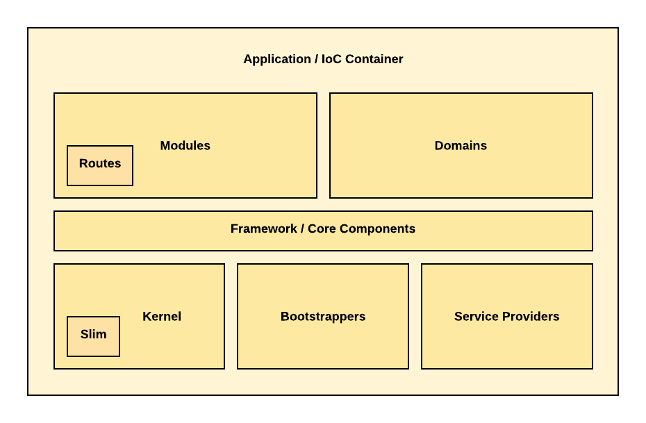
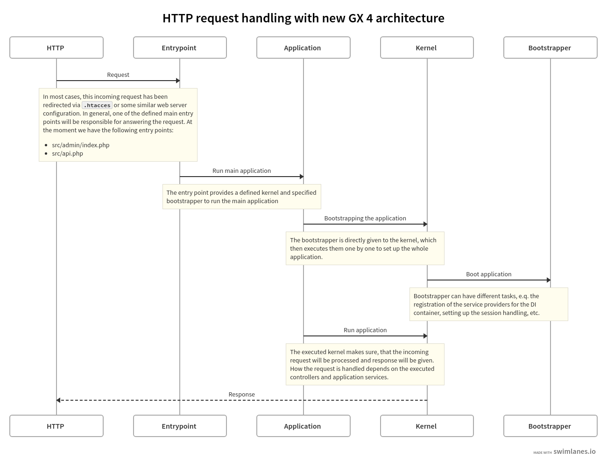

# Application Core

With the new shop version GX 4, we started developing a new Application Core. This will provide more flexibility and
future-proofness to the shop system but it also has far-reaching consequences and changes. We are currently using this
new Application Core for parts of the shop software because refactoring the whole shop system will take a lot of time.
Whenever the new Application Core isn't used, a previously developed (by us or XTC) architecture is used.

## What is an Application Core?

The Application Core (or application) handles all processes that trigger specific functionalities and mechanics of the
software, like showing the products page, registering a customer account, or placing an order. Because this software is
a web-based application, the triggers are HTTP requests that will be interpreted and processed by internal components
of the application. The following picture shows you the essential parts of the Application Core:

### Kernel

The kernel is the central component that delegates the start, execution, and finalisation of the application. In
the starting process, it uses Bootstrapper to set up the application and delegates to specific application services
to handle incoming requests.

Our `Gambio\Core\Application\Kernel\HttpKernel` implementation is based on the microframework Slim. For execution,
the processing of the HTTP request will be forwarded to Slim, which receives the incoming HTTP requests and starts
the processing that handles these requests.

Another example for a general use case for a kernel would be a CLI program.

### Bootstrapper

Besides the kernel, we have the Bootstrappers, which set up the application itself. Each Bootstrapper prepares a
part of the application before any HTTP requests will be handled. Typical tasks of these Bootstrappers are the
registration of components, handling of HTTP sessions, or registration of routes and middlewares.

### Service Providers

We designed the application in a way that it acts as a DI Container; that allows an easy way of [Inversion of
Control]{target=_blank} and [Dependency Injection]{target=_blank}. Having a DI Container means that every component
or service class used to handle specific functionalities of the application needs to be registered. The
container/application will generally arrange the instantiation of these components, services and classes by itself.
The Service Providers are the parts of the application responsible for registering these components and services.

### Modules

After the application has received an incoming HTTP request and determines which module is responsible, a corresponding
HTTP controller or action will be executed. These controllers or actions are part of the module. A single module
only provides a fraction of the shop softwares complete functionality. Therefore it uses (and sometimes even
contains) a domain.

### Domains

Domain is a term of the [Domain-driven design]{target=_blank} and represents a part of the softwares business logic. 
While an HTTP controller or other components of a module orchestrate processes (e.g. placing an order),
the domain contains the inner logic and model of the business itself. 

### Core components / Framework

The block "Framework / Core components" contains core components that are used by different modules. Systems for
caching, logging, or providing language-depended text phrases are examples for these components. They can be seen
as the general framework for every module.

## The old Application Core

Before version GX 4 (and even still) each page that had been processed by the shop system included one of the
following files:

- admin/includes/application_top.php
- includes/application_top.php
- includes/application_top_callback.php
- includes/application_top_export.php
- includes/application_top_main.php

These files can be seen as the old Application Core. They for example included the MainFactory, the old
autoloading system, or started the session.

The *entry point* determines how the application is started and is therefore essential to the Application Core.
There were two possible entry points in Gambio Admin before version 4.1:

1. Direct call of a file: http://www.example.org/admin/customers.php
2. So-called *front controller*: http://www.example.org/admin/admin.php?do=\[Controller name without controller suffix\]

Ultimately, both options initially included one of the listed *application_top* files but handled the page processing
differently. The logic was either executed directly in the PHP file or it was delegated to a controller class.

### Problems with the old Application Core

The files mentioned above have grown over the years and are hardly maintainable. Decades-old programming paradigms,
which are no longer up to date, have been used and thus lead to a significant [Bottleneck]{target=_blank}. Therefore,
we have decided to develop a new Application Core.

### Differences between old and new Application Core

The new Application Core has been developed from scratch. In doing so, we have adhered to the current PHP standards
(PSR's) and integrate modern open-source libraries to meet these standards.

The modernized Application Core forms the basis for all future developments. The goal is to renew all pages with an
old Application Core in the next few years, so that in the long term the old Application Core can be removed without
any problems.

Because of that we strongly recommend that external developers integrate their functions into the shop system using the
new tools. Currently, the new Application Core has only been integrated into a few places in the shop system. We'll
replace old areas of the Gambio Admin gradually within the following versions.

With GX 4.1 for example, the REST API v3 as well as the management of parcel services and revocations in Gambio
Admin are based on the new Application Core.

## Processing HTTP requests

As already mentioned, the task of the Application Core is to process and respond to incoming HTTP requests. The shop
system responds to HTTP requests with HTTP responses, which in turn coined the term *Request Lifecycle*. The browser
can render (draw) the desired page, which usually takes only a fraction of a second within the entire cycle.

{.enlargeable .fullWidth}

## Developing new core components

The new development of the Application Core meant that not only all previous components but also all services, which
we have developed in recent years, could no longer be used in the new system. Therefore, the integration of the new
Application Core is a long-term project and we had to develop new core components.

## Usage of namespaces

To avoid interfering with third-party developers and our modules, we used several namespaces for the new
Application Core, as well as the PSR-4 autoloading of [Composer]. We introduced the following namespaces and mapped
them to the listed directories.

| Namespace | Directory | Description |
| --------- | --------- | ----------- |
| `Gambio\Admin` | `src/GambioAdmin` | Contains all components and modules regarding the Gambio Admin |
| `Gambio\Api`   | `src/GambioApi`   | Contains all components and modules regarding the REST API v3 |
| `Gambio\Core`  | `src/GambioCore`  | Contains all core components or general framework for every module |
| `Gambio\Shop`  | `src/GambioShop`  | Contains all components and modules regarding the public   Gambio Shop |
| `GXModules`    | `src/GXModules`   | Contains all components and modules developed by third-party   developers, as well as some of our modules |

!!! note "Notice"
    If you have downloaded the full version of the shop, the `src` directory will match the root directory of the shop files.

## Differences between new and legacy architecture

The main difference between these two areas is the instantiation and implementation of classes. While the [legacy
architecture] uses the MainFactory to instantiate classes and allow Class-Overloading, the new architecture provides
more freedom to implement classes but restricts the possibilities to extend the system. For instance, if you wanted
to execute some logic in the legacy architecture, you would have created an overload following specific rules and
conventions. Using the new architecture, you would have to create a component or service that does what you wanted to do,
register it to the application core using a Service Provider and connect your component or service with an event or
command.

Creating a new HTTP controller/action shows the differences as well. The legacy architecture demanded you create
a class extending the `HttpViewController` or `AdminHttpViewController` controller and add the suffix `Controller`
to your class name. The methods inside your controller class needed to start with `actions` and the HTTP routes would
always be something like `<ShopBaseUrl>/shop.php?do=<ControllerNameWithoutSuffix>/<MethodNameWithoutPrefix>`. More
importantly, you also wouldn't be able to add dependencies into your HTTP controller using [Dependency
Injection]{target=_blank} but you needed to instantiate your dependency inside the class itself. The new architecture
allows you to create a class as you wish. Sometimes there are classes you need to extend from, but you are free to
use [Dependency Injection]{target=_blank}, define your routes, and aren't bound to naming conventions.

[Bottleneck]: https://wikipedia.org/wiki/Bottleneck_(software)
[Domain-driven design]: https://wikipedia.org/wiki/Domain-Driven_Design
[Composer]: https://getcomposer.org/
[Inversion of Control]: https://wikipedia.org/wiki/Inversion_of_Control
[Dependency Injection]: https://wikipedia.org/wiki/Dependency_Injection
[legacy architecture]: ./legacy-architecture.md
