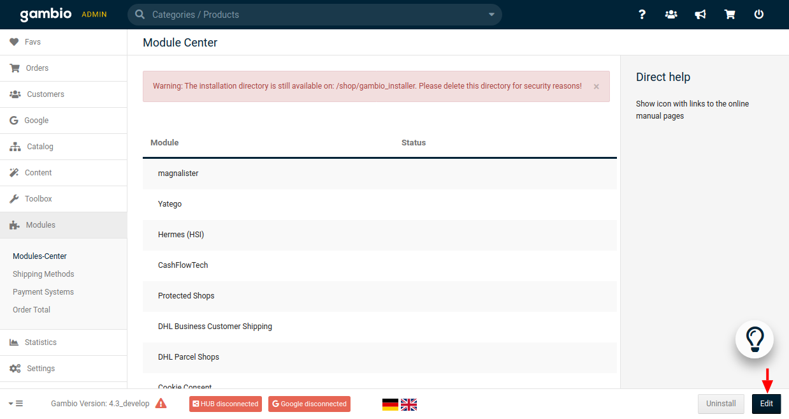
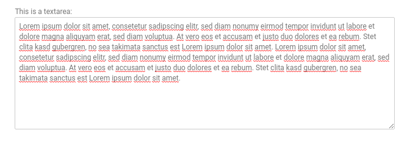
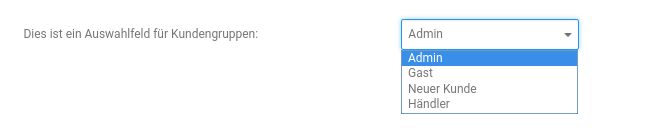
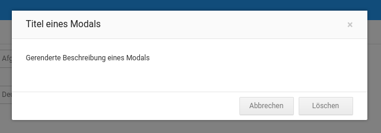

# Creating a generic Module Center module

At some point your module might need some kind of configuration page for your module. Using the `GXModule.json` file
in the root directory of your module, you can define an automatically created configurations page that can be accessed
by our Module Center.



If you take a closer look at the following example configuration page, you can see that there are multiple sections
that include several configurations, which have specific types and parameters.


## Defining sections

To start with everything is based on the JSON structure of the `GXModule.json` file, with the `configuration` attribute.

```json
{
    "title": "sample_module.module_title",
    "description": "sample_module.module_description",
    "forceIncludingFiles": false,
    "configuration": [
        {
            "title": "sample_module.section_title",
            "fields": {}
        }
    ]
}
```

Each JSON object inside the `configuration` array defines a section of the configuration page. Similar to the
`title` attribute, each of these JSON object inside the `configuration` array reference their `title` the
same way. Using the `fields` object you can define the specific configurations that belong to this section. More
information about defining configurations will be given in the next part.

Besides these two attributes, there is also another optional attribute called `tab` that references a text phrase
(like the `title` and `description` attributes). If you add this attribute, a tab will be added to the
configuration page and this tab will only contain the sections with the same reference.

```json
{
    "title": "sample_module.module_title",
    "description": "sample_module.module_description",
    "forceIncludingFiles": false,
    "configuration": [
        {
            "title": "sample_module.section_title_1",
            "tab": "sample_module.tab_title_1",
            "fields": {}
        },
        {
            "title": "sample_module.section_title_2",
            "tab": "sample_module.tab_title_1",
            "fields": {}
        },
        {
            "title": "sample_module.section_title_3",
            "tab": "sample_module.tab_title_2",
            "fields": {}
        },
        {
            "title": "sample_module.section_title_4",
            "fields": {}
        }
    ]
}
```

If some sections do have a `tab` attribute and some don't, then all sections without this attribute will be grouped
by a `General` (or in German `Allgemein`) tab.


## Defining configurations

Configurations itself can be defined by using the `fields` attribute inside the JSON object for describing the sections.
Therefore, you have two possibilities to select one of many configuration types and use parameters to change this
configuration regarding your needs. Defining a configuration named `sampleConfig`, a simple input value, looks like this:

```json
{
    "title": "sample_module.module_title",
    "description": "sample_module.module_description",
    "forceIncludingFiles": false,
    "configuration": [
        {
            "title": "sample_module.section_title",
            "fields": {
                "sampleConfig": {
                    "type": "text",
                    "label": "sample_module.input_field"
                }
            }
        }
    ]
}
```

The `type` attribute defines the type of the configuration and `label` references a text phrase. The key `sampleConfig`
is used for identifying, storing and reading the configuration and its given value. How to get a specific configuration
value will be explained in the chapter [Reading configuration values].

The following part lists the available types, provides examples how to define them and lists all (optional)
parameters that can be used to modify the configuration.

### Configuration types

#### Switcher


```json
{
    "configuration": [
        {
            "title": "sample_module.section_switcher",
            "fields": {
                "sampleSwitcher": {
                    "type": "checkbox",
                    "label": "sample_module.label_switcher"
                }
            }
        }
    ]
}
```

[Optional parameters](#optional-parameters):

- `default_value`
- `required`
- `tooltip`


#### Simple input field


```json
{
    "configuration": [
        {
            "title": "sample_module.section_inputs",
            "fields": {
                "sampleInput": {
                    "type": "text",
                    "label": "sample_module.label_input"
                }
            }
        }
    ]
}
```

[Optional parameters](#optional-parameters):

- `default_value`
- `readonly`
- `regex`
- `required`
- `tooltip`


#### Password input field


```json
{
    "configuration": [
        {
            "title": "sample_module.section_inputs",
            "fields": {
                "samplePassword": {
                    "type": "password",
                    "label": "sample_module.label_password"
                }
            }
        }
    ]
}
```

[Optional parameters](#optional-parameters):

- `regex`
- `required`
- `tooltip`


#### Email input field


```json
{
    "configuration": [
        {
            "title": "sample_module.section_inputs",
            "fields": {
                "sampleEmail": {
                    "type": "email",
                    "label": "sample_module.label_email"
                }
            }
        }
    ]
}
```

[Optional parameters](#optional-parameters):

- `default_value`
- `readonly`
- `regex`
- `required`
- `tooltip`


#### Numeric input field


```json
{
    "configuration": [
        {
            "title": "sample_module.section_inputs",
            "fields": {
                "sampleNumber": {
                    "type": "number",
                    "label": "sample_module.label_number"
                }
            }
        }
    ]
}
```

[Optional parameters](#optional-parameters):

- `default_value`
- `max`
- `min`
- `readonly`
- `regex`
- `required`
- `step`
- `tooltip`


#### Color picker


```json
{
    "configuration": [
        {
            "title": "sample_module.section_inputs",
            "fields": {
                "sampleColor": {
                    "type": "color",
                    "label": "sample_module.label_color"
                }
            }
        }
    ]
}
```

[Optional parameters](#optional-parameters):

- `default_value`
- `required`
- `tooltip`


#### Date picker


```json
{
    "configuration": [
        {
            "title": "sample_module.section_inputs",
            "fields": {
                "sampleDate": {
                    "type": "date",
                    "label": "sample_module.label_date"
                }
            }
        }
    ]
}
```

[Optional parameters](#optional-parameters):

- `default_value`
- `readonly`
- `required`
- `tooltip`


#### Date and time picker


```json
{
    "configuration": [
        {
            "title": "sample_module.section_inputs",
            "fields": {
                "sampleDateTime": {
                    "type": "datetime",
                    "label": "sample_module.label_datetime"
                }
            }
        }
    ]
}
```

[Optional parameters](#optional-parameters):

- `default_value`
- `readonly`
- `required`
- `tooltip`


#### File update


```json
{
    "configuration": [
        {
            "title": "sample_module.section_inputs",
            "fields": {
                "sampleFile": {
                    "type": "file",
                    "label": "sample_module.label_file",
                    "folder": "images"
                }
            }
        }
    ]
}
```

Necessary parameters:

- `folder`: Destination directory for the updated file, based on the root directory of the shop.

[Optional parameters](#optional-parameters):

- `accept`
- `tooltip`


#### Textarea



```json
{
    "configuration": [
        {
            "title": "sample_module.section_inputs",
            "fields": {
                "sampleTextarea": {
                    "type": "textarea",
                    "label": "sample_module.label_textarea"
                }
            }
        }
    ]
}
```

[Optional parameters](#optional-parameters):

- `default_value`
- `readonly`
- `required`
- `tooltip`


#### HTML Editor


```json
{
    "configuration": [
        {
            "title": "sample_module.section_inputs",
            "fields": {
                "sampleEditor": {
                    "type": "editor",
                    "label": "sample_module.label_editor"
                }
            }
        }
    ]
}
```

[Optional parameters](#optional-parameters):

- `default_value`
- `readonly`
- `required`
- `tooltip`


#### Dropdown


```json
{
    "configuration": [
        {
            "title": "sample_module.section_selects",
            "fields": {
                "sampleSelect": {
                    "type": "select",
                    "label": "sample_module.label_select",
                    "values": [
                        {
                            "value": "value1",
                            "text": "sample_module.option_value1"
                        },
                        {
                            "value": "value2",
                            "text": "sample_module.option_value2"
                        },
                        {
                            "value": "value2",
                            "text": "sample_module.option_value3"
                        }
                    ]
                }
            }
        }
    ]
}
```

Necessary parameters:

- `values`: Contains a list of all available items. The `value` attribute defines the value of the item and the
            `text` attribute references a text phrase.

[Optional parameters](#optional-parameters):

- `default_value`
- `required`
- `tooltip`


#### Dropdown with multi select


```json
{
    "configuration": [
        {
            "title": "sample_module.section_selects",
            "fields": {
                "sampleMultiSelect": {
                    "type": "multiselect",
                    "label": "sample_module.label_multiselect",
                    "values": [
                        {
                            "value": "value1",
                            "text": "sample_module.option_value1"
                        },
                        {
                            "value": "value2",
                            "text": "sample_module.option_value2"
                        },
                        {
                            "value": "value2",
                            "text": "sample_module.option_value3"
                        }
                    ]
                }
            }
        }
    ]
}
```

Necessary parameters:

- `values`: Contains a list of all available items. The `value` attribute defines the value of the item and the
            `text` attribute references a text phrase.

[Optional parameters](#optional-parameters):

- `default_value`
- `selected`
- `required`
- `tooltip`


#### Customer groups



```json
{
    "configuration": [
        {
            "title": "sample_module.section_selects",
            "fields": {
                "sampleCustomerGroup": {
                    "type": "customer_group",
                    "label": "sample_module.label_customer_group"
                }
            }
        }
    ]
}
```

[Optional parameters](#optional-parameters):

- `default_value`
- `required`
- `tooltip`


#### Order status


```json
{
    "configuration": [
        {
            "title": "sample_module.section_selects",
            "fields": {
                "sampleOrderStatus": {
                    "type": "order_status",
                    "label": "sample_module.label_order_status"
                }
            }
        }
    ]
}
```

[Optional parameters](#optional-parameters):

- `default_value`
- `required`
- `tooltip`


#### Countries


```json
{
    "configuration": [
        {
            "title": "sample_module.section_selects",
            "fields": {
                "sampleCountryList": {
                    "type": "countries",
                    "label": "sample_module.label_countries"
                }
            }
        }
    ]
}
```

[Optional parameters](#optional-parameters):

- `default_value`
- `required`
- `tooltip`


#### Languages


```json
{
    "configuration": [
        {
            "title": "sample_module.section_selects",
            "fields": {
                "sampleLanguage": {
                    "type": "languages",
                    "label": "sample_module.label_languages"
                }
            }
        }
    ]
}
```

[Optional parameters](#optional-parameters):

- `default_value`
- `required`
- `tooltip`


#### AJAX button


```json
{
    "configuration": [
        {
            "title": "sample_module.section_buttons",
            "fields": {
                "sampleAjaxButton": {
                    "type": "button",
                    "label": "sample_module.label_button_ajax",
                    "text": "sample_module.text_button_ajax",
                    "action": {
                        "controller": "SampleButtonController",
                        "method": "sampleAction",
                        "message": "sample_module.text_success_button_ajax"
                    }
                }
            }
        }
    ]
}
```

Necessary parameters:

- `action`: Defines the AJAX action that's triggered after clicking the button.
  - `controller`: Defines the controller class that is to be called.
  - `method`:     Defines the method of the controller class that is to be called.
  - `message`:    References the text phrase for the success message that is to be be shown.

[Optional parameters](#optional-parameters):

- `color`
- `tooltip`

**Notice:** The first provided argument to the called controller method contains all form data of the configuration
page. For an easier handling, you can extend from the `\GXModuleController` class.


#### Modal button


```json
{
    "configuration": [
        {
            "title": "sample_module.section_buttons",
            "fields": {
                "sampleModalButton": {
                    "type": "button",
                    "label": "sample_module.label_button_modal",
                    "text": "sample_module.text_button_modal",
                    "modal": "sampleModal"
                }
            }
        }
    ]
}
```

Necessary parameters:

- `text`: References the text phrase that is to be used as the modal text.
- `modal`: Defines which modal is to be shown.

[Optional parameters](#optional-parameters):

- `color`
- `tooltip`


#### Modal with simple text


```json
{
    "configuration": [
        {
            "title": "sample_module.section_buttons",
            "fields": {
                "sampleModal": {
                    "type": "modal",
                    "title": "sample_module.modal_title_sample_modal",
                    "description": "sample_module.modal_description_sample_modal",
                    "buttons": {
                        "close": {
                            "text": "buttons.cancel"
                        },
                        "delete": {
                            "text": "buttons.delete",
                            "action": {
                                "controller": "SampleButtonController",
                                "method": "someAction",
                                "message": "sample_module.text_success_button_modal"
                            }
                        }
                    }
                }
            }
        }
    ]
}
```

Necessary parameters:

- `title`:             References the text phrase that is to be used as the modal title.
- `description`:       References the text phrase that is to be used as the modal text.
- `buttons`:           Defines the available buttons.
  - `close`, `delete`: Name of the available buttons.
  - `action`:          (Optional) Defines the AJAX action that's triggered after clicking the button.
                       If this attribute is missing, the modal will be closed after clicking the button.
    - `controller`:    (Optional) Defines the controller class that is to be called.
    - `method`:        (Optional) Defines the method of the controller class that is to be called.
    - `message`:       (Optional) References the text phrase for the success message that is to be shown.

[Optional parameters](#optional-parameters):

- `color`


#### Modal with rendered HTML



```json
{
    "configuration": [
        {
            "title": "sample_module.section_buttons",
            "fields": {
                "sampleModal2": {
                    "type": "modal",
                    "title": "sample_module.modal_title_sample_modal",
                    "content": "Vendor/Module/Admin/Html/modal_content.html",
                    "buttons": {
                        "close": {
                            "text": "buttons.cancel"
                        },
                        "delete": {
                            "text": "buttons.delete",
                            "action": {
                                "controller": "SampleButtonController",
                                "method": "someAction",
                                "message": "sample_module.text_success_button_modal"
                            }
                        }
                    }
                }
            }
        }
    ]
}
```

Necessary parameters:

- `content`:           References the HTML file that is to be rendered.
- `buttons`:           Defines the available buttons.
  - `close`, `delete`: Name of the available buttons.
  - `action`:          (Optional) Defines the AJAX action that's triggered after clicking the button.
                       If this attribute is missing, the modal will be closed after clicking the button.
    - `controller`:    (Optional) Defines the controller class that is to be called.
    - `method`:        (Optional) Defines the method of the controller class that is to be called.
    - `message`:       (Optional) References the text phrase for the success message that is to be shown.

[Optional parameters](#optional-parameters):

- `color`


## Optionale parameters

### accept

Defines the accepted file extensions for an uploading file.

```json
{
    "configuration": [
        {
            "title": "sample_module.section_optionals",
            "fields": {
                "sampleOptionalAccept": {
                    "type": "file",
                    "label": "sample_module.label_optional_accept",
                    "folder": "images",
                    "accept": "image/*"
                }
            }
        }
    ]
}
```


### color

Defines the color of the button. Possible values are: `default`, `primary`, `success`, `info`, `warning`, `danger`,
and `link`.

```json
{
    "configuration": [
        {
            "title": "sample_module.section_optionals",
            "fields": {
                "sampleOptionalColor": {
                    "type": "button",
                    "label": "sample_module.label_button_modal",
                    "text": "sample_module.text_button_modal",
                    "modal": "sampleModal",
                    "color": "warning"
                }
            }
        }
    ]
}
```


### default_value

Defines the default value of the configuration.

```json
{
    "configuration": [
        {
            "title": "sample_module.section_optionals",
            "fields": {
                "sampleOptionalDefaultValue": {
                    "type": "text",
                    "label": "sample_module.label_input",
                    "default_value": "Lorem ipsum …"
                }
            }
        }
    ]
}
```


### max

Defines the maximal value of a numeric input field.

```json
{
    "configuration": [
        {
            "title": "sample_module.section_optionals",
            "fields": {
                "sampleOptionalMax": {
                    "type": "number",
                    "label": "sample_module.label_number",
                    "max": 50
                }
            }
        }
    ]
}
```


### min

Defines the minimal value of a numeric input field.

```json
{
    "configuration": [
        {
            "title": "sample_module.section_optionals",
            "fields": {
                "sampleOptionalMix": {
                    "type": "number",
                    "label": "sample_module.label_number",
                    "mix": 50
                }
            }
        }
    ]
}
```


### regex

Defines a pattern for the input value that needs to be matched.

```json
{
    "configuration": [
        {
            "title": "sample_module.section_optionals",
            "fields": {
                "sampleOptionalRegex": {
                    "type": "text",
                    "label": "sample_module.label_input",
                    "regex": "[0-9()-\\+\\s]+"
                }
            }
        }
    ]
}
```


### required

Defines if this input field is required.

```json
{
    "configuration": [
        {
            "title": "sample_module.section_optionals",
            "fields": {
                "sampleOptionalRequired": {
                    "type": "text",
                    "label": "sample_module.label_input",
                    "required": true
                }
            }
        }
    ]
}
```


### selected

Defines the default value for multi select dropdowns (similar to `default_value`).

```json
{
    "configuration": [
        {
            "title": "sample_module.section_optionals",
            "fields": {
                "sampleOptionalSelected": {
                    "type": "multiselect",
                    "label": "sample_module.label_optional_selected",
                    "values": [
                        {
                            "value": "value1",
                            "text": "sample_module.option_value1"
                        },
                        {
                            "value": "value2",
                            "text": "sample_module.option_value2"
                        },
                        {
                            "value": "value3",
                            "text": "sample_module.option_value3"
                        }
                    ],
                    "selected": [
                        "value1",
                        "value2"
                    ]
                }
            }
        }
    ]
}
```


### step

Defines the steps for a numeric input value.

```json
{
    "configuration": [
        {
            "title": "sample_module.section_optionals",
            "fields": {
                "sampleOptionalStep": {
                    "type": "number",
                    "label": "sample_module.label_optional_step",
                    "step": 0.5
                }
            }
        }
    ]
}
```


### tooltip

Defines a tooltip.

```json
{
    "configuration": [
        {
            "title": "sample_module.section_optionals",
            "fields": {
                "sampleOptionalTooltip": {
                    "type": "text",
                    "label": "sample_module.label_optional_tooltip",
                    "tooltip": {
                        "type": "info",
                        "text": "sample_module.text_tooltip"
                    }
                }
            }
        }
    ]
}
```

- `type`: Defines the type of the tooltip. Possible values are: `info` und `error`.
- `text`: References the text phrase for the tooltip.


# Reading a configuration value

To get saved configuration values, you need to use the `GXModuleConfigurationStorage`. The following example shows,
how to initialize and request a configuration value.

```php
$configurationStorage = MainFactory::create('GXModuleConfigurationStorage', '<Vendor>/<Module>');
$activeValue = $configurationStorage->get('active');
```

Please mind, that the second argument of the `create` method uses placeholders for the vendor and module name.

!!! Notice "Notice"
    If no module configuration had been saved, the `GXModuleConfigurationStorage` will provide the default
    configuration value from the `GXModule.json`.


## Type of the return value for each type

| Type             | Type of the return value                                   |
|------------------|------------------------------------------------------------|
| `checkbox`       | string, `1` for true, `0` for false                        |
| `text`           | string                                                     |
| `password`       | string                                                     |
| `email`          | string                                                     |
| `number`         | string                                                     |
| `color`          | string, color code with prefixed `#`                       |
| `date`           | string                                                     |
| `datetime`       | string                                                     |
| `file`           | string, file path based on the root directory of the shop  |
| `textarea`       | string,                                                    |
| `editor`         | string,                                                    |
| `select`         | string                                                     |
| `multiselect`    | array                                                      |
| `customer_group` | string                                                     |
| `order_status`   | string                                                     |
| `countries`      | string                                                     |
| `languages`      | string                                                     |


# Detailed example

We created a detailed example that contains every possible type:

- [Example as ZIP files](./../_samples/gxmodules-config-json.zip)
