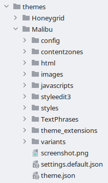

# Theme System Architecture

The theme system uses a **standardized file and folder structure**. This means that every theme always contains the
same folders. For both Gambio and developers, creating new themes and extending existing themes can easily be done.


## Extensibility

Besides the possibility to create a completely new theme, it is also possible to create new themes based on another
theme. This inheritance option offers **full flexibility** for theme developers.

For instance, you can create your own theme based on Malibu. Subsequently, based on your created theme, you are able
to create additional themes for different subjects (for example: _summer_ and _winter_ themes).

The expandability and possible theme inheritance is unlimited, as shown in this example:

```text
Malibu
 └─ MyShopTheme
     ├─ MyShopChristmasTheme
     ├─ MyShopSpringfeverTheme
     │   └─ MyShopValentinesDayTheme
     └─ MyShopSummerPartyTheme
```


## Theme structure

A theme always adheres to the same structure and is always located in the `themes` folder. In following you can
get an idea of what the structure of a theme is like:

{class="pull-right" style="margin-left: 20px;"}

The root directory always has a unique name (e.g. `Malibu`) and is placed inside the `theme` directory of the shop
root. Inside this directory you can find these files and directories:

- `theme.json`: Theme meta data file, which provides information about the theme
- `settings.default.json`: Theme configuration file
- `html`: HTML snippets directory
- `images`: Images directory
- `javascripts`: JavaScript files directory
- `styles`: Stylesheet files directory
- `TextPhrases`: Language files directory

There may also be additional folders for your own files (e.g. `fonts`).


## How the theme system works

!!! Info "Notice"
    The following paragraphs describe the in-depth technical details. This can be skipped, if only the usage of the
    theme system is of interest.

To understand the theme system, it is important to know that **Gambio already has an older theme system**, which
will gradually disappear. **The legacy themes are called _templates_.** The old _template_ system is currently still
in place to maintain compatibility.

The new _theme_ system was built "next to it". This gives us the possibility to progressively change the standard
from templates to themes. Old templates still retain their location in `templates`, while new themes end up in
the `themes` folder.


### ThemeControl

There is a class called `ThemeControl`, which is the central control center for templates and themes. It takes care
of delivering the correct paths for the activated _theme_ or _template_.


### ThemeContentView

For all views in the shop there are the corresponding `ContentView` classes.

__Example:__ `LoginContentView` is responsible for the display of the login page. `ContentView` is always the
base class of all views in the shop. However, these _ContentViews_ only apply to the old template system.

For this reason, a new base class called `ThemeContentView` was created, which is the corresponding counterpart for
the theme system. This means that the corresponding _ThemeContentViews_ have also been created for all views. In
relation to the previous example, there is now also a corresponding `LoginThemeContentView` class.

The new _ThemeContentViews_ are located in `GXMainComponents/View/ThemeContentViews`.


### MainFactory

The `MainFactory` class has been modified to deliver the corresponding views depending on the activated _template_ or
_theme_; that is, _ContentView_ for templates and _ThemeContentViews_ for themes. You can examine the logic for
this in `MainFactory::load_class()`.

As a result of this change, it is not necessary for the developer to check whether a template or a theme has just
been activated, because thats what the _MainFactory_ takes care of.

To refer back to the previous example: In the `LoginContentControl` class the corresponding `LoginContentView` is
loaded via the `MainFactory`, as you can see below.

```php
// LoginContentControl.inc.php line 172
$coo_login_view = MainFactory::create_object('LoginContentView');
$coo_login_view->set_('info_message', $info_message);
$coo_login_view->set_('checkout_started_get_param', $t_checkout_started_get_param);
$coo_login_view->set_('input_mail_value', $t_input_mail_value);
$coo_login_view->set_('cart_contents_count', $_SESSION['cart']->count_contents());

$this->v_output_buffer = $coo_login_view->get_html();
```

In this case the `MainFactory` checks whether a `LoginThemeContentView` counterpart to the `LoginContentView` exists.
If so, the `LoginThemeContentView` is loaded instead of the original `LoginContentView`.


### New template names

When we created the theme system, we simultaneously released a new base theme `Malibu`. This base theme is the
successor of Honeygrid. We also decided to restructure and rename the HTML templates.

The HTML templates for the _Malibu_ theme are located in `themes/Malibu/html/system` and now have a flat folder
structure (all files are in one folder). Additionally, the HTML templates have been renamed.

Regarding the previous example: it is once more made clear why we had to create extra `ThemeContentView` classes. If
we look at `LoginContentView::__construct()`, which is used for the **old _template_ system**, we see the following:

```php
// LoginContentView.inc.php line 32
public function __construct()
{
	parent::__construct();

	$this->set_content_template('module/login.html');
	$this->set_flat_assigns(true);
}
```

The HTML template 'modules/login.html' is loaded from the **template** directory.

Now we look at `LoginThemeContentView::__construct()` for the **new _theme_ system** and see that another HTML
template is loaded:

```php
// LoginThemeContentView.inc.php line 33
public function __construct()
{
    parent::__construct();

    $this->set_content_template('login.html');
    $this->set_flat_assigns(true);
}
```

The HTML template `login.html` from the **theme** directory is used here.

In conclusion, if you want to know which new HTML template is used for a particular _ContentView_, just look for the
corresponding _ThemeContentView_ class instead of the old _ContentView_ class.


### Theme compilation

The activated theme is "compiled" and ends up in the `public/theme` directory. If you want to regenerate the theme,
you have to delete that folder and then reload the shop in the browser.
