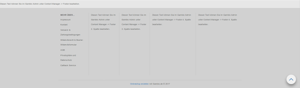
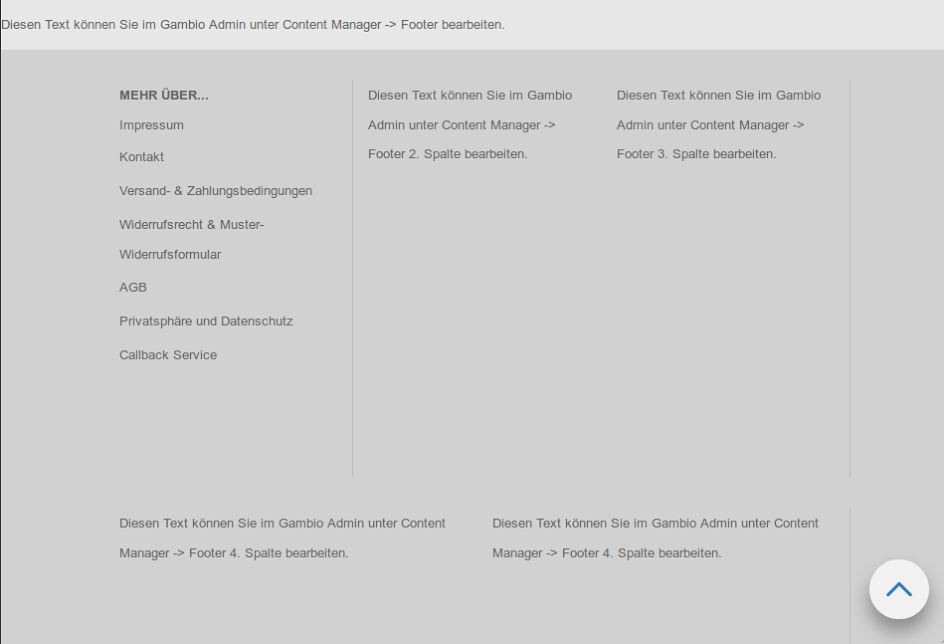

# Einbindung von Content Manager Inhalten

Wer bereits etwas mit dem Shop gearbeitet hat, kennt den Content Manager. Er ist die Schaltzentrale, wenn es darum geht
eigene Inhalte im Shop zu platzieren. Hierbei ist es möglich, entweder ganze Seiten selbst zu schreiben und diese zu
verlinken oder in bestimmten, vorgegebenen Positionen zu platzieren (wie z.B. auf der Startseite, im Header oder im
Footer). Es ist aber auch möglich, eigene Seitenelemente zu erstellen, welche man dann später an beliebigen Stellen
in einem Template oder Theme eingebunden werden kann.


**Inhalt:**

* <a href="#Arbeiten im Gambio Admin">Arbeiten im Gambio Admin</a>
    * <a href="#Erstellen eines neuen Startseitencontents">Erstellen eines neuen Startseitencontents</a>
    * <a href="#Erstellen eines neuen Headercontents">Erstellen eines neuen Headercontents</a>
    * <a href="#Erstellen eines neuen Footercontents">Erstellen eines neuen Footercontents</a>
    * <a href="#Erstellen eines beliebig platzierbaren Contents">Erstellen eines beliebig platzierbaren Contents</a>
    * <a href="#Erstellen einer neuen Box">Erstellen einer neuen Box</a>
* <a href="#Arbeiten im Frontend des Shops">Arbeiten im Frontend des Shops</a>
    * <a href="#Anpassen der Startseite">Anpassen der Startseite</a>
    * <a href="#Anpassen des Headers">Anpassen des Headers</a>
    * <a href="#Anpassen des Footers">Anpassen des Footers</a>
        * <a href="#Hinzufügen eines weiteren Contents in eine bestehende Footerspalte">Hinzufügen eines weiteren Contents in eine bestehende Footerspalte</a>
        * <a href="#Hinzufügen einer weiteren Spalte mit eigenem Content">Hinzufügen einer weiteren Spalte mit eigenem Content</a>


## <a name="Arbeiten im Gambio Admin"></a>Arbeiten im Gambio Admin

Beginnen wir zunächst mit dem einfachen Teil, dem Schreiben der benötigten Contents. Ruft dafür den Content Manager
über **Darstellung > Content Manager** auf und wechselt in den Tab "Elemente". Hier findet ihr alle Seitenelemente
vor, die der Shop von sich aus ausliefert. Diese können natürlich auch verwendet werden, um den gewünschten Inhalt
anzuzeigen. Wollt ihr das allerdings ein bisschen besser aufteilen, dann müssen noch weitere Contents angelegt werden.


### <a name="Erstellen eines neuen Startseitencontents"></a>Erstellen eines neuen Startseitencontents

Beginnen wir damit einen neuen Content auf der Startseite zu platzieren. Klickt auf den Erstellen-Button, der sich
rechts neben der Überschrift "Startseite" befindet, um einen neuen Startseitencontent zu erstellen.

Das Feld "Interner Name" gibt hier vor, wie der Content in der Übersicht gelistet wird, eine Anzeige im Frontend findet
hier nicht statt. Gebt dem Content daher am besten einen Namen, den man möglichst gut wiederfindet und bei dem man
weiß, wo er sich auf der Seite befindet, um euch später unnötige Sucherei zu ersparen, wenn ihr den Content mal
bearbeiten oder löschen wollt.

Der Schalter "sichtbar" gibt an, ob der Content im Frontend angezeigt werden soll oder nicht. Eine praktische Option,
wenn man erstmal einen Text schreiben, aber erst später für alle lesbar machen möchte oder man saisonale Texte im
Shop verwendet, die man wiederverwenden kann.

Darunter findet sich dann das Eingabefeld für den eigentlichen Text. Hier habt ihr die Möglichkeit, einen
WYSIWIG-Editor zu verwenden oder auf einen HTML-Editor umzuschalten, wenn ihr bestimmte Formatierungen per HTML und
CSS erreichen wollt, da diese im WYSIWIG-Editor gefiltert werden.

Nachdem ihr euren Content erstellt und sichtbar geschaltet habt, ist im Admin alles getan und der Content kann im
Frontend eingebunden werden.


### <a name="Erstellen eines neuen Headercontents"></a>Erstellen eines neuen Headercontents

Bisher gibt es zum Platzieren von eigenem Inhalt im Header nur den Content "Header". Möchte man aber weiteren Content
an anderer Stelle im Header platzieren, so war dies erstmal nicht ohne Weiteres möglich.

Über den Admin ist es nun möglich eigene Contents für den Header zu erstellen. Diese können dann mit ein paar
Anpassungen am HTML und CSS des Headers im Shop verbaut werden.

Das Vorgehen ist hier das gleiche, wie schon für die Startseitencontents beschrieben. Bei Klick auf den
Erstellen-Button neben der Überschrift "Header" öffnet sich das gleiche Eingabeformular wie zum Erstellen der
Startseitencontents.


### <a name="Erstellen eines neuen Footercontents"></a>Erstellen eines neuen Footercontents

Vier Spalten im Footer sind euch nicht genug oder ihr braucht eine weitere Reihe mit zusätzlichen Spalten? Kein Problem!
Legt euch im Content Manager im Bereich Footer einfach die Elemente an, die ihr benötigt und füllt sie mit Inhalt.
Die Einbindung im Template erkläre ich euch später ;).

Die Oberfläche zum Anlegen neuer Footercontents ist die gleiche, wie oben schon beschrieben.


### <a name="Erstellen eines beliebig platzierbaren Contents"></a>Erstellen eines beliebig platzierbaren Contents

Der Bereich für beliebig im Shop platzierbare Contents ist "Sonstiges" in der Elemente-Übersicht. Hier sollten alle
Contents abgelegt werden, die an unterschiedlichen Stellen des Shops Verwendung finden sollen und nicht durch die
anderen Kategorien abgedeckt werden. Bitte denkt hier besonders daran, Namen zu vergeben, von denen man auf die
Position der Contents im Shop schließen kann, damit man diese wiederfindet, wenn man etwas bearbeiten oder löschen
möchte.

Auch hier ist das Vorgehen analog zu den anderen Contents. Erstellt euch einen Content im Bereich Sonstiges füllt ihn
mit Inhalt und schaltet ihn sichtbar, damit er im Shop später angezeigt werden kann.


### <a name="Erstellen einer neuen Box"></a>Erstellen einer neuen Box

Hinweis: Das Erstellen von neuen Boxen ist leider noch etwas komplizierter und ist erstmal nur für fortgeschrittene
Nutzer gedacht. Sobald es hier einen einfacheren Weg gibt, wird das Tutorial an dieser Stelle aktualisiert.

Wer sich zutraut mehr als nur eine HTML-Datei anzupassen, hat auch die Möglichkeit eine neue Box über den Content
Manager mit Inhalt zu füllen. Die Arbeiten im Admin halten sich dabei gering. Legt im Bereich Boxen des Content
Managers einen neuen Content an, befüllt ihn mit Inhalt und schaltet ihn sichtbar. Das war es dann auch schon, was
wir im Admin dafür tun mussten. Der Rest wird dann an anderer Stelle erledigt.

Auch hier ist die Oberfläche zum Anlegen neuer Contents die gleiche, wie oben schon beschrieben.


## <a name="Arbeiten im Frontend des Shops"></a>Arbeiten im Frontend des Shops

Nun geht es ans Eingemachte. Bisher haben wir nur neue Contents in der Datenbank. Der Shop weiß jetzt allerdings noch
nicht, was er damit überhaupt tun soll. In den folgenden Schritten zeige ich euch, wie wir dem Shop beibringen, die
neuen Contents aus der Datenbank im Frontend anzuzeigen.

Dafür brauchen wir eigentlich nur eine kleine Funktion, die wir mit dem Shop ausliefern: Ein Smarty-Plugin mit dem
passenden Namen `{content_manager}`.

Dieses übernimmt im folgenden die hauptsächliche Arbeit. Was ihr zur Verwendung lediglich braucht ist die
`content_group_id` des betreffenden Contents.

Diese findet ihr, wenn ihr in der Übersicht der Content Elemente mit der Maus auf einen Content geht. In dem sich
öffnenden Tooltip steht dann die `content_group_id`.


_Abb 1: Wenn ihr mit der Maus über eine Content-Zeile hovert wird die ID des Contents eingeblendet_

Wenn ihr Änderungen im HTML vornehmt, empfiehlt es sich die Verwendung von Smarty-Blöcken zum Überladen von
Template-Dateien zu verwenden, damit die Änderungen, die ihr macht, nicht bei einem Update überschrieben werden.
Mehr zu diesem Thema findest du im Abschnitt [Anlegen neuer HTML Inhalte](create_new_html_content.md).


### <a name="Anpassen der Startseite"></a>Anpassen der Startseite

Besorgt euch die IDs der Contents, die ihr auf der Startseite einbauen wollt, wie eben beschrieben und notiert euch
diese. Die Datei, die für die Einbindung der Contents auf der Startseite angepasst werden muss, ist die
`templates/Honeygrid/modules/main_content.html`.

Wollen wir einen Content z.B. nach dem Begrüßungstext aus dem Content "Index" und den Artikelankündigungen
platzieren, verwenden wir den Smarty Block **module_main_content_main_text**:

```
{block name="module_main_content_main_text" append}
    {content_manager group=1234}
{/block}
```

Die Zahl, die ihr bei `group=` eintragt ist die ID des Contents, den ihr an der Stelle einbinden wollt. Das
Smarty-Plugin kümmert sich dann um die sprachabhängige Einbindung des Contents.


### <a name="Anpassen des Headers"></a>Anpassen des Headers

Um Contents im Header hinzuzufügen, bedienen wir uns etwas HTML, welches wir schon für den anderen freien Content im
Header verwenden. Hierdurch sparen wir uns erheblichen Aufwand, da wir im folgenden kein CSS anpassen müssen. Die
Einbindung funktioniert hier wie folgt:

**`{include  file="get_usermod:{$tpl_path}snippets/header/header_custom_content.html" content={content_manager group=1234}}`**

Auch hier finden wir unser Smarty-Plugin, welchem wir unsere notierte ID übergeben können. Das zu bearbeitende Template
wäre in diesem Fall **`templates/Honeygrid/index.html.`**

Wollen wir zum Beispiel einen weiteren Content nach dem Logo platzieren, könnte das wie folgt realisiert werden:

```
{block name="index_outer_wrapper_header_inside_header" append}
    {include file="get_usermod:{$tpl_path}snippets/header/header_custom_content.html" content={content_manager group=12345}}
{/block}
```

Nachdem wir nun mehr Platz im Header verbrauchen, als eigentlich vorgesehen, muss die Spaltenanzahl der Headerelemente
noch angepasst werden. Dafür ruft ihr den StyleEdit 3 auf und passt unter "Header" alle Elemente so an, dass die Anzahl
der Grid-Spalten in der Summe 12 ergeben.

**Achtung:** Bedenkt dabei, dass ihr den Bereich "Freigestaltbarer Bereich" nun zwei mal habt, sodass die
Grid-Spalten-Anzahl in unserem Beispiel doppelt gezählt werden müssen.


### <a name="Anpassen des Footers"></a>Anpassen des Footers

Alle Templateanpassungen werden in `templates/Honeygrid/module/footer.html` erledigt. Sollten noch weitere
Anpassungen an anderen Stellen notwendig sein, werde ich im jeweiligen Beispiel darauf hinweisen.


#### <a name="Hinzufügen eines weiteren Contents in eine bestehende Footerspalte"></a>Hinzufügen eines weiteren Contents in eine bestehende Footerspalte

Möchte man die Inhalte in einer Footerspalte logisch voneinander trennen oder zusätzlichen Text in der ersten
Footerspalte platzieren, empfiehlt es sich mehrere Contents in einer Footerspalte einzubinden. Um das zu erreichen
können wir einfach mehrfach das Smarty-Plugin anwenden. Dafür brauchen wir wieder die ID des gewünschten Contents.
Auch diese könnt ihr euch besorgen, wie vorher beschrieben.

Anschließend binden wir dann das Smarty-Plugin in der Footerspalte ein, wo der Content hin soll. In folgendem Beispiel
ist das die erste Spalte unter dem Inhalt der "Mehr über"-Box, die standardmäßig in der ersten Spalte angezeigt wird.
Das resultierende HTML sieht dann wie folgt aus:

```
{block name="module_footer_inside_content1" append}
    <div class="footer-col-1">
        {$MORE_ABOUT}
        {content_manager group=12345}
    </div>
{/block}
```

#### <a name="Hinzufügen einer weiteren Spalte mit eigenem Content"></a>Hinzufügen einer weiteren Spalte mit eigenem Content

Das Hinzufügen weiterer Spalten für neue Contents ist prinzipiell möglich, erfordert dann allerdings noch weitere
Anpassungen am CSS, damit die Spaltenaufteilung richtig funktioniert. Zunächst notiert euch erstmal wieder die IDs der
Contents, die ihr in weiteren Spalten einbinden wollt.

Anschließend passen wir das Template wie folgt an:

```
{block name="module_footer_inside_content1" append}
    <div class="footer-col-5">{content_manager group=12345}</div>
{/block}
```

Damit es nun zu keiner Fehldarstellung durch überschreiten der Grid-Spaltenwerte kommt, muss der bestehende Style und
das CSS angepasst beziehungsweise erweitert werden. Dafür gehen wir wie folgt vor: Wechselt in den StyleEdit 3 und
öffnet dort das Fenster zum Eingeben von eigenem CSS. Hier fügen wir folgendes CSS ein:

```
#footer {
    .footer-col-5 {
        height: $gx-footer-height;

        p {
            line-height: $gx-footer-line-height;
        }

        a {
            &:not(.social-media-icons a) {
                color: $gx-footer-link-color;
            }
        }

        @media (min-width: $screen-sm-min) {
            min-height: ($gx-footer-min-height - 100);
        }

        @include make-xs-column(12);
        @include make-sm-column(6);
        @include make-lg-column(3);
    }
}
```

Dieses CSS übernimmt weitestgehend die Styles der anderen Footerspalten und gibt der neu erstellten Spalte mit der
Klasse `footer-col-5` folgende Spaltenverteilungen:

* Auf Smartphones verwende die komplette Breite, also alle zwölf Spalten.
* Auf Tablets verwende die halbe Breite, also sechs Spalten.
* Auf Desktops verwende ein Viertel der Breite, also drei Spalten.

Wollt ihr hier eine andere Spaltenverteilung erreichen sind die Werte für folgende Bereiche anzupassen:

```
@include make-xs-column(12);
@include make-sm-column(6);
@include make-lg-column(3);
```

Die Zahlen in den Klammern geben hierbei an, wie viele Spalten verwendet werden sollen. Beachtet dabei, dass die
Gesamtanzahl an Spalten pro Zeile den Wert zwölf nicht übersteigen dürfen, wenn alle Spalten in einer Zeile angezeigt
werden sollen.

Damit das auch mit den anderen Spalten gut aussieht, müssen diese im StyleEdit 3 angepasst werden. Unter
**Footer > Footer Spalte 1** bis **Footer Spalte 4** findet ihr die Optionen zum Einstellen der Gridspalten. Für mein
Beispiel habe ich folgende Einstellungen verwendet:

* Spalte 1:
    * Grid-Spalten klein: 12
    * Grid-Spalten medium: 4
    * Grid-Spalten groß: 2
* Spalte 2:
    * Grid-Spalten klein: 12
    * Grid-Spalten medium: 4
    * Grid-Spalten groß: 2
* Spalte 3:
    * Grid-Spalten klein: 12
    * Grid-Spalten medium: 4
    * Grid-Spalten groß: 2
* Spalte 4:
    * Grid-Spalten klein: 12
    * Grid-Spalten medium: 6
    * Grid-Spalten groß: 3

Das Ergebnis dieser Einstellungen, zusammen mit der zusätzlichen Spalte lässt sich am besten mit Bildern zeigen:



_Abb 2: Auf dem Desktop sind die vorderen drei Spalten wie konfiguriert nun kleiner, während die beiden hinteren mehr
Platz verwenden_



_Abb 3: Auf Tablet ergibt sich folgende Darstellung: In der ersten Zeile befinden sich nun die ersten drei Spalten,
während in der unteren Zeile die beiden letzte Spalten sich die Breite des Footers teilen._