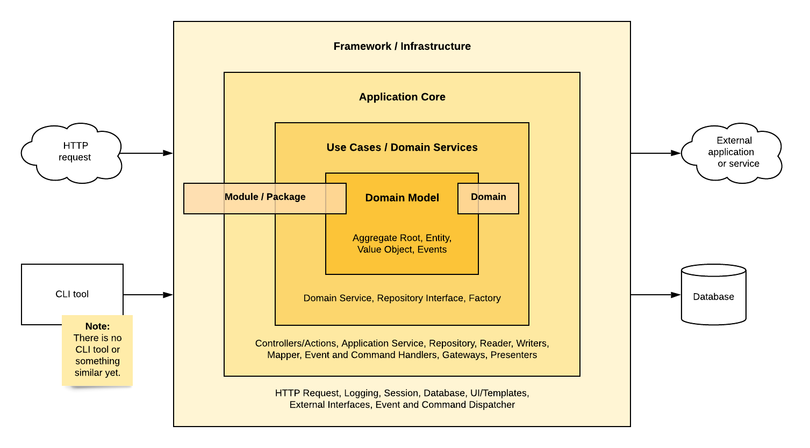

# Application Layers

In software development an application is divided into separate layers, which represent different parts of
functionality. The new [Application Core] can also be separated into layers like it's shown in the picture below:

{.enlargeable .fullWidth}

### Framework / Infrastructure

The framework or infrastructure layer includes general tools and components to execute the shop software. It contains
no specific business logic and can't tell you anything about the exact functionality of its software. This layer
will include elements handling incoming HTTP requests, logging, sessions, or the database connection.

### Application Core

Deeper in the [Application Core] layer, the components execute certain main functionalities of the application. The
tasks performed here are still very technical and far away from specific business rules. Parts of this layer are
controllers or actions for the incoming HTTP requests, application services, or database readers and writers.

### Use Cases / Domain Services
The ([Domain-driven design]{target=_blank}) domain starts with the layer for use cases. The entirety of domains
shows what this application is about; therefore, this layer provides information about the use cases and possibilities
of interacting with these domains. Domain services, interfaces of repositories and factories are typical components
of this layer.

### Domain Model
When using [Domain-driven design]{target=_blank}, the model is a fundamental part of the software because it contains
the business logic of the whole software. This is also less volatile than the outer parts of the software. The
components of this layer are entities, value objects, events and the aggregate root.

[Application Core]: ./../application-core.md
[Domain-driven design]: https://wikipedia.org/wiki/Domain-driven_design
[DDD]: https://wikipedia.org/wiki/Domain-driven_design
