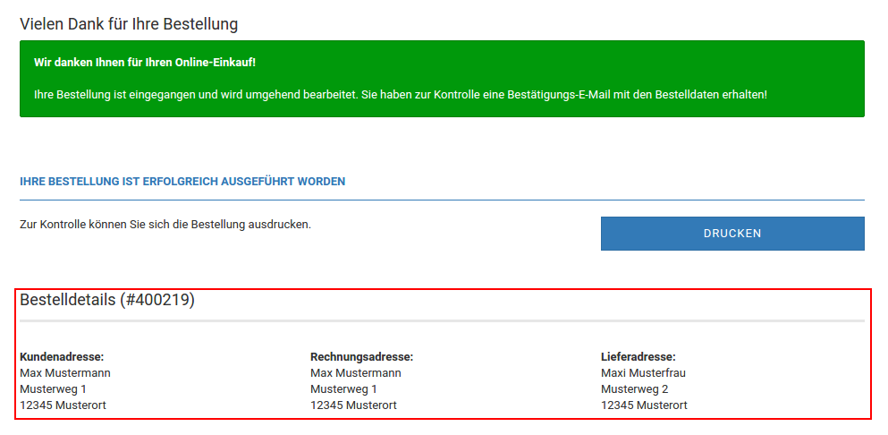

# Legacy architecture

In the old architecture that is used in the GX2 and GX3 versions of the shop software, the `MainFactory` class acted
as the only component which provided all essential classes/services that were needed to execute the shop software.
Compared to the new architecture, there are some similarities to the DI Container but without describing how
components should be built and how they interact or depend on each other.

The focus of the MainFactory was to allow overloading classes and to provide a powerful way of extending the system.
The main problem of it was that any incorrect usage of it would lead to issues that could break the whole system and
would be hard to debug.

!!! Notice "Notice"
    This tutorial explains the old overloading and extender system that we used in the old architecture. The new GX4
    architecture does not support this. There are still some parts of the shop software that are using the old
    architecture and that's why we still provide this information.

There are two possibilities to change existing PHP classes in the shop system. The first possibility is
class-overloading and allows you to overload the behaviour of an existing class with your logic. The second
possibility, the extending system, can hook into existing program logic and execute your own logic. 


## Class-Overloading

Class-Overloading increases the update-security of code changes. Class-Overloading allows you to change the behaviour
of PHP classes without modifying the class itself. Since the changes aren't made in the original class, they are not
lost when original files get replaced with new ones.

Changes made by Class-Overloading can be, e.g. extensions of existing methods, adding new methods, replacing
methods (or even the whole class). Thus, all possibilities are available to change the class's behaviour to
your wishes.


### How to overload a class

To overload an existing class, a new class following some specific rules needs to be created. You need to create a
subdirectory inside the `GXModules/<Vendor>/<Module>/Admin/Overloads` or `GXModules/<Vendor>/<Module>/Shop/Overloads`
directory with the name of the class you want to overload (e.g. 'breadcrumb'). Then you create a PHP file
inside this directory with a new unique class name (e.g. `CustomizedBreadcrumb.inc.php`). The naming convention
for these files is: `<ClassName>.inc.php`.

The following example shows an overload `CustomizedBreadcrumb`, which extends the `trail` method of the original
`breadcrumb` class. The entries in the breadcrumb will be enclosed in square brackets and the separator replaced
with a pipe, unless the given separator differs from the standard. For this purpose a file
`GXModules/<Vendor>/<Module>/Shop/Overloads/breadcrumb/CustomizedBreadcrumb.inc.php` is created with the following
content:

```php
class CustomizedBreadcrumb extends CustomizedBreadcrumb_parent
{
	/**
	 * Returns a modified breadcrumb as a string. The items are in brackets. 
	 *
	 * They are separated by a pipe if the standard separator is a dash. Otherwise 
	 * the given separator is used.
	 * 
	 * @param string $separator Optional, the breadcrump separator string.
	 * 
	 * @return string Returns the modified breadcrump string. 
	 */
	public function trail($separator = ' - ')
	{
		foreach($this->_trail as &$item)
		{
			$item['title'] = '[' . $item['title'] . ']';
		}
		
		if($separator === ' - ')
		{
			$separator = ' | '; // Replace the original separator.
		}
		
		return parent::trail($separator);
	}
}
```

In the example above, you can see that the `CustomizedBreadcrumb` inherits classes from `CustomizedBreadcrumb_parent`,
which is very important for the overloading system. The parent class always follows the naming convention:
`<ClassName>_parent`. The MainFactory starts the inheritance for overloading based on the folder name `breadcrumb`,
in which the overload class is located. Overloading the same class multiple times is possible. To do this, place
all overloads in the same specific directory.

Technically the overloading corresponds to an inheritance chain. The classes all inherit from each other in the order
they are located in the file system.


### Which classes can be overloaded?

All classes created by the MainFactory can be overloaded. This covers almost all classes of the old architecture.
The overloadable classes are located in the following directories including their subdirectories:

- `admin/includes/classes`
- `admin/includes/gm/classes`
- `gm/classes`
- `GXEngine`
- `GXMainComponents`
- `includes/classes` (except `includes/classes/scssphp`)
- `includes/modules/order_total`
- `includes/modules/payment`
- `includes/modules/shipping`
- `system/classes`
- `system/core`
- `system/extender`
- `system/overloads`

Excluded are classes that are only used for type validation (TypeHints) and therefore are not created via the
MainFactory. These classes are located in the directory `GXEngine/Shared/Types`.

Especially worth mentioning are the [extenders](./../module-development/general/all-extenders.md), which can be used
by Class-Overloading.

You can find some sample overloads to illustrate the functionality in the
`GXMainComponents/overloads/_samples` directory. They can be activated by moving the respective folder one level up.


### Overloading a class with namespaces

If you want to overload a class within a namespace, the namespace must also be mapped into the folder structure of
the overload. If, for example, you want to overload the class `Customer` in the namespace `Gambio\Orders\ValueObjects`
with a new overload called `OverloadedCustomer`, then this class must be placed like this:

`GXModules/<Vendor>/<Module>/Shop/Overloads/Gambio/Orders/ValueObjects/Customer/OverloadCustomer.inc.php`


### What else should be considered

- A few classes occur twice in the system, for example the `order`, which can be found both in the `includes/classes`
  and `admin/includes/classes` directory. If  you want to overload the class from the `admin/includes/classes`
  directory, you need to use `admin-order` as the directory name, instead of `order`. This `admin-` prefix works
  **exclusively** for the following duplicate classes:
    - `language`
    - `messageStack`
    - `order`
    - `shoppingCart`
    - `splitPageResults`
- Since the same class can be overloaded several times, you have to be careful not to interrupt the inheritance chains.
  So when extending a method, make sure to call the parent method.
- After creating an overload, the cache for **module information** must be cleared in Gambios Admin panel (**Toolbox >
  Cache**). Only then a new overload becomes effective.
- Changes of original classes, e.g. caused by shop updates, may influence the functionality of an overload. The
  behaviour may no longer be as expected, or errors may occur if, for example, methods or entire classes no longer
  exist. If original classes change, it is necessary to check whether the overload still works.
- The class name of the overload must be chosen uniquely throughout the system. Otherwise, the MainFactory cannot
  instantiate the overload, since class names must be unique in PHP. Namespaces are taken into account. Identical
  class names in different namespaces are distinguished and are therefore allowed.
- The class name must match the file name.
- The same namespace must be specified in the overload and in the class to be overloaded.


## Extender system

The extender system is a hook-point system and is used for convenient and update-safe adaptation and expansion of the
shop system. It enables module developers to inject content or behaviour at predefined points. Using the
`OrderExtender`, it's possible to add additional information to the order detail view. An extender not only allows
content to be placed at specific locations but also allows functions to be executed at particular points in the code.
For example, if you have added another input field to the product processing, you need to store this inputs content. 
This can be achieved by overloading the `AdminCategoriesExtender`.

The example below shows how to use the extender system. The example adds some order details to the confirmation
page that is displayed after a successful order.


### Choosing the right extender

The currently existing extenders can be found in this [list](./../module-development/general/all-extenders.md).

For our example, a suitable extender already exists: `CheckoutSuccessExtenderComponent`. With this extender, you can
execute source code after a successful order and place additional HTML code into the confirmation page.


### Page manipulation by overloading the extender

The extenders are based on the Class-Overloading system. For this purpose, many extenders have individual
specifications as to the form in which they expect content or provide data.

To display your content on the order confirmation page, follow these steps.


#### Create a subdirectory for the overload

First of all, a directory with the same name as the extender class must be created in your `Overloads`
directory: `GXModules/<Vendor>/<Module>/Shop/Overloads/CheckoutSuccessExtenderComponent`. Then the file
`MyOrderDetails.inc.php` can be created inside this directory.


#### Create your overload and implement the `proceed` method 

Again, the class name must correspond to the name of the file. The parent class name for each overload follows the
convention: `<ClassName>_parent`.

```php
class MyOrderDetails extends MyOrderDetails_parent {
}
```

Every extender uses the `proceed` method. This method executes the whole logic of the overload. When using extenders
it's important that you call the `proceed` method of the parent class using `parent::proceed()`, otherwise the overload
system will not work correctly.

Using this extender, the ID of the completed order can be taken from the variable `$this->v_data_array['orders_id']`.
To access the data of the order later on an object of the type `IDType` must be instantiated using
`new IdType($this->v_data_array['orders_id'])`, because the `OrderReadService` expects an object of this type.

The `proceed` method should look like this:

```php
public function proceed()
{
    parent::proceed();
    
    $orderId = new IdType($this->v_data_array['orders_id']);
}
```

There are two different ways to display HTML code.

The first option allows you to add content at any position. For this, a Smarty variable (e.g. `{$myOrderDetails}`)
must be added to the `checkout_success` template. Then, `$this->v_output_buffer['<variable_name>'] = '<html_code>';`
can be used to assign a Smarty variable.

The second option is to add HTML code in a fixed position. With `$this->v_output_buffer[] = '<html_code>';` the HTML
code is added directly below the actual confirmation message.

For simplicity's sake, we will use the second option for this example and use helper method
`createOrderDetails(IdType $orderId)`, to generate the HTML code to be added. Adding the order details should look
like this:

`$this->html_output_array[] = $this->createOrderDetails($orderId);`

In the example code below, you can see the whole `MyOrderDetails` class. Within the `createOrderDetails` method, the
`OrderReadService` is used to read the order information from the database, and the HTML code generated.

```php
class MyOrderDetails extends MyOrderDetails_parent {
    public function proceed()
    {
        parent::proceed();
        
        $orderId = new IdType($this->v_data_array['orders_id']);
        $this->html_output_array[] = $this->createOrderDetails($orderId);
    }
    
    private function createOrderDetails(IdType $orderId)
    {
        $orderReadService = StaticGXCoreLoader::getService('OrderRead');
        $order = $orderReadService->getOrderById($orderId);
        
        $customerAddressBlock = $order->getCustomerAddress();
        $billingAddressBlock = $order->getBillingAddress();
        $deliveryAddressBlock = $order->getDeliveryAddress();
        
        $html = '<h2>Bestelldetails (#' . $order->getOrderId() . ')</h2>'
                . '<div class="row">'
                    . '<div class="col-sm-4"><b>Kundenadresse:</b><br /> '
                        . $customerAddressBlock->getFirstname() . ' '
                        . $customerAddressBlock->getLastname() . '<br />'
                        . $customerAddressBlock->getStreet() . ' '
                        . $customerAddressBlock->getHouseNumber() . '<br />'
                        . $customerAddressBlock->getPostcode() . ' '
                        . $customerAddressBlock->getCity() . '<br />'
                    . '</div>'
                    . '<div class="col-sm-4"><b>Rechnungsadresse:</b><br /> '
                        . $billingAddressBlock->getFirstname() . ' '
                        . $billingAddressBlock->getLastname() . '<br />'
                        . $billingAddressBlock->getStreet() . ' '
                        . $billingAddressBlock->getHouseNumber() . '<br />'
                        . $billingAddressBlock->getPostcode() . ' '
                        . $billingAddressBlock->getCity() . '<br />'
                    . '</div>'
                    . '<div class="col-sm-4"><b>Lieferadresse:</b><br /> '
                        . $deliveryAddressBlock->getFirstname() . ' '
                        . $deliveryAddressBlock->getLastname() . '<br />'
                        . $deliveryAddressBlock->getStreet() . ' '
                        . $deliveryAddressBlock->getHouseNumber() . '<br />'
                        . $deliveryAddressBlock->getPostcode() . ' '
                        . $deliveryAddressBlock->getCity() . '<br />'
                    . '</div>'
                . '</div>';
        
        return $html;
    }
}
```

The complete overload/extender can be found [here](./_samples/MyOrderDetails.zip).


#### Clearing the module cache

Because the extender system also uses the overloading system, you need to clear the module cache after adding
or implementing an extender. This can be done in the Gambio Admin (**Toolbox > Cache**).


#### Result of this example

Using this sample extender the result should look like this:




### Additional examples

Some additional example can be downloaded [here](./_samples/extender.zip).
