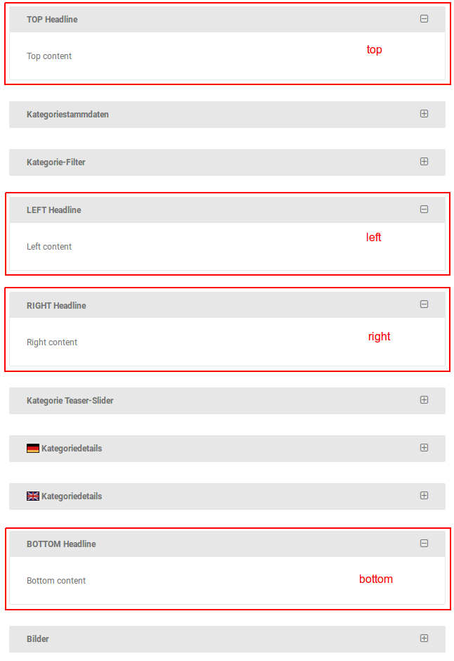
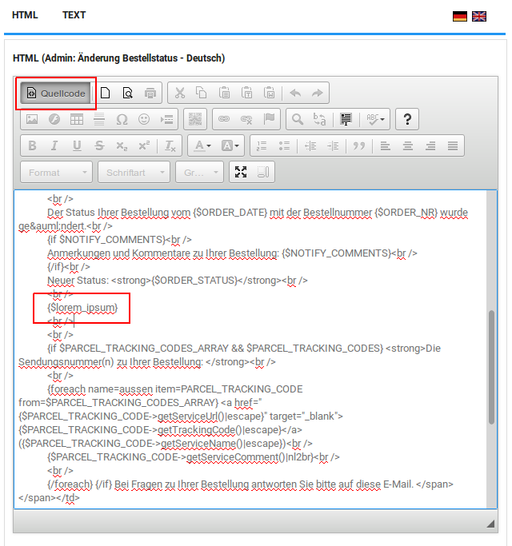

# List of all available extenders (deprecated)

!!! warning "Notice"
    The content of this page references the old overloading and extender system that we used in the [legacy
    architecture]. The new GX4 architecture does not support this. There are still some parts of the shop software
    that are using the old architecture and that's why we still provide this information.

## AdminApplicationBottomExtenderComponent

**Class name:**  
`AdminApplicationBottomExtenderComponent`

**File:**  
`system/extender/AdminApplicationBottomExtenderComponent.inc.php`

**Description:**  
This extender is integrated in the `application_bottom.php` in the Gambio Admin. Through an overload, it is possible
to execute source code on every page in the Gambio Admin at the bottom of the page. Because the extender is loaded
outside the body tag, no output should be generated.

## AdminApplicationTopExtenderComponent

**Class name:**  
`AdminApplicationTopExtenderComponent`

**File:**  
`system/extender/AdminApplicationTopExtenderComponent.inc.php`

**Description:**  
This extender is integrated in the `application_top.php` in the Gambio Admin. Through an overload, it is possible to
execute source code on every page in the Gambio Admin at the beginning of the page. Because the extender is loaded
outside the body tag, no output should be generated.


## AdminApplicationTopPrimalExtenderComponent

**Class name:**  
`AdminApplicationTopPrimalExtenderComponent`

**File:**  
`system/extender/AdminApplicationTopPrimalExtenderComponent.inc.php`

**Description:**  
This extender works in the same way as the [AdminApplicationTopExtender](#adminapplicationtopextendercomponent), except
that this extender is executed at an earlier location of [application_top.php]. This Extender is the earliest way to
inject your code into the Gambio Admin.


## AdminCategoriesExtenderComponent

**Class name:**  
`AdminCategoriesExtenderComponent`

**File:**  
`system/extender/AdminCategoriesExtenderComponent.inc.php`

**Description:**  
This extender is integrated in the `classes/categories.php` in the Gambio Admin. Through an overload, it is possible
to intervene when editing (saving or deleting) a product or category and to include your source code.


## AdminEditCategoryExtenderComponent

**Class name:**  
`AdminEditCategoryExtenderComponent`

**File:**  
`system/extender/AdminEditCategoryExtenderComponent.inc.php`

**Description:**  
This extender is used to extend the form in category editing. There are four different output positions, to each of
which individual contents, such as input fields or information, can be added.

The positions are:
- `top`: above the category master data
- `left`: under category filter
- `right`: under the position `left`
- `bottom`: under the category details

The names of the positions `left` and `right` describe their location in the old admin area (version < 2.5) and have
been kept for backwards compatibility.

The assignment of contents to a position follows the following structure:


```php
$this->v_output_buffer['<top|left|right|bottom>']['<custom_identifier>'] = array('title' => '<headline>', 'content' => '<content>');
```

- `<top|left|right|bottom>`: Position specification for the resulting box (`top`, `left`, `right` or `bottom`)
- `<custom_identifier>`: Unique identifier for the upload of internal identification
- `<headline>`: Free text for the header of the resulting box
- `<content>": content of the resulting box

Example of an `AdminEditCategoryExtender` upload:

```php
class SampleAdminEditCategoryExtender extends SampleAdminEditCategoryExtender_parent
{
	function proceed()
	{
		parent::proceed();
		
		$this->v_output_buffer['top']['sampleOverload'] = array('title' => 'TOP Headline', 'content' => 'Top content');
		$this->v_output_buffer['bottom']['sampleOverload'] = array('title' => 'BOTTOM Headline', 'content' => 'Bottom content');
		$this->v_output_buffer['left']['sampleOverload'] = array('title' => 'LEFT Headline', 'content' => 'Left content');
		$this->v_output_buffer['right']['sampleOverload'] = array('title' => 'RIGHT Headline', 'content' => 'Right content');
	}
}
```

This example creates boxes with dummy values at all available positions.




## AdminEditProductExtenderComponent

**Class name:**  
`AdminEditProductExtenderComponent`

**File:**  
`system/extender/AdminEditProductExtenderComponent.inc.php`

**Description:**  
This extender is used to extend the form in article processing. There are two different output positions, to each of
which individual contents such as input fields or information can be added. Within the extender the variable
`product_data` can be accessed, containing all article data.

The positions are:
  - `top`: under the filter selection
  - `bottom`: under the article pictures

The old admin area contained two additional positions `left` and `right`. These are not supported in the current
version.

The assignment of contents to a position follows the subsequent structure:

```php
$this->v_output_buffer['<top|bottom>']['<custom_identifier>'] = array('title' => '<headline>', 'content' => '<content>');
```

- `<top|bottom>`: Position specification for the resulting box (`top` or `bottom`)
- `<custom_identifier>`: Unique identifier for the upload for internal identification
- `<headline>`: Free text for the header of the resulting box
- `<content>": content of the resulting box

Example of an overload of the `AdminEditProductExtender`:

```php
class SampleAdminEditProductExtender extends SampleAdminEditProductExtender_parent
{
	function proceed()
	{
		parent::proceed();
		
		$this->v_output_buffer['top']['sample'] = array('title' => 'TOP Headline', 'content' => 'Top content');
		$this->v_output_buffer['bottom']['sample'] = array('title' => 'BOTTOM Headline', 'content' => 'Bottom content');
	}
}
```

This example creates boxes with dummy values at all available positions.


## HeaderExtenderComponent

**Class name:**  
AdminHeaderExtenderComponent

**File:**  
`system/extender/AdminHeaderExtenderComponent.inc.php`

**Description:**  
This extender is integrated everywhere in the Gambio Admin. Through an overload any content, for instance JavaScript
code, can be added to the `<head>`. It should be executed on every page in the shop. The integration of the overload
happens last (second to last in Honeygrid) in the `<head>` area.


## AdminLanguageExtenderComponent

**Class name:**  
`AdminLanguageExtenderComponent`

**File:**  
`system/extender/AdminLanguageExtenderComponent.inc.php`

**Description:**  
This extender is executed when editing a language on the `admin/languages.php`.
<a name="AdminLanguageExtender_table"></a>The following actions are distinguished:

|Action       |Description |Accessing the language ID          |
|-------------|------------|-----------------------------------|
|insert       |Inserting   |`$this->v_data_array['insert_id']` |
|copy         |Copying     |`$this->v_data_array['insert_id']` |
|save         |Changing    |`$this->v_data_array['GET']['lID']`|
|deleteconfirm|Deletion    |`$this->v_data_array['GET']['lID']`|

In order to react differently to the various actions, a switch can be made to `$this->v_data_array['GET']['action']`.
For the various actions, the language ID is accessed in different ways (see table above).
For the `copy` action, the ID of the language from which the copy was made can be accessed via
`$this->v_data_array['POST']['ref_language_id']`.

Example of an overload of the `AdminLanguageExtender`:

```php
class SampleAdminLanguageExtender extends SampleAdminLanguageExtender_parent
{
    public function proceed()
    {
        $logControl = MainFactory::create_object('LogControl', array(), true);
        
        switch($this->v_data_array['GET']['action'])
        {
            case 'insert':
                $logControl->notice('The language with ID ' .
                    (int)$this->v_data_array['insert_id'] .
                    ' was created.');
                break;
            case 'copy':
                $logControl->notice('The language with ID ' .
                    (int)$this->v_data_array['insert_id'] .
                    ' wurde von einer Sprache mit der ID ' .
                    (int)$this->v_data_array['POST']['ref_language_id'] .
                    ' was copied.');
                break;
            case 'save':
                $logControl->notice('The language with ID ' .
                    (int)$this->v_data_array['GET']['lID'] .
                    ' was changed.');
                break;
            case 'deleteconfirm':
                $logControl->notice('The language with ID ' .
                    (int)$this->v_data_array['GET']['lID'] .
                    ' was deleted.');
                break;
        }

        parent::proceed();
    }
}
```

This example creates different log entries depending on the executed action.


## AdminOrderActionExtenderComponent

**Class name:**  
`AdminOrderActionExtenderComponent`

**File:**  
`system/extender/AdminOrderActionExtenderComponent.inc.php`

**Description:**  
This extender is executed when actions are performed via the order overview (`admin/orders.php`). As soon as the GET
parameter `action` is filled, the extender is executed and can be used to define your actions. It is recommended to
use this extender in combination with the [AdminOrderOverviewExtender](#adminorderoverviewextendercomponent).

The following actions are currently available:

|Action         |Description                      |Special Parameters                                         |
|---------------|---------------------------------|-----------------------------------------------------------|
|update_order   |Change the order status       |`$this->v_data_array['order_updated']` - success indicator |
|gm_multi_status|Change multiple order statuses  |`$this->v_data_array['order_updated']` - success indicator |
|resendordermail|Regenerate order confirmation    |                                                           |
|deleteconfirm  |Delete                           |                                                           |
|deleteccinfo   |Delete credit card information   |                                                           |
|afterbuy_send  |Afterbuy                         |                                                           |

To be able to react differently to the different actions, a switch can be made to `$this->v_data_array['action']`.

Example of an overload of the `AdminOrderActionExtender`:

```php
class SyncCustomerEmail extends SyncCustomerEmail_parent
{
    public function proceed()
    {
        switch($this->v_data_array['action'])
        {
            case 'sync_email_address':
                $this->_syncEmailAddress(new IdType((int)$this->v_data_array['GET']['oID']));
                break;
        }

        parent::proceed();
    }
    
    private function _syncEmailAddress(IdType $orderId)
    {
        $orderReadService = StaticGXCoreLoader::getService('OrderRead');
        $orderWriteService = StaticGXCoreLoader::getService('OrderWrite');
        $customerReadService = StaticGXCoreLoader::getService('CustomerRead');
        
        $order = $orderReadService->getOrderById($orderId);
        $customerId = new IdType($order->getCustomerId());
        $customer = $customerReadService->getCustomerById($customerId);
        $actualEmail = $customer->getEmail();

        $order->setCustomerEmail(new EmailStringType((string)$actualEmail));
        $orderWriteService->updateOrder($order);
    }
}
```

This example reacts to the action parameter `sync_email_address` and replaces the email address stored in an order
with the current email address specified in the customer record.


## AdminOrderStatusMailExtenderComponent

**Class name:**  
`AdminOrderStatusMailExtenderComponent`

**File:**  
`system/extender/AdminOrderStatusMailExtenderComponent.inc.php`

**Description:**  
With this extender, additional content can be added to the order status change email.
The assignment of the contents follows the following grammar:
 
`$this->v_output_buffer[<variable_name>] = <content>`

`<variable_name>`: Variable name for the e-mail template
`<content>`: Content to be added to the mail

The variable can be used in the e-mail template **Admin: Change order status** in source code mode with
`{$<variable_name>}`, e.g. `{$lorem_ipsum}`.



Example of an overload of the `AdminOrderStatusMailExtender`:

```php
class SampleAdminOrderStatusMailExtender extends SampleAdminOrderStatusMailExtender_parent
{
    public function proceed()
    {
        $this->v_output_buffer['lorem_ipsum'] = 'Lorem ipsum dolor sit amet.';
        
        parent::proceed();
    }
}
```

The example adds the text "Lorem ipsum dolor sit amet." in the order status change e-mail.


## ApplicationBottomExtenderComponent

**Class name:**  
`ApplicationBottomExtenderComponent`

**File:**  
`system/extender/ApplicationBottomExtenderComponent.inc.php`

**Description:**  
This extender is integrated in the `application_bottom.php` in the shop. Through an overload, it is possible to execute
source code on every page in the shop at the end of the page. As the extender is loaded within the body tag, it is
possible to generate HTML output in addition to PHP code and thus also execute JavaScript and CSS.

In an overload of the `ApplicationBottomExtender` the following data are available:

|Access                              |Description                                                       |
|------------------------------------|------------------------------------------------------------------|
|`$this->v_data_array['cPath']`      |Category path: A sequence of `_`-separated category IDs           |
|`$this->v_data_array['products_id']`|Product ID                                                        |
|`$this->v_page`                     |Page titles: Possible titles can be found in the table below      |

The following page titles are possible as values for `$this->v_page`:

|Page title        |Description                          |
|------------------|-------------------------------------|
|Account           |Customer/guest registration          |
|AccountHistory    |Order view under "Your account"      |
|AddressBookProcess|Saving an address book entry         |
|CallbackService   |Callback service                     |
|Cart              |Shopping cart                        |
|Cat               |Category page                        |
|Checkout          |All checkout pages                   |
|GVSend            |Send a voucher                       |
|Index             |Homepage                             |
|Manufacturers     |Manufacturer page                    |
|PriceOffer        |Price offer page                     |
|ProductInfo       |Article detail page                  |
|Wishlist          |Wishlist                             |
|Withdrawal        |Withdrawal form                      |

Example of an `ApplicationBottomExtender` overload:

```php
class SampleApplicationBottomExtender extends SampleApplicationBottomExtender_parent
{
	function proceed()
	{
		$this->v_output_buffer[] = '<span id="my_span">This is my span.</span>';
		$this->v_output_buffer[] = '<style type="text/css">.green { color: green; }</style>';
        $this->v_output_buffer[] = '<script type="text/javascript">$("#my_span").addClass("green");</script>';

		parent::proceed();
	}
}
```

This example inserts the text "This is my span." at the bottom of each page of the shop, defines a CSS class "green"
that colours text green and executes JavaScript code that assigns this class to the text.


## ApplicationTopExtenderComponent

**Class name:**  
`ApplicationTopExtenderComponent`

**File:**  
`system/extender/ApplicationTopExtenderComponent.inc.php`

**Description:**  
This extender is integrated in the `application_top.php` in the shop. Through an overload, it is possible to execute
source code on every page in the shop at the beginning of the page. Since the extender is loaded outside the body tag,
no output should be generated.


## ApplicationTopPrimalExtenderComponent

**Class name:**  
`ApplicationTopPrimalExtenderComponent`

**File:**  
`system/extender/ApplicationTopPrimalExtenderComponent.inc.php`

**Description:**  
This extender works in the same way as the [ApplicationTopExtender](#applicationtopextendercomponent), except that
this extender is executed at an earlier location of the `application_top.php`. This extender is the earliest way to
inject your code into the shop.


## CheckoutSuccessExtenderComponent

**Class name:**  
`CheckoutSuccessExtenderComponent`

**File:**  
`system/extender/CheckoutSuccessExtenderComponent.inc.php`

**Description:**  
This extender is integrated in the `check_success.php`. Through an overload, it is possible to execute source code
in the shop after a successful order and to add your HTML code. Adding HTML code is possible in different ways:

1. **Add content at any position**  
   For HTML to be displayed, an appropriate Smarty variable (e.g. `{$lorem_ipsum}`) must be added to the
   `checkout_success` template. This can be found under `templates/<EyeCandy|Honeygrid>/module/checkout_success.html`.
   The assignment of the Smarty variable follows the following grammar:
  
   `$this->v_output_buffer['<variable_name>'] = '<html_code>'`
  
   - `<variable_name>`: variable name in the `checkout_success` template (e.g. `lorem_ipsum`)
   - `<html_code>`: Any HTML code
2. **Add content in a fixed position**  
   A more comfortable way is the second option for adding content in a fixed position: The added HTML code is
   displayed directly below the success message after the order has been completed. Adding HTML code follows the
   following grammar:
   
   `$this->html_output_array[] = '<html_code>'`
   
   - `<html_code>`: Any HTML code

The ID of the generated order can be accessed via `$this->v_data_array['orders_id']`.

Example of an overload of the `CheckoutSuccessExtender``:

```php
class SampleCheckoutSuccessExtender extends SampleCheckoutSuccessExtender_parent
{
    public function proceed()
    {
        parent::proceed();

        $this->_someLogic(new IdType($this->v_data_array['orders_id']));

        $this->html_output_array[] = '<b>My own success message.</b>';
    }
    
    private function _someLogic(IdType $orderId)
    {
        // Some logic
    }
}
```

In this example, a text "My own success message." is displayed in bold type.


## CustomerExtenderComponent

**Class name:**  
`CustomerExtenderComponent`

**File:**  
`system/extender/CustomerExtenderComponent.inc.php`

**Description:**  
This extender is called up in Gambio Admin on the create and edit page of a customer. This extender can be used to add
additional fields or extra html at the end of the page. Fields can be added for the sections Personal, Company, Address,
Contact and More Options. Extra html will be appended to the page.

|Position           |Method for adding content                             |Description                                                         |
|-------------------|------------------------------------------------------|--------------------------------------------------------------------|
|`personal_fields`  |`addPersonalField(string $label, string $fieldHtml)`  |Adds a new row with label and field html to the Personal section    |
|`company_fields`   |`addCompanyField(string $label, string $fieldHtml)`   |Adds a new row with label and field html to the Company section     |
|`address_fields`   |`addAddressField(string $label, string $fieldHtml)`   |Adds a new row with label and field html to the Address section     |
|`contact_fields`   |`addContactField(string $label, string $fieldHtml)`   |Adds a new row with label and field html to the Contact section     |
|`additional_fields`|`addAdditionalField(string $label, string $fieldHtml)`|Adds a new row with label and field html to the More Options section|
|`extra_html`       |`addExtraHtml(string $html)`                          |Adds extra html at the end of the page                              |

```php
/**
 * Class SampleCustomerExtender
 *
 * This is a sample overload for the CustomerExtenderComponent.
 *
 * @see CustomerExtenderComponent
 */
class SampleCustomerExtender extends SampleCustomerExtender_parent
{
    public function proceed()
    {
        parent::proceed();
        
        // logic for handling POST data like storing it
        
        // logic for getting data to prefill fields
        
        $this->addPersonalField('Middle name:', '<input type="text" name="middle_name" maxlength="32" />');
        $this->addCompanyField('Location:', '<input type="text" name="location" maxlength="32" />');
        $this->addAddressField('Floor:', '<input type="text" name="floor" maxlength="32" />');
        $this->addContactField('Mobile number:', '<input type="tel" name="mobile_number" />');
        $this->addAdditionalField('Reference Code:', '<input type="text" name="reference_code" />');
        $this->addExtraHtml('<div><p>Some extra HTML</p></div>');
    }
}
```

This example adds the new input fields for every form section and some sample html at the end of the page.


## HeaderExtenderComponent

**Class name:**  
`HeaderExtenderComponent`

**File:**  
`system/extender/HeaderExtenderComponent.inc.php`

**Description:**  
This extender is integrated everywhere in the shop. Through an overload, any content can be added to the `<head>`,
e.g. JavaScript code that is to be executed on every page in the shop. The integration of the Overload happens last
(second to last in Honeygrid) in the `<head>` area.


## JSSectionExtenderComponent

**Class name:**  
`JSSectionExtenderComponent`

**File:**  
`system/extender/JSSectionExtenderComponent.inc.php`

**Description:**  
This JavaScript extender is a bit special and can be used on all pages of the Gambio Admin. Using particular
parameters, which are passed to the `gm_javascript.js.php`, area-specific JavaScript code can be loaded.

Example call of the `gm_javascript.js.php`: `gm_javascript.js.php?page=Section&globals=off&section=my_section`

|Parameter name    |Possible values |Description                                                                          |
|------------------|----------------|-------------------------------------------------------------------------------------|
|page              |`Section`       |To use the JSSectionExtender, this parameter must have the value `Section`           |
|section           |`<section_name>`|The name of the section and the name of the executed method in the overload          |
|globals (optional)|`on`\|`off`     |Indicator whether global JavaScripts, such as jQuery and jQuery-UI, should be loaded |

When called, the `gm_javascript.js.php` returns all the JavaScripts that are included in the `my_section` function. The
section corresponds to a function which is defined in an overload of the `JSSectionExtender`.

Example of an overload of the `JSSectionExtender`:

```php
class SampleJSSectionExtender extends SampleJSSectionExtender_parent
{
	protected function my_section()
	{
		echo 'alert("This is my section");';
	}
}
```

This example performs an `alert` on an overload of `gm_javascript.js.php?page=Section&section=my_section` with the
text "This is my section".


## LoginExtenderComponent

**Class name:**  
`LoginExtenderComponent`

**File:**  
`system/extender/LoginExtenderComponent.inc.php`

**Description:**  
This extender is loaded at login. By means of an overload, your source code can be executed during login. This extender
is not suitable for displaying content. When using this extender, a method `get_customer()` is available that returns
the customer record of the logger in the form of a `GMDataObject`. Also, the ID of the customer
`$this->v_data_array['customers_id']` is available.


## OrderExtenderComponent

**Class name:**  
`OrderExtenderComponent`

**File:**  
`system/extender/OrderExtenderComponent.inc.php`

**Description:**  
This extender is called up in Gambio Admin on the detail page of an order. This extender can be used to add additional
containers (e.g. for payment modules like SEPA or PayPal). Currently, there are five positions to which content can
be added. Four of these positions have an additional header, which can be set with the suffix `_heading`.

|Position            |Header                      |Description                                                                     |
|--------------------|----------------------------|--------------------------------------------------------------------------------|
|`below_product_data`|`below_product_data_heading`|Below the article data, using the entire width of the page                      |
|`below_order_info`  |`below_order_info_heading`  |Below the order information on the left side (invoice/delivery address)         |
|`below_withdrawal`  |`below_withdrawal_heading`  |Below the revocations on the right side                                         |
|`below_history`     |`below_history_heading`     |Below the order status history on the left side                                 |
|`order_status`      |-                           |Below the comment field in the "Change order status" dialogue (within the form) |

The position `below_order_info` can cause shifts in content, as existing modules sometimes use it and the order
within a position cannot be influenced.

```php
class SampleOrderExtender extends SampleOrderExtender_parent
{
	public function proceed()
	{
		$this->v_output_buffer['below_order_info_heading'] = 'below_order_info TITLE';
		$this->v_output_buffer['below_order_info']         = '<div style="color: #0000FF">below_order_info CONTENT</div>';
		
		$this->v_output_buffer['below_withdrawal_heading'] = 'below_withdrawal TITLE';
		$this->v_output_buffer['below_withdrawal']         = '<div style="color: #0000FF">below_withdrawal CONTENT</div>';
		
		$this->v_output_buffer['below_history_heading'] = 'below_history TITLE';
		$this->v_output_buffer['below_history']         = '<div style="color: #0000FF">below_history CONTENT</div>';
		
		$this->v_output_buffer['below_product_data_heading'] = 'below_product_data TITLE';
		$this->v_output_buffer['below_product_data']         = '<div style="color: #0000FF">below_product_data CONTENT</div>';
		
		$this->v_output_buffer['order_status'] = '<div style="color: #0000FF">order_status CONTENT</div>';
		
		//The following two rows need to be at the end of every overload of the OrderExtender
		$this->addContent();
		parent::proceed();
	}
}
```

This example outputs a short sample text at all available positions of the Extender.


## PDFOrderExtenderComponent

**Class name:**  
`PDFOrderExtenderCompontent`

**File:**  
`system/extender/PDFOrderExtenderComponent.inc.php`

**Description:**  
This extender is integrated into `admin/gm_pdf_order.php` immediately before the PDF documents are generated and
allow almost complete manipulation of the data on which the creation of invoices/delivery notes is based. This
allows the insertion of payment type dependent details. For this purpose, a method is provided
for each manipulable content that can be overloaded.

The following contents can be manipulated:

|Method name                 |Type of content                                                                           |
|----------------------------|------------------------------------------------------------------------------------------|
|`extendOrderRight()`        |Company address, customer number, order date, order number, invoice/delivery number, date |
|`extendOrderData()`         |Article data: model, name, quantity, unit, taxes, unit price, price, attributes           |
|`extendOrderTotal()`        |Summary: subtotal, total net, total, etc.                                                 |
|`extendOrderInfo()`         |Shipping address, payment method, shipping method, note text                              |
|`extendPdfFooter()`         |Footer: company address, account information, etc.                                        |
|`extendPdfFonts()`          |Font details in relation to the different parts of the invoice/delivery note              |
|`extendGmPdfValues()`       |Various layout settings, such as spacing and display flags                                |
|`extendGmOrderPdfValues()`  |Further layout settings                                                                   |
|`extendGmUseProductsModel()`|Setting whether the model should be used (affects the layout)                             |

Various information is also available:

|Access                              |Description                                                                        |
|------------------------------------|-----------------------------------------------------------------------------------|
|`$this->v_data_array['type']`       |Type of document (possible values: `invoice`\|`packingslip`)                       |
|`$this->v_data_array['order_id']`   |Order number                                                                       |
|`$this->v_data_array['order']`      |Order information in an object of type `order` (`admin/includes/classes/order.php`)|
|`$this->v_data_array['order_check']`|Some additional ordering information                                               |


## PostInstallationAdminExtendercomponent

**Class name:**  
`PostInstallationAdminExtendercomponent`

**File:**  
`system/extender/PostInstallationAdminExtendercomponent.inc.php`

**Description:**  
This extender is integrated immediately after completion of the shop installation at the first call of the admin
area and allows the execution of your code.


## PostInstallationShopExtenderComponent

**Class name:**  
`PostInstallationShopExtenderComponent`

**File:**  
`system/extender/PostInstallationShopExtenderComponent.inc.php`

**Description:**  
This extender is integrated immediately after completion of the shop installation at the first call of the shop and
allows the execution of your code.


## PostUpdateAdminExtendercomponent

**Class name:**  
`PostUpdateAdminExtendercomponent`

**File:**  
`system/extender/PostUpdateAdminExtendercomponent.inc.php`

**Description:**  
This extender is integrated immediately after the update is completed when the admin area is called up for the first
time and allows you to run your code.


## PostUpdateShopExtenderComponent

**Class name:**  
`PostUpdateShopExtenderComponent`

**File:**  
`system/extender/PostUpdateShopExtenderComponent.inc.php`

**Description:**  
This extender is integrated immediately after completion of the update at the first call of the shop and allows the
execution of your code. 


[legacy architecture]: ./../../framework/legacy-architecture.md
